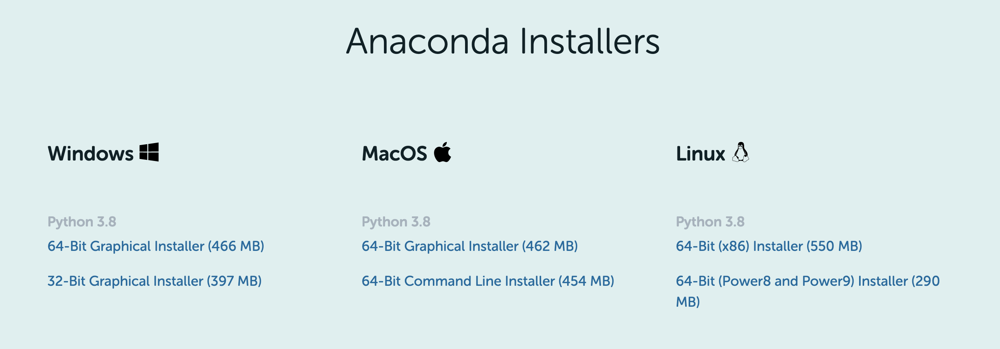
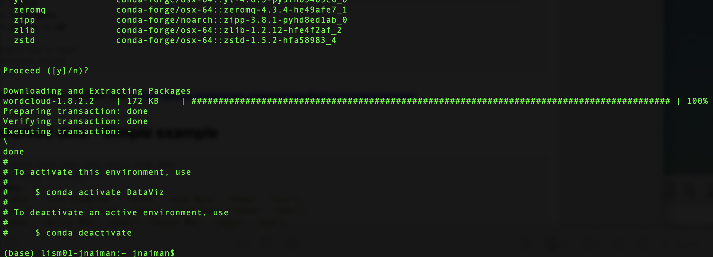

## 1. Install Anaconda with Python 3

<!-- JPN: check the individual page install -->
To install the packages and libraries we need for this course we will be using the Anaconda package manager, so you'll need to install this first.  First, navigate to the [individual edition page](https://www.anaconda.com/products/individual) and scroll down until you see the download links and select either a 32 or 64 bit installation, depending on your machine (if you're not sure if you are on a 32/64 bit machine the easiest is probably to google your computer's name and date along with "32 or 64").:

<!-- JPN: update his image -->

**NOTE:** You will need the Python 3.X version (the version might be different than listed on the conda webpage).

<!-- JPN: check these links -->
Next, follow these installation steps to install anaconda on your computer:
 * [Install on a Windows](https://docs.anaconda.com/anaconda/install/windows/)
 * [Install on a Mac](https://docs.anaconda.com/anaconda/install/mac-os/)
 
**NOTE:** If you already have Anaconda installed you might get an error.  You can simply make sure Anaconda is the most recent version by opening a Terminal (Mac) or the Anaconda Prompt (Windows) and typing `conda update anaconda`.
 

## 2. Create an Anaconda Environment

Now we will make a "stand-alone" envirnoment to do our data-viz stuff in.  This is useful to make sure we install packages in a way that will not cause bad interactions.

<!--
Here is a ~5 minute movie of how this process looks on my Mac (it may take longer on your machine!) which covers the instructions in section 2.1 and 2.2 of the installation process (note: this uses Python 3.8, but you should try with Python 3.7 first):
-->

<!-- JPN: redo this movie -->
<!--
<iframe width="560" height="315" src="https://www.youtube.com/embed/0RT_03U5dWI?rel=0" frameborder="0" allow="accelerometer; autoplay; encrypted-media; gyroscope; picture-in-picture" allowfullscreen></iframe>
-->

<!-- JPN: recreate this enviroment -->
### 2.1 Conda environment
 1. On a Mac search for the "Terminal" prompt/on Windows search for the "Anaconda Prompt" (NOT the navigator)
 2. In the terminal window type: `conda create -n DataViz python=3.7 seaborn plotly pygraphviz pandas matplotlib=3.2.2 bqplot=0.12.30 numpy regex networkx openssl altair yt geopandas gdal rasterio shapely pyproj rtree fiona pillow palettable h5py contextily webcolors openpyxl ipyvolume ipyleaflet vega_datasets nltk wordcloud wget -c conda-forge`
 
#### DO NOT TRY TO INSTALL THESE PACKAGES ONE AT A TIME

This can lead to package conflicts!
 
You will then see an output that looks a bit like this:
 

After the "Solving Environment" step completes it will ask you if you want to install hit "y" and "Enter" or just "Enter" to complete the process.

**DO NOT WORRY** about the following warning messages you might see:
 * `Solving environment: failed with initial frozen solve. Retrying with flexible solve.`
 * `Solving environment: failed with repodata from current_repodata.json, will retry with next repodata source.`
 
This does not mean your installation has failed – as long as its still running let it be! 

## Note the installation process can take a while – average is ~30 minutes, but sometimes it can take OVER NIGHT.

A successful installation is indicated by seeing the following:

 
 
 
#### Tips and Tricks

If the install fails or there are package conflicts you can try with Python 3.8 or Python 3.9.  For example to re-install with Python 3.8 the command becomes: `conda create -n DataViz python=3.8 seaborn plotly pygraphviz pandas matplotlib=3.2.2 bqplot=0.12.30 numpy regex networkx openssl altair yt geopandas gdal rasterio shapely pyproj rtree fiona pillow palettable h5py contextily webcolors openpyxl ipyvolume ipyleaflet vega_datasets nltk wordcloud wget -c conda-forge`

**Windows users:** If you have an issue with the `wget` command, you can install without it like: `conda create -n DataViz python=3.7 seaborn plotly pygraphviz pandas matplotlib=3.2.2 bqplot=0.12.30 numpy regex networkx openssl altair yt geopandas gdal rasterio shapely pyproj rtree fiona pillow palettable h5py contextily webcolors openpyxl ipyvolume ipyleaflet vega_datasets nltk wordcloud -c conda-forge`

## 3. Run & Test your environment

**NOTE: Here I am assuming your default browser is either Chrome or Firefox.  If not, change it to one of these browsers for the duration of this class.**

### 3.1 Run a jupyter notebook from the environment

**YOU WILL NEED TO DO THIS EVERY TIME YOU OPEN UP JUPYTER NOTEBOOK**

 1. after all installs are done type `conda activate DataViz` in the terminal window/anaconda prompt
 2. then type `jupyter notebook` to open the notebook from the command line
 
### 3.2. Test the installs (this is part of the first HW, do once)

 1. [Download the test install script - test_imports_week01](https://uiuc-ischool-dataviz.github.io/is445_bcubcg_fall2022/week01/test_imports_week01.ipynb), open it with your jupyter notbeook and run it cell-by-cell
 
A movie of this process is shown below from a slightly older installation process (but the overall steps will remain the same, even if some of the packages are different):

<!-- JPN: redo this movie w/o Pygel -->

<iframe width="560" height="315" src="https://www.youtube.com/embed/D5wLYqCuHZM?rel=0" frameborder="0" allow="accelerometer; autoplay; encrypted-media; gyroscope; picture-in-picture" allowfullscreen></iframe>

A few things of note:
 * When the little `*` is showing in the `In[]` part to the left of each cell this means your computer is thinking.  Its best to wait until its done with one cell before moving onto the next one.
 * If nothing shows up for the `bqplot` plot or the `ipyvolume` plot there are a few tips listed -- try refreshing your browser, try installing the extensions (uncomment those lines and run the cell and try running the plotting cells again), or completely close and completely re-open your jupyter notebook as discussed in section 3.1
