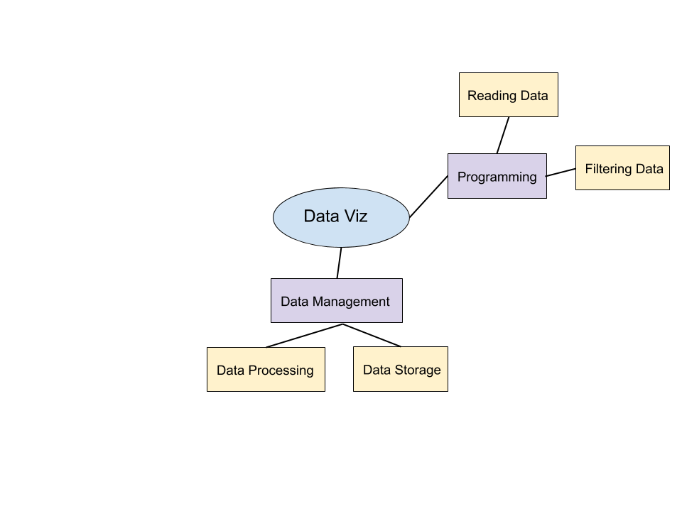
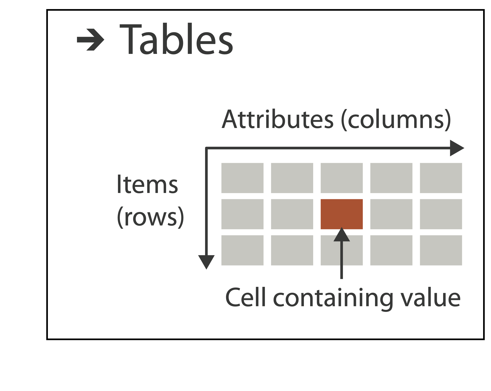
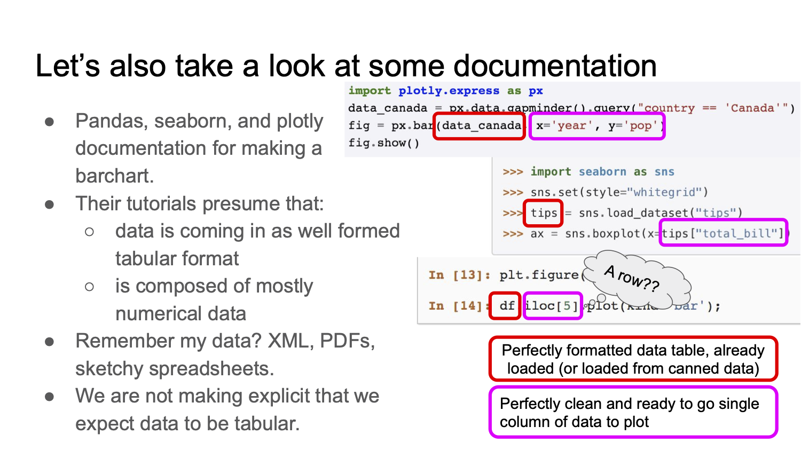
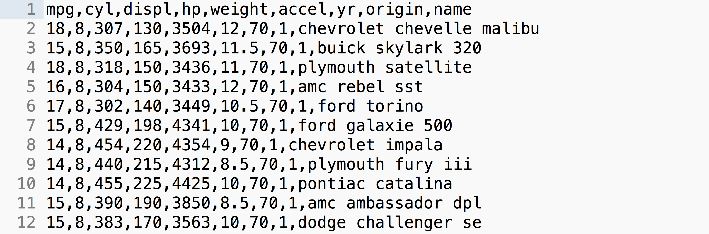
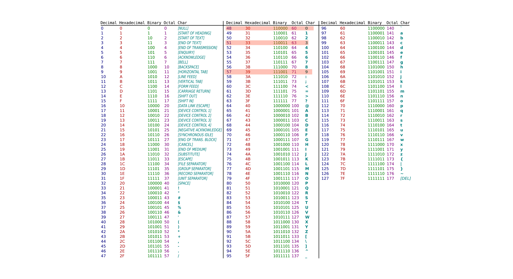
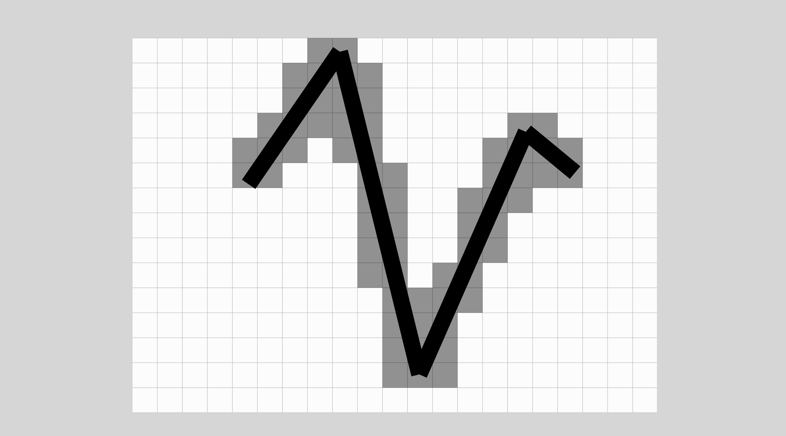
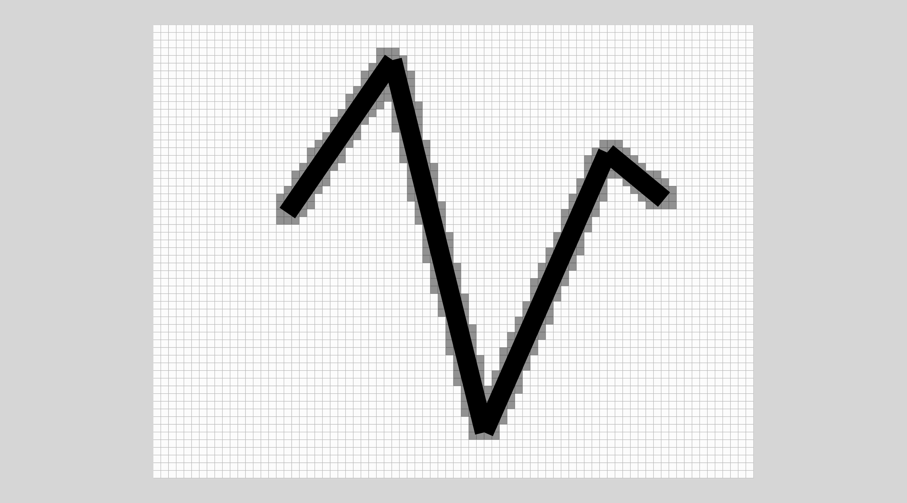
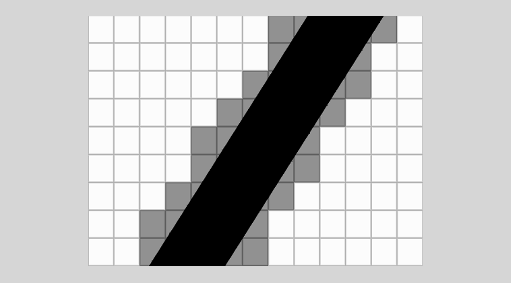
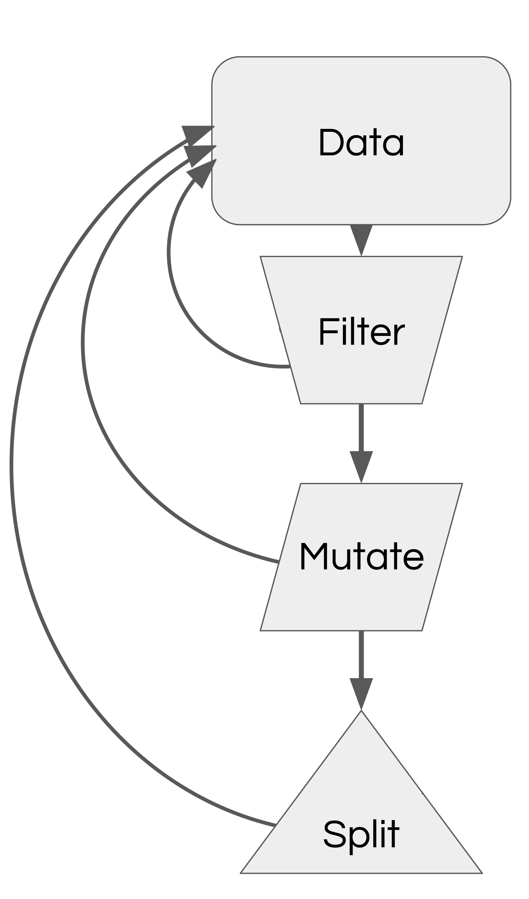

<br>
<br>
<br>

# Bureaucracy, Redux

---

## COVID-19 Policies

Please see the statement about policies related to COVID-19 at the [top of the Syllabus](https://uiuc-ischool-dataviz.github.io/is445_bcubcg_fall2022/syllabus.html).

### Masks in class (and buildings) are now *highly recommended* by the Chancellor

### Other ways to access course materials (Zoom recordings posted after class)

### If you feel unwell, stay home!

### If *I* get sick, we have a plan: classes online/recordings

notes:
couple of reminders -- especially about masks (if its too hard, see Zoom resources!)

**show where zoom recording is saved**

---

## How to get help

Jill P. Naiman - `jnaiman@illinois.edu`
 * Office Hours: Mon, Wed 10am-11am (online)

TA: Qiuyan Guo - `qqguo2@illinois.edu`
 * Office Hours: Tues, Thurs, Fri 8:30am-10:30am (online)
 
TA: Leon Hounnou - `hounnou2@illinois.edu`
 * Office Hours: Mon, Fri 4-6pm (online)
 
Other: 
 * Slack, email

---

## In summary: where things will be located:

 * Canvas: https://canvas.illinois.edu/courses/21951 - where the grades and assignments will be posted

 * Course webpage: https://uiuc-ischool-dataviz.github.io/is445_bcubcg_fall2022/  - where lecture slides, notebooks, data & general course info will live.

 * Slack: https://is445fall2022.slack.com - the best place to ask questions in the `#general` channel

---

## Weekly Visualization Reports

Every week, you are to turn in a visualization you have found in the media
(newspapers, magazines, online journalism) and a brief summary of something you like/don't like,
think is interesting, etc.

_These are meant to be easy points:_ No more than 2-3 sentences are needed in your description.

Please see [TurnItIn](https://uiuc-ischool-dataviz.github.io/is445_bcubcg_fall2022/week02/lecture02_assignment_submission_help.html#/) slides for more info

notes:
our first one is assigned today, due next week 

As a reminder: we have TurnItIn in this class, but we really want you to use it as a tool, so you should be able to see your report once you submit and you can look at the same report we will see. How does this work? **go to these slides**

---

## Assignment 1

<span style="color:red">Part 2: an intake survey</span> 

<span style="color:red">Part 3: Say hi on Slack!</a>

notes:
these last two count for ~25% of this hw grade so I'll carefully ignore you if you are typing on something else for a few min!

---

## Homework grading

 * All HWs will be graded out of 100%, all HWs are worth the same, however,
 * Some weeks assignments are broken into multiple parts (that all add up to 100%)
 * We *will* drop a HW score

---

## Choose your own adventure

There are 3 pathways (that I can see in this course, could be more!)

 1. "I am here to get better at programming and play with viz platforms"
 1. "I am thinking about a career in data viz."
 1. "I don't know/I am new to programming and I want to focus on that."

notes:
just a few reminders if you're in the 3rd track, or any track really!

---

## Choose your own adventure

There are 3 pathways (that I can see in this course, could be more!)

 3. "I don't know/I am new to programming and I want to focus on that."
    * Strategy: 
       * look at the code, focus heavily on Python
       * <span style="color:red">read the prep notebooks before class!</span>
       * do the Javascript parts
       * if you're new to programming, do Javascript parts in class, and build on them for any HW
       * come back to the optional texts/docs after the course is over

---

## Participate in Viz Research

#### University of Illinois study on cinematic-style data visualization

You are invited to participate in a research study to help improve the impact of documentary films and 3D data visualization. Watch a 9-minute video clip of data visualizations from “Solar Superstorms”, narrated by Benedict Cumberbatch, and respond to a 10-minute survey about it.

You’ll be entered into a drawing to win one of 5 gift cards for $30.

Join the study using this link:

https://go.illinois.edu/sciviz

This research project is being conducted by the Advanced Visualization Lab at the NCSA in the University of Illinois at Urbana-Champaign. This project is funded by The Brinson Foundation.


---

## Today



notes:

today we're going to get some practice with the practicalities of dealing with data

We'll talk a bit about the kinds of data that are out there and their definitions, and how many people disagree on these definitions!

---

<!--  -->


notes:
So, usually you're probably used to thinking about data like this - numerical or quantitative which is then broken down into discrete & continous.

Also categorical or qualitative data which is either ordered (ordinal) or unordered (nominal).

---

<!--  -->


We need to dig a little deeper for data viz.

notes:
This is a fine for something like stats, but we have to start thinking about how data type and format maps itself visually -- what is the best mapping for our visual cortex?

---

## Data organization is important

<div class="left">
	
</div>
<div class="right">
    
	 - Munzner - https://www.cs.ubc.ca/~tmm/talks.html

</div>


notes:
We have to think a little bit about how our data represents reality *and* how it is represented on disk.

for example, both spatial data like that on a map and data that we use to compare salaries for example, are numerical data - we have lat/long and data value combinations for geographic data and numbers for salaries, but there is something fundementally different about how we would represent these two datasets on a visualization

Similarly for categorical data like with an organization, network, or a tree -- this data is much different than a table of categorical occurances.

---

## Example: Temporal data is numerical, but its also something "else"

<!-- .slide: class="two-floating-elements" -->

<div class="left">


</div>

<div class="right">


</div>

notes:
temporal data, like here the temperature change in a vew places over time, is numerical, but, depending on what time spans we are interested in, its can also be periodic

The first graph tell us a lot, and the 2nd may at first be a little weird to read but it tells us information about both changes in time and the averages about the place *and* it captures a central nature about this data - that it is periodic

---

<!-- .slide: class="two-floating-elements" -->

## Files, Data, and Organization

* Text
  * ASCII (raw)
  * CSV / TSV
  * JSON
* Binary
  * HDF5
  * PNG/BMP/GIF/JPG/etc
  * Excel
  * Arrow
* Query-based
  * SQL
  * JSON/REST

<div class="right" markdown=1>

<!---->


<!---->


</div>

notes:
We also need to worry a bit about how this data is stored on disk because that will tell us what steps are between us and (1) making the data user-friendly *and* putting into a format that we can make a visualization with

read-write operations from disk are extremely time consuming, so raw text files come with massive overhead

REST = REpresentational State Transfer - web architecture that keeps clients and servers independent and queries using flexible JSON formatting.

---

<!-- .slide: class="two-floating-elements" -->

## Files, Data, and Organization

* Text
  * ASCII (raw)
  * <span style="color:red">CSV / TSV </span>
  * JSON
* Binary
  * HDF5
  * <span style="color:red">PNG/BMP/GIF/JPG/etc</span>
  * Excel
  * Arrow
* Query-based
  * SQL
  * JSON/REST

<div class="right" markdown=1>

<!---->


<!---->


</div>

notes:
Today in our programming we'll be focusing on these 2 types and comparing our interactions with them

---

## The "simple" pipeline

<!-- .slide: data-background-image="images/viz_diagram.svg.png" data-background-size="contain"-->

notes: what we want is something like this where we have some data, we load it into Python/javascript/whatever and then we make a super cool viz.

---

## The "simple" pipeline... is not so simple

From Elizabeth Wickes' talk: https://zenodo.org/record/3563145#.XjdvdRNKgtc



notes:
We know that this is not easy though! Especially for "complicated" data like we might run into out in the wild. While most of the data we'll use here will be less messy than "out in the wild" data, we nevertheless need to figure out how to process it a bit.

There are several great examples of this from Elizabeth Wickes' talks linked here, but basically, here she is highlighting all of the places the documentation can "go wrong" if you are trying to follow along with your data.

---

<!-- .slide: data-background-image="images/viz_diagram2.svg.png" data-background-size="contain"-->

notes:
~~Today we are going to practice a bit of the data-reading part ourselves, but~~ usually we are going to be
able to make use of readers, but in the prep notebook from last week there is an example of how one would construct a data reader "by hand"

~~And we'll see how to go from raw "read in" data to data that is viz-ready.~~

---

<br>
<br>
<br>

# Let's consider tabular data

---

## Organization

| | Column 1 | Column 2 | Column 3 | Column 4 |
|-|-|-|-|-|
|Row 1|11|21|31|41|
|Row 2|12|22|32|42|
|Row 3|13|23|33|43|

Internally, this data is stored linearly, with one value immediately following
another.  We can do this in two methods:

||||||||||||||
|:-|-|-|-|-|-|-|-|-|-|-|-|-|
| Row | 11 | 21 | 31 | 41 | 12 | 22 | 32 | 42 | 13 | 23 | 33 | 43 |
| Column | 11 | 12 | 13 | 21 | 22 | 23 | 31 | 32 | 33 | 41 | 42 | 43 |

<!-- .element: class="fragment" -->

---

### Organization: Row

| | | | | | | | | | | |
|-|-|-|-|-|-|-|-|-|-|-|
| 11 <!--.element: class="table-hl" -->| <!--.element: class="table-hl" -->21 | 31 | 41 | 12 | 22 | 32 | 42 | 13 | 23 | 33 | 43 |

In row-oriented storage, successive _fields_ for a single _record_ are
adjacent.

<div style="height: 2.0em;"></div>

### Organization: Column

| | | | | | | | | | | |
|-|-|-|-|-|-|-|-|-|-|-|
| 11 <!--.element: class="table-hl" -->| 12 | 13 | <!-- .element: class="table-hl" --> 21 | 22 | 23 | 31 | 32 | 33 | 41 | 42 | 43 |

In column-oriented storage, successive _records_ for a single _field_ are
adjacent.

notes:
These formats are more efficient when the information you're interested in is adjacent. For instance, operations requiring many rows and only a few columns benefit from row-oriented storage.

---

## CSV (Comma-separated values)

| Column 1 | Column 2 | Column 3 | Column 4 | Column 5 |
|-|-|-|-|-|
| . | . | . | . | . |
| . | . | . | . | . |
| . | . | . | . | . |
| . | . | . | . | . |

<div style="height: 2.0em;"></div>

---

## CSV (Comma-separated values)



 * "Lowest-common denominator format" (widest available)
 * Flexible delimiters 
 * Ad hoc comments and headers (data readers need to be adapted)
 * Row-oriented
 * Row-size can vary: no implicit indexing

notes:
Sometimes called "DSV" or "Delimiter-separated values"

Ad hoc means data readers need to be adapted to format.

---

## Reading CSV

```
...
390,1.83970e-003,-4.53930e-004,1.21520e-002
395,4.61530e-003,-1.04640e-003,3.11100e-002
400,9.62640e-003,-2.16890e-003,6.23710e-002
405,1.89790e-002,-4.43040e-003,1.31610e-001
410,3.08030e-002,-7.20480e-003,2.27500e-001
415,4.24590e-002,-1.25790e-002,3.58970e-001
420,5.16620e-002,-1.66510e-002,5.23960e-001
425,5.28370e-002,-2.12400e-002,6.85860e-001
...
```

notes:
Let's take this sample data and see how it's represented in computer memory.

---

```

390,1.83970e-003,-4.53930e-004,1.21520e-002
```

If we assume ASCII encoding, this becomes:

| | | | |
|-|-|-|-|
|"390" <!-- .element: class="table-hl" --> | 51 | 57 | 48 |
<!-- .element: style="margin-left: 0.2em;" -->



notes:
A string is not a number, but a list of characters. A character is a symbol represented by a unique byte as described in the ASCII table.

---

```

390,1.83970e-003,-4.53930e-004,1.21520e-002
```

If we assume ASCII encoding, this becomes:

| | | | |
|-|-|-|-|
|"390" <!-- .element: class="table-hl" --> | 51 | 57 | 48 |
<!-- .element: style="margin-left: 0.2em;" -->

Breaking this further down, we encode each character:

||||||||||
|-|-|-|-|-|-|-|-|-|
|51 <!-- .element: class="table-hl" --> | 0 | 0 | 1 | 1 | 0 | 0 | 1 | 1 |
|57 <!-- .element: class="table-hl" --> | 0 | 0 | 1 | 1 | 1 | 0 | 0 | 1 |
|48 <!-- .element: class="table-hl" --> | 0 | 0 | 1 | 1 | 0 | 0 | 0 | 0 |
<!-- .element: style="margin-left: 0.2em;" -->

---

```

390,1.83970e-003,-4.53930e-004,1.21520e-002
```

If we assume ASCII encoding, this becomes:

| | | | |
|-|-|-|-|
|"390" <!-- .element: class="table-hl" --> | 51 | 57 | 48 |
<!-- .element: style="margin-left: 0.2em;" -->

Breaking this further down, we encode each character:

||||||||||
|-|-|-|-|-|-|-|-|-|
|51 <!-- .element: class="table-hl" --> | 0 | 0 | 1 | 1 | 0 | 0 | 1 | 1 |
|57 <!-- .element: class="table-hl" --> | 0 | 0 | 1 | 1 | 1 | 0 | 0 | 1 |
|48 <!-- .element: class="table-hl" --> | 0 | 0 | 1 | 1 | 0 | 0 | 0 | 0 |
<!-- .element: style="margin-left: 0.2em;" -->

**See aside on binary representations at the end of the lecture notes if you are curious!**

---

## A few other representations: JSON

| | | |
|:-|:-|:-|
| Record 1 | Record 2 | Record 3 |

<div style="height: 2.0em;"></div>

 * Row-oriented
 * Potentially-unknown subcomponent sizes (lists of lists)
 * Common response to REST APIs
 * Multiple types
   * String
   * Number
   * Object (JSON)
   * Array (list)
   * Boolean
   * null
 * Format of .ipynb Python Notebooks

notes:
Another way to store tabular-like data is with JSON files.

XML-like syntax for storing data values. 

All fields for a record are presented at once.

REST = REpresentational State Transfer - web architecture that keeps clients and servers independent and queries using flexible JSON formatting.

**take a look at a jupyter notebook!**

---

```
[
 ...
 {"Agency Name":"University of Illinois",
  "Address":"501 E Daniel",
  "City":"Champaign",
  "Zip code":61820,
  "Year Acquired":1992,
  "Year Constructed":1935,
  "Square Footage":21845,
  "Total Floors":5
 }, 
 ...
]
```

<div style="height: 2.0em;"></div>

 * `[` and `]` indicate an array
 * `{` and `}` indicate a JSON object (or mapping)
 * `"` indicates a string
 * Numbers are, well, numbers.

---

## A few other representations: HDF5

| | | |
|:-|:-|:-|
| Column 1 | Column 2 | Column 3 |

<div style="height: 2.0em;"></div>

 * Columnar, chunked store
 * Flexible data types in-memory and on-disk
 * Hyperslab and boolean indexing
 * Fine-grained key/val metadata
 * Groups & hierarchies
 * Extensible types:
   * Numeric
   * Fixed-length strings
   * Variable strings

---

<br>
<br>
<br>

# Let's consider image (spatial) data.

notes:
image data is an excellent example of data where the orientation of each element is important -- i.e. how we display things in space is not a choice that is really up to us, its up to the data!

---

<!-- .slide: data-background-image="../week02/images/stitch_nobg_tilted.png" data-background-size="contain"-->

notes:
how is this dataset "fundementally" different than a tabular dataset?

---

## Does reordering tables & columns matter?

<!-- .slide: class="two-floating-elements" -->

<div class="left">


</div>

<div class="right">


</div>

notes: what happens if I re-order the rows of this table?

Or columns?

Is information lost or confused?

---

## Does reordering tables & columns matter?

<!-- .slide: class="two-floating-elements" -->

<div class="left">


</div>

<div class="right">


</div>

notes: 
with data that is enharently spatial in nature, we see we lose information and can potentially confuse our viewer if we shuffle data location and order.

---

## Does reordering tables & columns matter?

<!-- .slide: class="two-floating-elements" -->

<div class="left">


</div>

<div class="right">


</div>

We'll start with manipulating image data and then move on to geographical data in a few lectures.

notes: 
with data that is enharently spatial in nature, we see we lose information and can potentially confuse our viewer if we shuffle data location and order.

---

<br>
<br>
<br>

# Raster vs. Vector representations of image data

notes:
generally, we'll be in charge of *making* images from data and not using images as data themselves, but it is worth spending some time thinking about how images are actually represented on a computer.

---

## Let's draw a line.

<!-- .slide: data-background-image="images/line.svg" data-background-size="auto 65%" data-background-position="right 10% bottom 50%"-->

---

## Let's draw a line.

<!-- .slide: data-background-image="images/line.svg" data-background-size="auto 65%" data-background-position="right 10% bottom 50%"-->

```
start = (x0, y0)
end   = (x1, y1)
width = 1.0
```
<!-- .element: class="left_abs" style="width: 50%"-->

notes:
you can see a line is basically 5 bytes in memory - one byte for each integer end point coordinate, and one byte for the width.

---

## Let's draw a line.

Convert to an 8x8 image.

<!-- .slide: data-background-image="images/line_grid.svg" data-background-size="auto 65%" data-background-position="right 10% bottom 50%"-->

notes: so, if we map this line to an image, we see that we lose a bit of information - the graphic becomes pixelated

---

## Let's draw a line.

Convert to an 8x8 image.

<!-- .slide: data-background-image="images/line_grid_fill.svg" data-background-size="auto 65%" data-background-position="right 10% bottom 50%"-->

notes:
this is how that line would look in a pixel representation

---

## Let's draw a line.

Convert to an 16x16 image.

<!-- .slide: data-background-image="images/line_grid_fine2.svg" data-background-size="auto 65%" data-background-position="right 10% bottom 50%"-->

---

## Let's draw a line.

Convert to an 16x16 image.

<!-- .slide: data-background-image="images/line_grid_fine2_fill.svg" data-background-size="auto 65%" data-background-position="right 10% bottom 50%"-->

---

## Let's draw a line.

Convert to an 32x32 image.

<!-- .slide: data-background-image="images/line_grid_fine4.svg" data-background-size="auto 65%" data-background-position="right 10% bottom 50%"-->

---

## Let's draw a line.

Convert to an 32x32 image.

<!-- .slide: data-background-image="images/line_grid_fine4_fill.svg" data-background-size="auto 65%" data-background-position="right 10% bottom 50%"-->

notes: so we see our pixelation gets less and less sever if we increase the number of pixels in our image

---

## Representations

We will concern ourselves with understanding two representations of an image:
the **raster** representation and the **vector** representation.

---

## Representations: raster

 * Each pixel is represented as a color (encoded by something like RGB)

notes: there are other encodings like HSV

---

## Representations: raster

 * Each pixel is represented as a color (encoded by something like RGB)
 * Common file formats such as GIF, JPG, PNG

---

## Representations: raster

 * Each pixel is represented as a color (encoded by something like RGB)
 * Common file formats such as GIF, JPG, PNG
 * Compression can be lossy (JPG) or lossless (PNG)
 * Common Editors: Paint, Photoshop

---

## Representations: raster

 * Each pixel is represented as a color (encoded by something like RGB)
 * Common file formats such as GIF, JPG, PNG
 * Compression can be lossy (JPG) or lossless (PNG)
 * Common Editors: Paint, Photoshop

In a raster image, you describe precisely what to display at each pixel.

---

## Representations: vector

 * Each component is defined as a "drawing" component, or some action to be
   taken by the rendering engine.  This can include paths, patterns,
   shapes, and text.  Components have properties associated with them.

---

## Representations: vector

 * Each component is defined as a "drawing" component, or some action to be
   taken by the rendering engine.  This can include paths, patterns,
   shapes, and text.  Components have properties associated with them.
 * Common file formats are SVG, PDF, EPS

---

## Representations: vector

 * Each component is defined as a "drawing" component, or some action to be
   taken by the rendering engine.  This can include paths, patterns,
   shapes, and text.  Components have properties associated with them.
 * Common file formats are SVG, PDF, EPS
 * The display does not exist until it is "rendered."

---

## Representations: vector

 * Each component is defined as a "drawing" component, or some action to be
   taken by the rendering engine.  This can include paths, patterns,
   shapes, and text.  Components have properties associated with them.
 * Common file formats are SVG, PDF, EPS
 * The display does not exist until it is "rendered."
 * Options for compression include (lossless) text compression, although
   the rendering engine can simplify display

---

## Representations: vector

 * Each component is defined as a "drawing" component, or some action to be
   taken by the rendering engine.  This can include paths, patterns,
   shapes, and text.  Components have properties associated with them.
 * Common file formats are SVG, PDF, EPS
 * The display does not exist until it is "rendered."
 * Options for compression include (lossless) text compression, although
   the rendering engine can simplify display
 * Common Editors: Illustrator, Inkscape

---

## Representations

Vector: 1 line (uncompressed, single precision)</br> 
 * x0, y0, x1, y1, width </br>
 * 5 bytes </br>
 * 40 bits </br>

---

## Representations

Vector: 1 line (uncompressed, single precision)</br> 
 * x0, y0, x1, y1, width </br>
 * 5 bytes </br>
 * 40 bits </br>

Raster: 1 pixel (uncompressed, singe bit-depth)</br>
 * 1 bit

---

## Representations

Vector: 1 line (uncompressed, single precision)</br> 
 * x0, y0, x1, y1, width </br>
 * 5 bytes </br>
 * 40 bits </br>

Raster: 1 pixel (uncompressed, singe bit-depth)</br>
 * 1 bit

If a line covers fewer than 40 pixels, raster is less memory than vector

notes:
keep in mind, compression algorithms can make these comparisons a little fuzzier

---

## Representations



notes:
in this image, all the lines ARE less than 40 pixels

so, in this case raster is less memory than vector

---

## Representations



notes:
but in this image, the lines aren't. What's the difference? 

The difference is the ratio of the size of the lines to the raster resolution.

---

## Representations



notes:
and now we're back to less than 40 pixels per line. But what changed? Not the resolution.

Now most of the line goes off the screen. We haven't changed the coordinates, we've just zoomed in.

Raster data discards any information outside of the domain. Vector data preserves all information, regardless of boundaries.

so, for example, if you have a PDF document you can often times do "infinity zooming in" and STILL see sharp outlines of pictures/text.  But if its 
a raster representation zooming in will make things look "pixelated" at some point.

---

## Raster Representation

| | | | | |
|-:|-|-|-|-|
| | 1 Line | 10 Lines | 1000 Lines | 1e6 Lines |
| &nbsp; &nbsp; &nbsp; `600x600` | 45kb &nbsp; | 45kb | 45kb | 45kb |

notes: lets look at a few examples - for a 600x600 pixel image, we have to define data
at each pixel, reguardless if we have a line there or not...

---

## Raster Representation

| | | | | |
|-:|-|-|-|-|
| | 1 Line | 10 Lines | 1000 Lines | 1e6 Lines |
|`  600x600` | 45kb | 45kb | 45kb | 45kb |
|`1200x1200` | 180kb | 180kb | 180kb | 180kb |

notes: so, if we increase the number of lines in the image...

---

## Raster Representation

| | | | | |
|-:|-|-|-|-|
| | 1 Line | 10 Lines | 1000 Lines | 1e6 Lines |
|`  600x600` | 45kb | 45kb | 45kb | 45kb |
|`1200x1200` | 180kb | 180kb | 180kb | 180kb |
|`2400x2400` | 720kb | 720kb | 720kb | 720kb |

(uncompressed, 1-bit images)

600 x 600 = 360,000 bits / 8 = 45,000 bytes = 45 kilobytes

notes:
You can see that regardless of the number of shapes, the image size stays the same

---

## Vector Representation

| | | | | |
|-:|-|-|-|-|
| | 1 Line | 10 Lines | 1000 Lines | 1e6 Lines |
|`600x600` | 5 bytes | 50 bytes | 5kb | 5Mb |
|`1200x1200` | 5 bytes | 50 bytes | 5kb | 5Mb |
|`2400x2400` | 5 bytes | 50 bytes | 5kb | 5Mb |

(uncompressed, single precision)

notes:
see that now the memory required increases with increasing number of lines

Now no matter the image size, the shape data stays the same size. You can see that with a large number of shapes, the raster representation becomes smaller for a large number of lines - 5Mb vs 720kb for the largest number of lines

---

## Text

Modern fonts are composed of glyphs defined by functional forms of their shape.
Font rendering engines such as freetype2 can generate bitmaps for fonts
rendered at specific resolutions.

---

## Text

Modern fonts are composed of glyphs defined by functional forms of their shape.
Font rendering engines such as freetype2 can generate bitmaps for fonts
rendered at specific resolutions.

In raster image file formats, fonts do not need to be embedded: the rasterized,
rendered version is the one that is transmitted to the viewer.

---

## Text

Modern fonts are composed of glyphs defined by functional forms of their shape.
Font rendering engines such as freetype2 can generate bitmaps for fonts
rendered at specific resolutions.

In raster image file formats, fonts do not need to be embedded: the rasterized,
rendered version is the one that is transmitted to the viewer.

In vector file formats, fonts can either be embedded (in whole or in part) or
fallback fonts available to the rendering engine can be used.

---


---

## Geographical Data

Which of these are better represented as raster or vector?
 1. State Boundaries
 2. Relief (height) Map
 3. Population Density
 4. Capitol Cities

notes:
a simple cheat is anytime you see the word "density", it's easier to represent with raster.

---

<br>
<br>
<br>

# Doing Stuff with Data

Now that we understand a few ways that data can be stored, let's do some things
to it.

---

<div class="left">



<!-- .element: style="height: 20em;" -->
</div>

<div class="right" style="font-size: 150%;">
<div style="height: 4.0em;"></div>
In the abstract: You have a palette of operations to apply.
</div>

---

## Filtering Operations

 * Relationships:
   * Equality, inequality
   * Quantitative value (less than, greater than)
   * Intersection, disjoint
 * Subsampling
   * Regular sampling
   * Randomized sampling
   * Nyquist frequency
 * Related data queries
   * Queries on other columns at fixed row location
   * External membership queries

---

## Relationships Examples

 * Equality
   * Identity
   * Quantitative values
 * Ordering or quantitative
   * Less than (or equal)
   * Greater than (or equal)
   * "Comes before" and "Comes after"
 * Set-based operations
   * "Is a member"
   * "Is not a member"
   * "Shares members"
   * "Shares no members"

---

## Examples

### Equality

```
value == "hello"
value == 10
```

### Ordering and Quantitative

```
value < 30
value > July 1, 2010
```

### Set-Based

```
value in ("red", "blue")
value not in (3.141, 2.7)
```

---

## Sampling

We can choose a subset of points and use those to explore our data.  This is
not without its possible faults, however.

---

<!-- .slide: data-background-image="images/sampling_fig1.png" data-background-size="contain" -->

---

<!-- .slide: data-background-image="images/sampling_fig2.png" data-background-size="contain" -->

---

<!-- .slide: data-background-image="images/sampling_fig3.png" data-background-size="contain" -->

notes:
We might preserve the shape better by alternate sampling methods. These random samplings preserve features that the uniform samplings lost - but they also lose features that the uniform sampling preserved.

---

<!-- .slide: data-background-image="images/sampling_fig4.png" data-background-size="contain" -->

notes:
You'll also notice that high rates of change are more susceptible to data loss. A better sampling algorithm would target these fast changing regions.

---

<!-- .slide: data-background-image="images/sampling_fig5.png" data-background-size="contain" -->

notes:
the Nyquist limit is the minimum rate at which a signal can be sampled without introducing errors - 2x the highest frequency in the data.

You can see that in this higher frequency data, the same sampling rates fall apart faster.

---

<!-- .slide: data-background-image="images/sampling_fig6.png" data-background-size="contain" -->

---

<!-- .slide: data-background-image="images/teapots.png" data-background-size="contain" -->

---

## Let's try some stuff in Python with image data!

---

<!-- .slide: data-background-image="images/stitch_bg.png" data-background-size="contain"-->

notes:
This is a screenshot from the movie "Lilo and Stitch" where the little girl Lilo is graphing how much evil is in the alien Stitch. It borrows from a familiar visual - the thermometer. But how could this visualization be misinterpreted? How is it different from a thermometer?

---

<!-- .slide: data-background-image="images/stitch_nobg.png" data-background-size="contain"-->

notes:
The angle can be misleading. So can the relative width of the head vs the feet. The surface area is not consistent from top to bottom. Also there are empty areas in the mouth and eyes!

---

<!-- .slide: data-background-image="images/stitch_nobg_tilted.png" data-background-size="contain"-->

notes:
If we rotate the image so that the red liquid is level, do we get a different impression for how much bad is in Stitch?

We'll spend some time messing with this image to try to understand how colors encode these goodness/badness levels

