<br>
<br>
<br>

# Let's consider image (spatial) data.

notes:
image data is an excellent example of data where the orientation of each element is important -- i.e. how we display things in space is not a choice that is really up to us, its up to the data!

---

<br>
<br>
<br>

# Raster vs. Vector representations of image data

notes:
generally, we'll be in charge of *making* images from data and not using images as data themselves, but it is worth spending some time thinking about how images are actually represented on a computer.

---

## Let's draw a circle.

<!-- .slide: data-background-image="images/single_circle.svg" data-background-size="auto 65%" data-background-position="right 10% bottom 50%"-->

```
center = (x0, y0)
radius = 1.0
```
<!-- .element: class="left_abs" style="width: 50%"-->

notes: we can do the same exercise with a circle

---

## Let's draw many circles.

<!-- .slide: data-background-image="images/dots.svg" data-background-size="auto 65%" data-background-position="right 10% bottom 50%"-->

---

## Let's draw many circles.

<!-- .slide: data-background-image="images/dots_grid.svg" data-background-size="auto 65%" data-background-position="right 10% bottom 50%"-->

---

## Let's draw many circles.

<!-- .slide: data-background-image="images/dots_grid_fill.svg" data-background-size="auto 65%" data-background-position="right 10% bottom 50%"-->

notes: you can see on this raster representation, the representation of each circle gets better as we increase the representation

---

## Let's draw many circles.

<!-- .slide: data-background-image="images/dots_grid_fine2.svg" data-background-size="auto 65%" data-background-position="right 10% bottom 50%"-->

---

## Let's draw many circles.

<!-- .slide: data-background-image="images/dots_grid_fine2_fill.svg" data-background-size="auto 65%" data-background-position="right 10% bottom 50%"-->

---

## Let's draw many circles.

<!-- .slide: data-background-image="images/dots_grid_fine4.svg" data-background-size="auto 65%" data-background-position="right 10% bottom 50%"-->

---

## Let's draw many circles.

<!-- .slide: data-background-image="images/dots_grid_fine4_fill.svg" data-background-size="auto 65%" data-background-position="right 10% bottom 50%"-->

---

## Raster Representation

| | | | | |
|-:|-|-|-|-|
| | 1 Circle | 2 Circles | 30 Circles | 1000 Circles |
|`600x600` | 45kb | 45kb | 45kb | 45kb |
|`1200x1200` | 180kb | 180kb | 180kb | 180kb |
|`2400x2400` | 720kb | 720kb | 720kb | 720kb |

(uncompressed, 1-bit images)

notes: we can also compare the raster and vector representations and see that again, vectors
work better for a small number of objects, and rasters work better for a larger number of objects

---

## Vector Representation

| | | | | |
|-:|-|-|-|-|
| | 1 Circle | 2 Circles | 1000 Circles | 1e6 Circles |
|`600x600` | 3 bytes | 6 bytes | 3000 bytes | 3 Mb |
|`1200x1200` | 3 bytes | 6 bytes | 3000 bytes | 3 Mb |
|`2400x2400` | 3 bytes | 6 bytes | 3000 bytes | 3 Mb |

(uncompressed, single precision)

notes: note here that a circle is represented by less points than the line so the file size is 3Mb compared to 5Mb


---

<br>
<br>
<br>

# An aside on binary representations.

---

## Binary

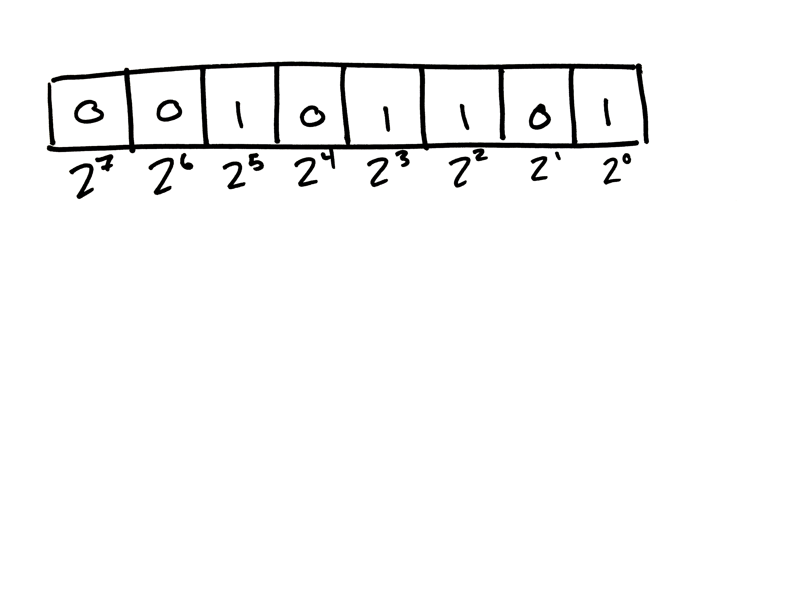

notes:
Who can tell me what decimal number these binary digits represent?

---

## Binary

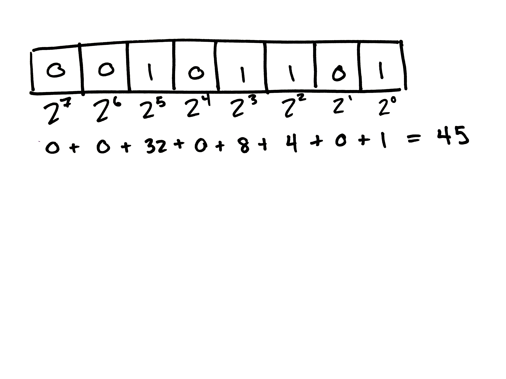

notes:
2 to each exponent is flipped on or off, then the on-values are added together.

---

## Binary

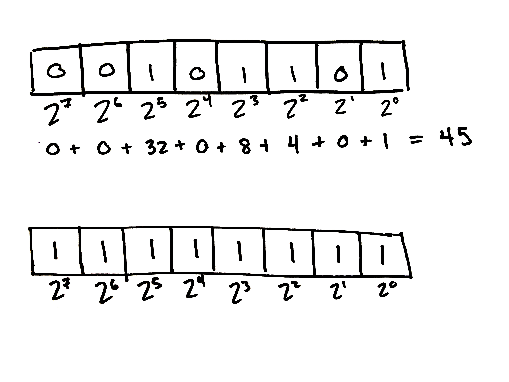

notes:
Who can tell me what these digits represent in decimal?

---

## Binary

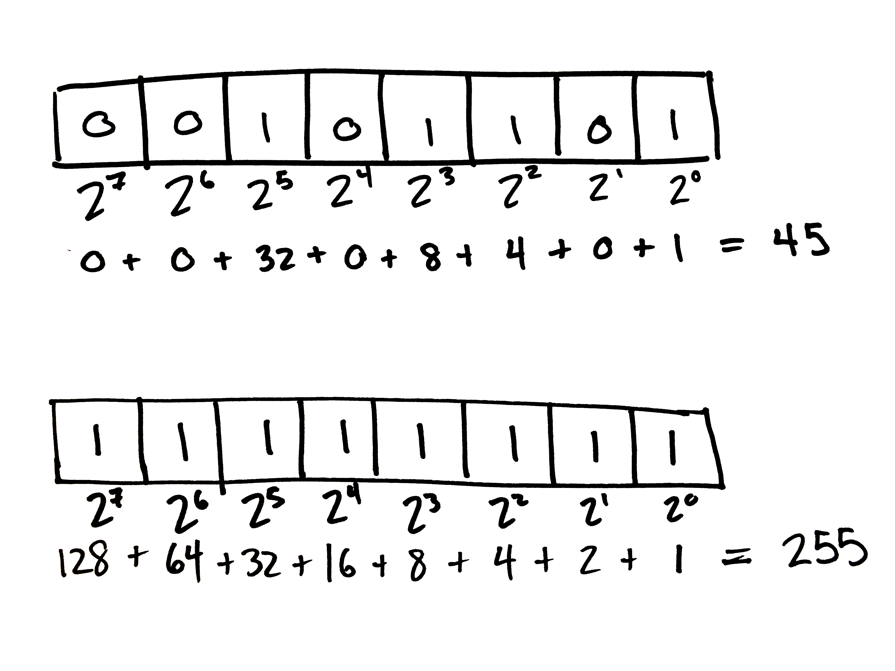

notes:
Computers use electrical current to turn millions of switches called "bits" on or off. They combine 8 bits together like this to make a "byte". 

---

```

390,1.83970e-003,-4.53930e-004,1.21520e-002
```

If we assume ASCII encoding, this becomes:

| | | |
|-|-|-|
|"390" <!-- .element: class="table-hl" --> |51 |57 |48 |
<!-- .element: style="margin-left: 0.2em;" -->


notes:
A string is not a number, but a list of characters. A character is a symbol represented by a unique byte as described in the ASCII table.

---

```

390,1.83970e-003,-4.53930e-004,1.21520e-002
```

If we assume ASCII encoding, this becomes:

| | | |
|-|-|-|
|"390" <!-- .element: class="table-hl" --> |51 |57 |48 |
<!-- .element: style="margin-left: 0.2em;" -->

Breaking this further down, we encode each character:

||||||||||
|-|-|-|-|-|-|-|-|-|
|51 <!-- .element: class="table-hl" --> | 0 | 0 | 1 | 1 | 0 | 0 | 1 | 1 |
|57 <!-- .element: class="table-hl" --> | 0 | 0 | 1 | 1 | 1 | 0 | 0 | 1 |
|48 <!-- .element: class="table-hl" --> | 0 | 0 | 1 | 1 | 0 | 0 | 0 | 0 |
<!-- .element: style="margin-left: 0.2em;" -->

---

```

390,1.83970e-003,-4.53930e-004,1.21520e-002
```

Then a string-to-float function translates the string "390" into a floating point number.

For a 32-bit, single-precision floating point number in the computer this looks like:

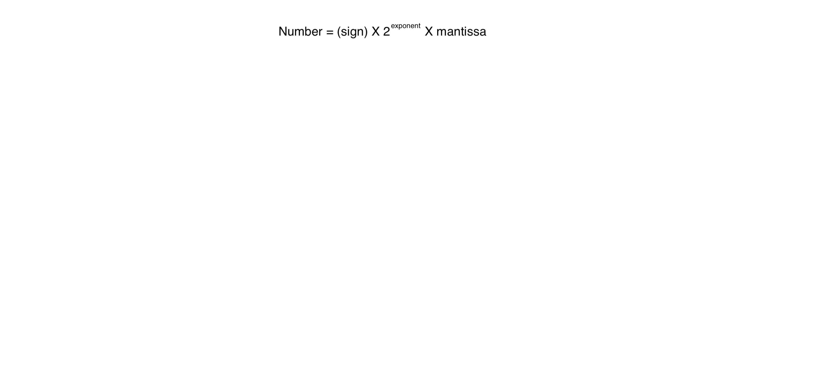

notes:
This is how our example would be stored as an IEEE754 Single precision 32-bit float. This IEEE standard for encoding floats tries to optimize for very small and very large numbers, with the understanding that computers cannot store infinite accuracy.

---

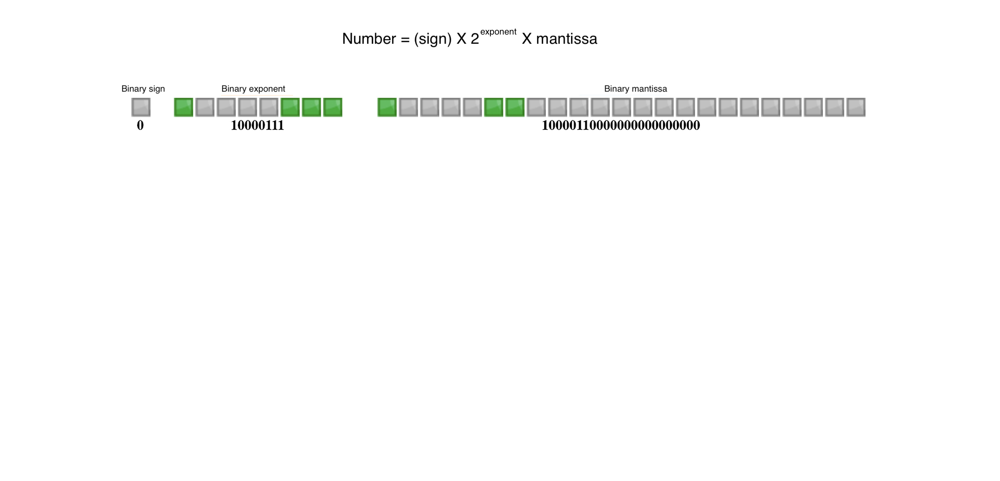

---

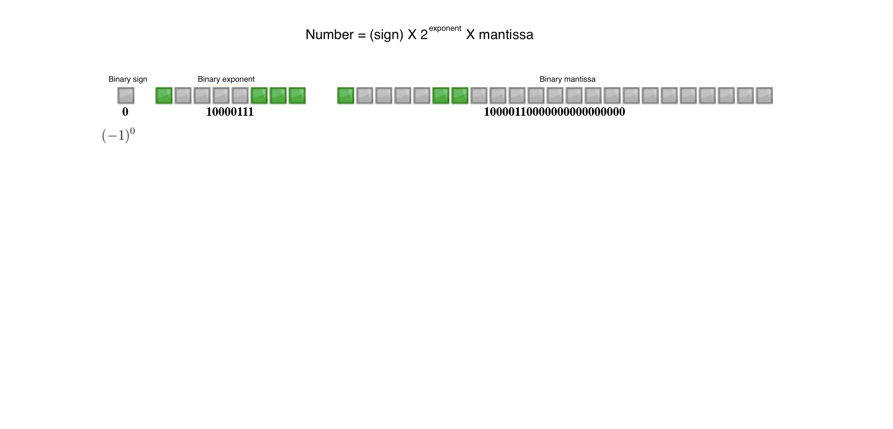

---

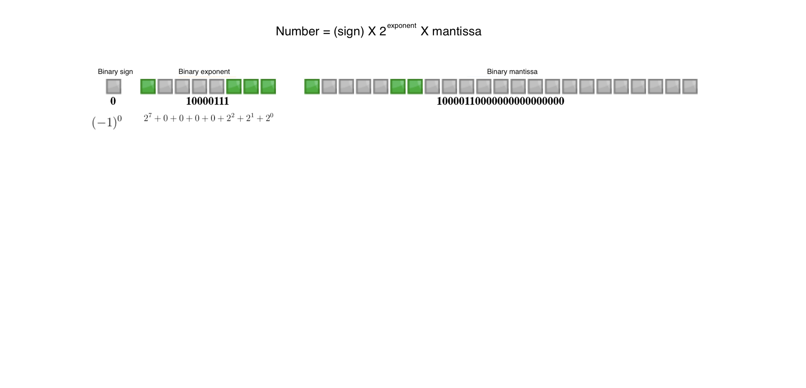

---

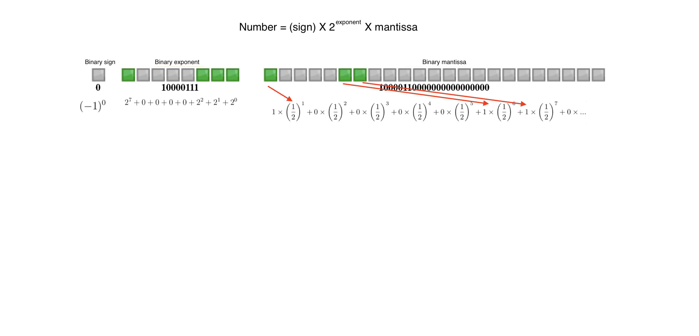

---


---

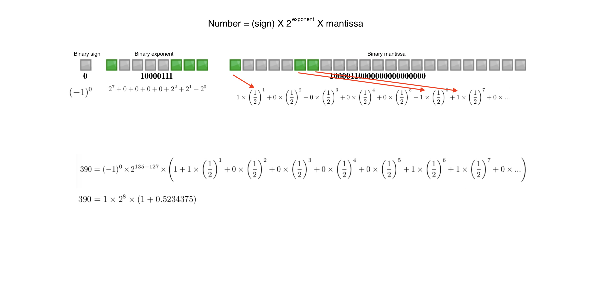

---
```

390,1.83970e-003,-4.53930e-004,1.21520e-002
```

|||||||||||||
|-|-|-|-|-|-|-|-|-|-|-|-|
| "1.83970e-03" <!-- .element: class="table-hl" -->| 49 | 46 | 56 | 51 | 57 | 55 | 48 | 101 | 45 | 48 | 51 |
<!-- .element: style="margin-left: 0.2em;"-->

And this is translated into a floating pointer number as well:

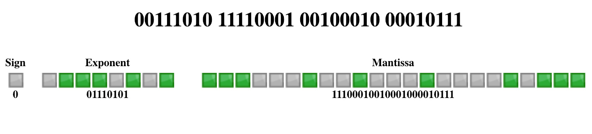

notes:
Point being, reading a CSV file is pretty processor intensive - so it's not a great format for huge datasets.
