## Annoucement

---

## Today's Main Topics

 * Colors - what are they really?
 * Color mapping - mapping data to colors
 * Visual Encoding in general
 * Python: More on data transformations (Pandas)
 * Python: Colors! (an introduction)
 
notes: 
in the homework you got to play with some raster image data AND started thinking about color representations of data

today we'll get into a bit more of the theory of this and play a bit more with colors

also, we'll dig more deeply into data with Pandas

---

## Last week

notes:
last week we covered the data management and practical programming aspects of data viz

---

## Today

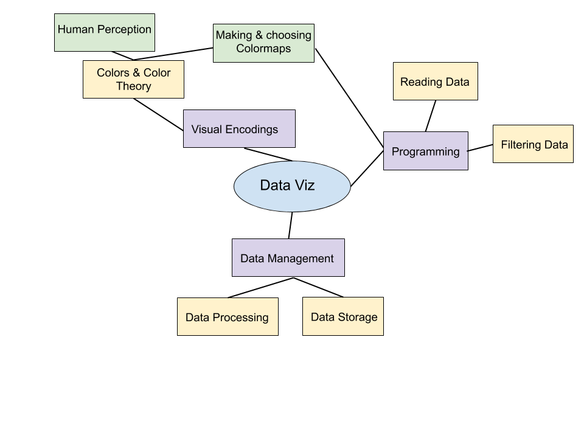

notes:
this week we will talk about how we can encode information about our data into visual ques

we'll focus mostly on color for this lecture but we'll briefly touch on a few other things.

---

 
 
 

# TOPIC 1: What is color?

---

## How Do Colors Work?

Rods (low-light) and cones (color) mediate vision. Humans have about 20 times
as many rods (120 million) as cones (6 million).

Cones see in the colors red, green and blue.

notes: so here is a little slice of you inner eye and you can see the rods and cones that are
responsible for seeing gray-ish (low light) and in color (cones)

---

## How Do Colors Work?

Rods (low-light) and cones (color) mediate vision. Humans have about 20 times
as many rods (120 million) as cones (6 million).

Cones see in the colors red, green and blue.

notes: here is that image again with an actual bit of the eye shown - the back of the
eye is where the optic nerve is & the front is where the choroid is

---

## Color Matching Function

The R,G, & B cones have different levels of responsiveness to different wavelenghts of light.

Below shows how responsive each type of cone is to a specific wavelength of light.

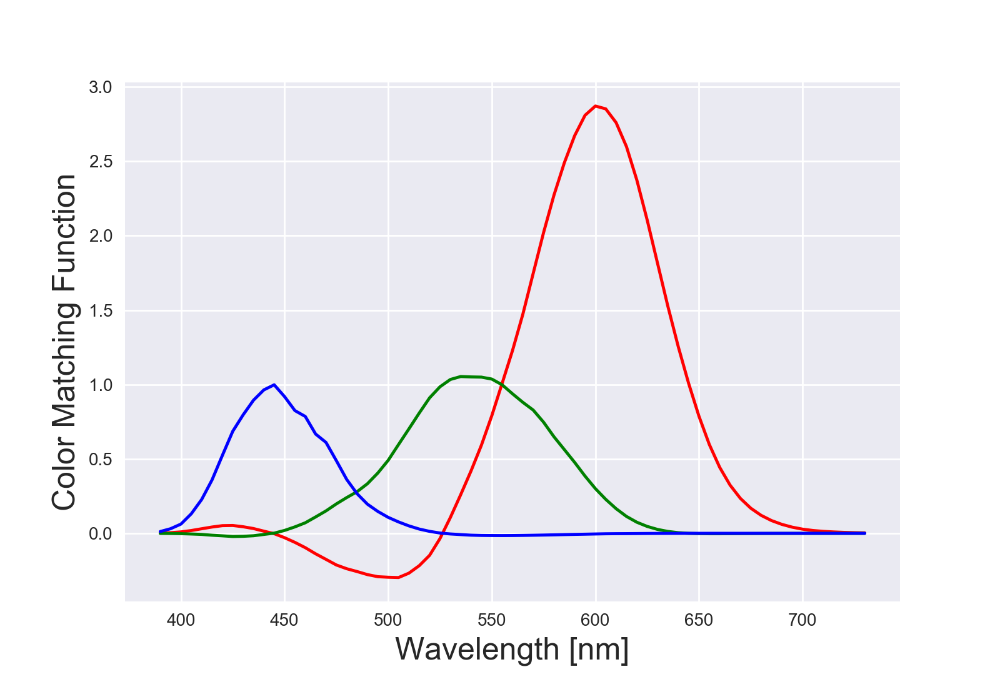

notes: here, you can think of this as how responsive your eye's cones are to different wavelengths.
You can see that your R cone is a lot more sensitive then there rest, especially at high wavelengths.

---

## Color Matching Function

The R,G, & B cones have different levels of responsiveness to different wavelenghts of light.

Below shows how responsive each type of cone is to a specific wavelength of light.

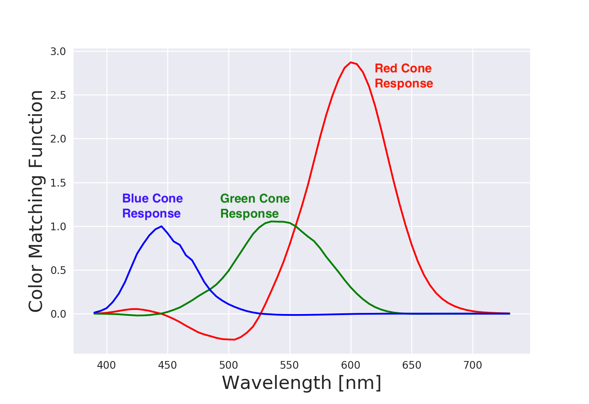

notes: here, you can think of this as how responsive your eye's cones are to different wavelengths.
You can see that your R cone is a lot more sensitive then there rest, especially at high wavelengths.

---

## Color Matching Function

The R,G, & B cones have different levels of responsiveness to different wavelenghts of light.

Below shows how responsive each type of cone is to a specific wavelength of light.

[Jupyter Notebook of Color Fundamentals](https://github.com/UIUC-iSchool-DataViz/spring2019online/blob/master/week05/color_fundamentals.ipynb)

notes: there is a lot more of this with links to research in this jupyter notebook

---

## "Naming" Colors

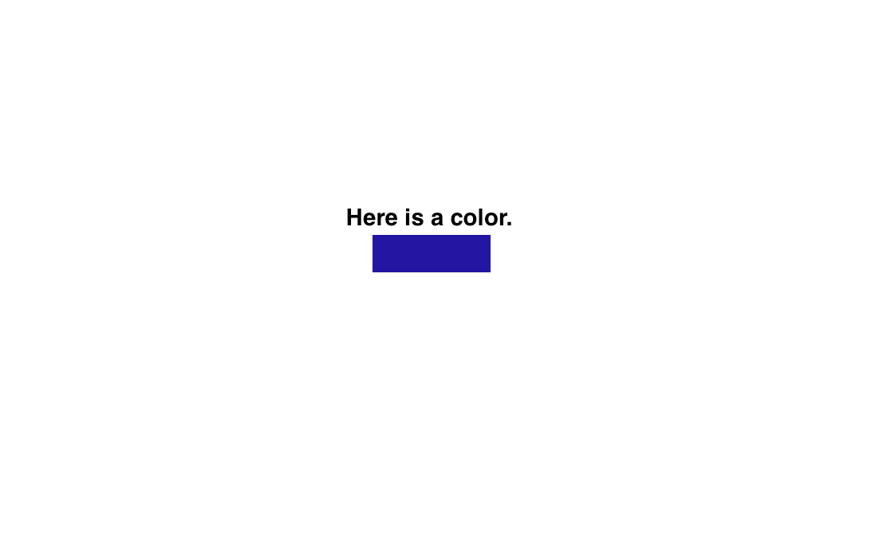

notes: so, we talk about how colors are named in different systems, and we'll cover the most basic here

---

## "Naming" Colors

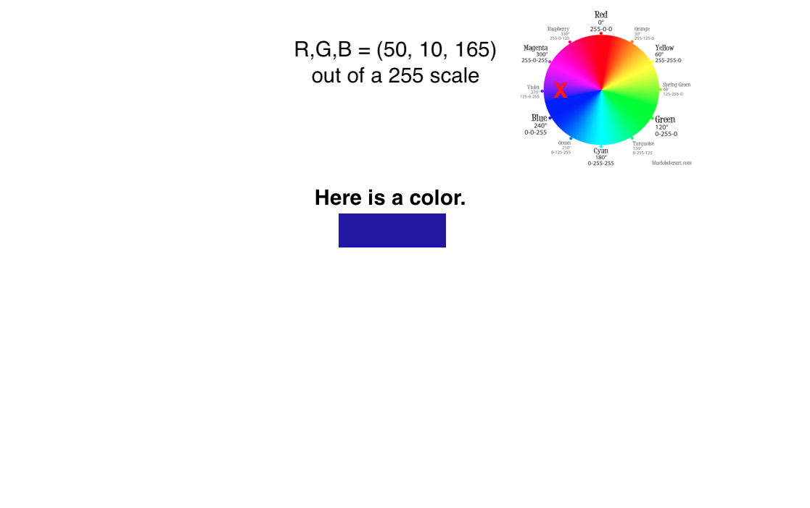

notes: since we have RGB rods and cones, we might think the most natural way to represent this is with RGB colors

This color wheel doesn't give an accurate depiction of all the colors in RGB space
(since the space is actually 3d), but it is often
what you'll see out in the real world, and its pretty easy to see where our example color lies.

This is the representation you played with in the HW for this past week.

---

## "Naming" Colors

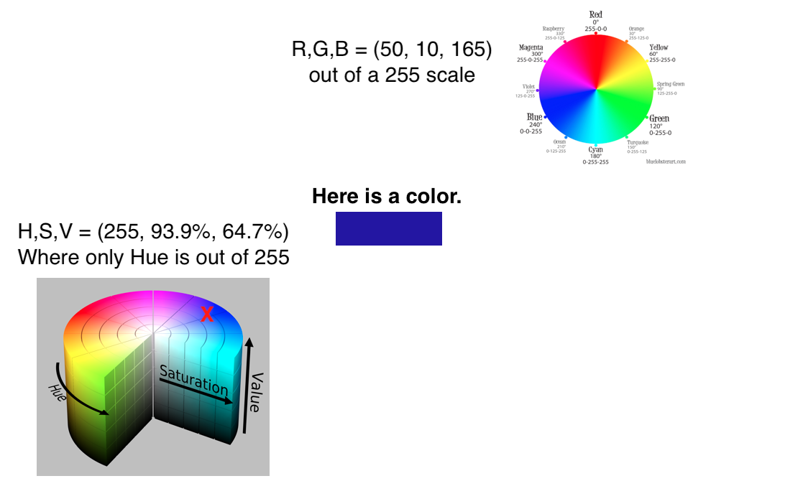

notes: another representation is Hue, Saturation, and Value

This depiction of HSV is in 3D here, and while its easier to visualize how colors change in the space, its
also hard to accurately mark where our specific one is.

---

## "Naming" Colors

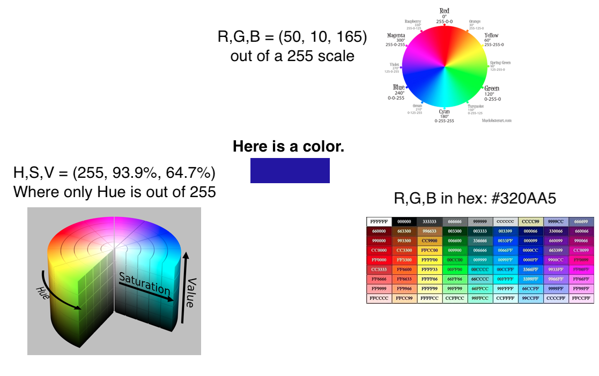

notes: here is another example - you'll see these codes a lot of you do html programming, but its another way to
specify colors with HEX numbers.  You'll note our color isn't listed here, but in a longer table it would be.

Hexadecimal only shows 16 million colors, RGB as uncompressed floats can theoretically represent quite a bit more (but there's a limitation of what monitors can display)

R = 2^8
G = 2^8
B = 2^8

RGB = 2^24 = 16 million

hexadecimal = 16^6 = 16 million

---

## "Naming" Colors: R,G,B Mapping

notes:
the mandrill image was an early color standardization image established by the Dept of Defense

Here we split it into its R, G, & B components

we can see different parts of this image are highlighted with specific colors -- red nose, blue/green cheeks/side of nose

---

## "Naming" Colors: R,G,B Mapping - Its limitations

<table><tr>
<td> sRGB - graphics RGB</td>
<td>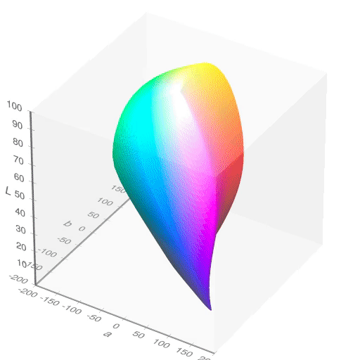 CIELAB - human RGB perception</td>
</tr></table>

notes:
this unified space of colors that works on most displays and printers is NOT the full range of human perception.

on the left we see the color space available on a typical laptop screen, on the right we see the full range of what a human can see -- this space is larger

---

## "Naming" Colors: HSV

### HSV Wheel

https://commons.wikimedia.org/wiki/File:HSV_color_solid_cylinder.png

notes:
you can see that saturation and value are linear axes while hue is cyclical.

---

## "Naming" Colors: HSV

(Cycle is though (1) H to change color, (2) S to change to grayscale, (3) V black to white)

notes:
This video scans through different hues, which are the part of the rainbow you want

Then different saturations, which is how vibrant or gray the colors are

Then different values, which is how bright or dark the colors are.

Allow to run first and then comment.

---

## "Naming" Colors: HSV

notes:
You might have actually played around with this system before if you've ever used a "color" picker app.

Here we see we have picked a "H" for Hue as red

We choose 50% saturation - i.e. how much of the color is in there where minimum is none of the color (gray)

We also choose 50% "L" which is sometimes called "V" for Luminiance which controls white-to-black

And here is one more channel = A for opacity.  Note that "A" sort of overlaps with both Saturation and Luminance so its usually not used to encode anything if we are using the others.

---

## "Naming" Colors: Beyond HTML HEX - Specific Names

<table><tr>
<td> HTML</td>
<td>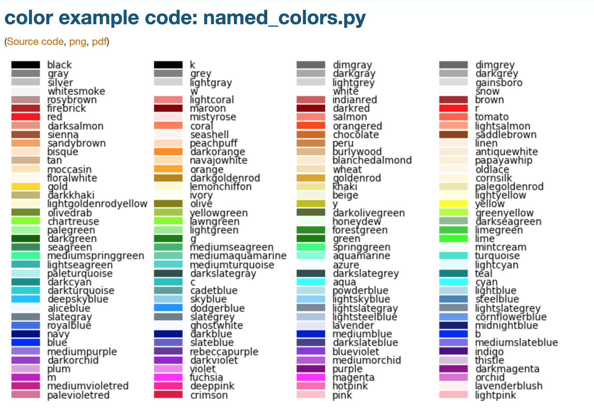 matplotlib</td>
</tr></table>

notes:
It's worth noting that "color words" are not consistent across languages or cultures. Color is a product of culture.

---

## "Naming" Colors: Summary

 * Color spaces 
   * HSV (Hue, saturation, value)
   * [CIELAB](https://en.wikipedia.org/wiki/CIELAB_color_space)
   * sRGB, Adobe sRGB
 * RGB triplets, sometimes compressed into hexadecimel ("#00FFAA", etc)
 * List of colors by name
   * [Web](https://www.w3schools.com/colors/colors_names.asp)
   * [matplotlib](https://matplotlib.org/2.0.2/examples/color/named_colors.html)

note: 
coding environments will often provide "named" colors if you're more interested in simplicity than flexible design
 
HSV is typically a color space used by color designers.

sRGB "standard RGB" is a color space that was standardized to unify different monitors and printers. 

CIELAB is the color space that covers the average of human vision.

---

## Importance of Color

Which image has the red dot?

notes:

why is color important? to see why...

lets play a game -- which image has a red dot?  yell out left or right

we'll see a series of images

---

## Importance of Color

Which image has the red dot?

<!-- .slide: class="two-floating-elements" -->

  

 

---

## Importance of Color

Which image has the red dot?

<!-- .slide: class="two-floating-elements" -->

  

 

---

## Importance of Color

Which image has the red dot?

<!-- .slide: class="two-floating-elements" -->

  

 

---

## Importance of Color

[https://www.csc2.ncsu.edu/faculty/healey/PP/#jscript_search](https://www.csc2.ncsu.edu/faculty/healey/PP/#jscript_search)

Color makes use of our "preattentive" visual cortex processing power -- we are able to detect color *before* our attention focuses.

notes:
which was the easiest one to do of these 3 images?

we can make thinks more/less complex with this game (that is part of your optional reading for this week)

---

 
 
 

# TOPIC 2: Color Maps

---

## Color maps = Visual Encoding

Color maps encode a data attribute as a color.

---

## Color maps = Visual Encoding

Color maps encode a data attribute as a color.

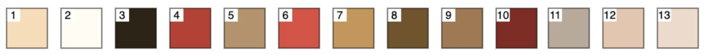

<table><tr>
<td>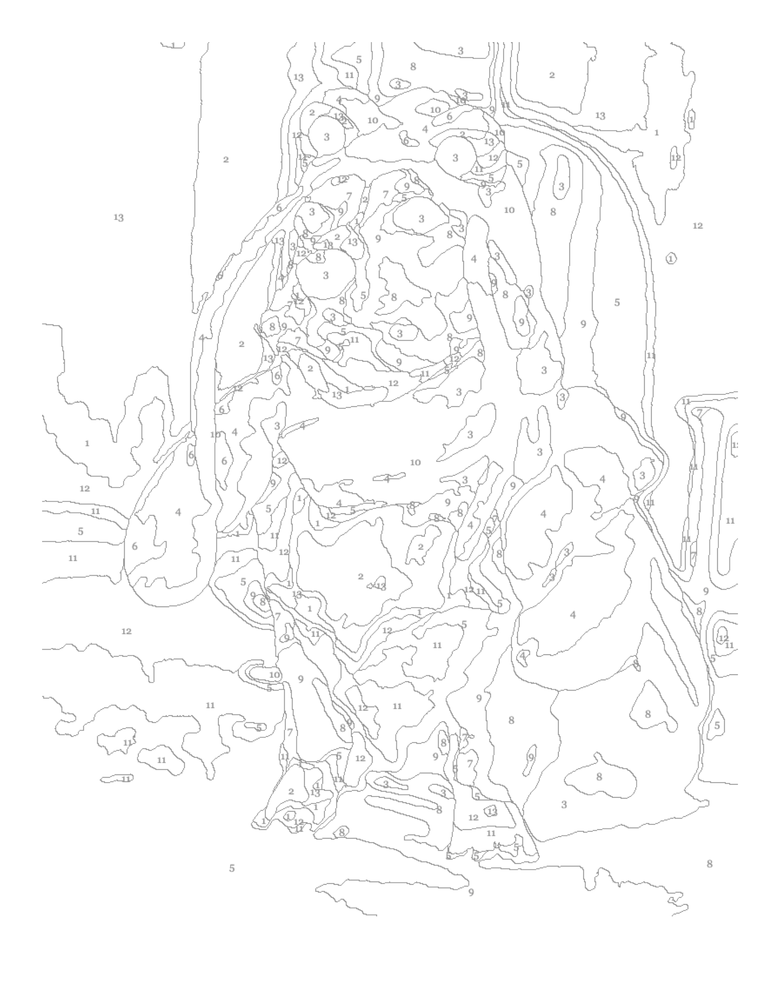
<td></td>
</tr></table>

notes:
you can think of it like a paint by numbers

Here I give you outlines of sections of the page that have data values, here the numbers 1-13 and I assign them a "palette" of colors.

---

## Color maps = Visual Encoding

Color maps encode a data attribute as a color.

<table><tr>
<td></td>
<td></td>
</tr></table>

notes:
Then I "paint" these colors on to make an image from my data

---

## Color maps = Visual Encoding

Color maps encode a data attribute as a color.

<table><tr>
<td>Colormap </td>
<td>Photo </td>
</tr></table>

notes:
Here I cheated a little bit and used a photo to generate my paint by numbers, so I get something back that looks like its photo

But note that these images are generated in very different ways

The colormap one was generated by a list of color values and instructions

The photo is generated by RGB color combinations at every pixel

---

## Color Palettes

Brewer, 1999

notes:
different kinds of color palettes can be used to describe different types of data

Here is a nice way of mapping out our options.  For example, binary (T/F or Y/N) is pretty easy to encode with 2 colors or luminance.

If we have 3 categories, we can choose different hues for qualatative data.

If we have sequential data, like height maps we can choose differences in Hues or luminance.

When we start combining them though, it can get a little more confusing -- for example diverging + sequential is a bit hard to parse

---

## Color Palettes

 * Resources:
  * [colorbrewer](http://colorbrewer2.org)
  * [palettable](https://www.palettable.io/) (package)

notes:
there are a million websites that allow you to create color palettes

for example, in color brewer you can see how your color choices will allow your user to see less/more detail (**click on "how to use"**). 

colorbrewer isn't showing actual data, but how color maps can make differences more/less apparent to viewer (**change colormap & outliers, take off borders to see**)

**Also click on paleetable to design your 5-color pallet**

---

## Ordered Colormaps

Historically, rainbows have been very popular.

notes:
which colors jump out at your the most?

---

## Ordered Colormaps

Historically, rainbows have been very popular, but they can be misleading.

notes:
Here is that same colormap converted to gray scale, and our intuition is true - our eyes are drawn to the luminacne values here, not only the hues

---

## Ordered Colormaps

Historically, rainbows have been very popular, but they can be misleading.

"Fixes" to the rainbow colormap are only so-so.

notes:
even if we try to make a perceptually uniform colormap, the results are underwhelming -- the "better" rainbow colormap looks a little muted and drab

---

## Ordered: Sequential Colormaps

notes:
one thing we can due is choose a hue and change the saturation or luminance -- here luminance

these are also known as monochromatic and are a subset of ordered colormaps

Here, the hue doesn't change, but the value (luminance) and the saturation do

---

## Diverging Colormaps

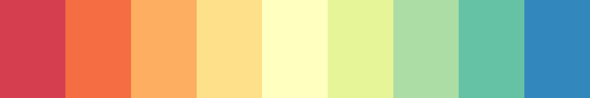

notes:
this shows you that different colors in the rainbow have different perceived brightness.

The outsides of this color map get darker while the center is brighter.

---

## Ordered Colormaps

Combinations of color can pick out different features at different scales.

<!-- .slide: class="two-floating-elements" -->

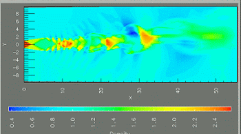

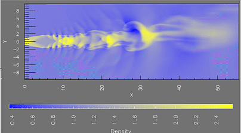

notes:
The differnet colormaps pick out changes at different scales.  The colormap with more hues heighlights the finer details of this simulation, while the colormap with only 2 hues shows off the larger scale structure.

---

## Qualitative Colormaps

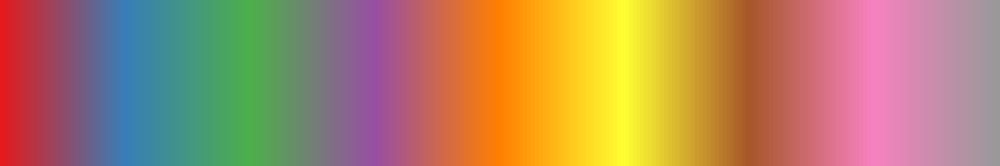

notes:
The blended areas of the continuous map here are kind of gross looking. This kind of random color map is best for categorical data that is NOT continuous.

---

## Color Meaning

<!---->

notes:
Which end of this is hot and which end is cold? What do red and blue mean?

red in the USA is bravery, but red in China is revolution

green in the western world is Christmas, but green in the eastern world is Islam

You're not always picking colors relative to each other, but relative to culture as well.

---

## Color Meaning

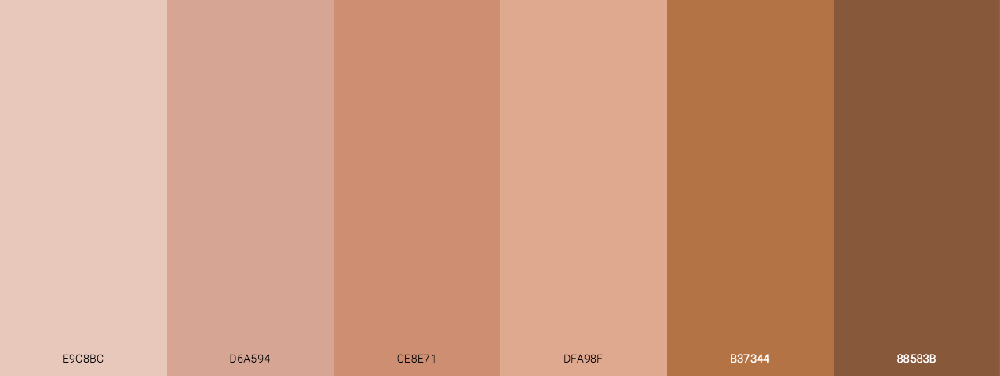

notes:
Human skin color is a particularly SENSITIVE area of color psychology. Western culture often treats dark colors as "mysterious" or "evil" and this is largely rooted in a history of racial bias.

---

## Just for fun: It's full of colors

https://commons.wikimedia.org/wiki/File:16777216colors.png

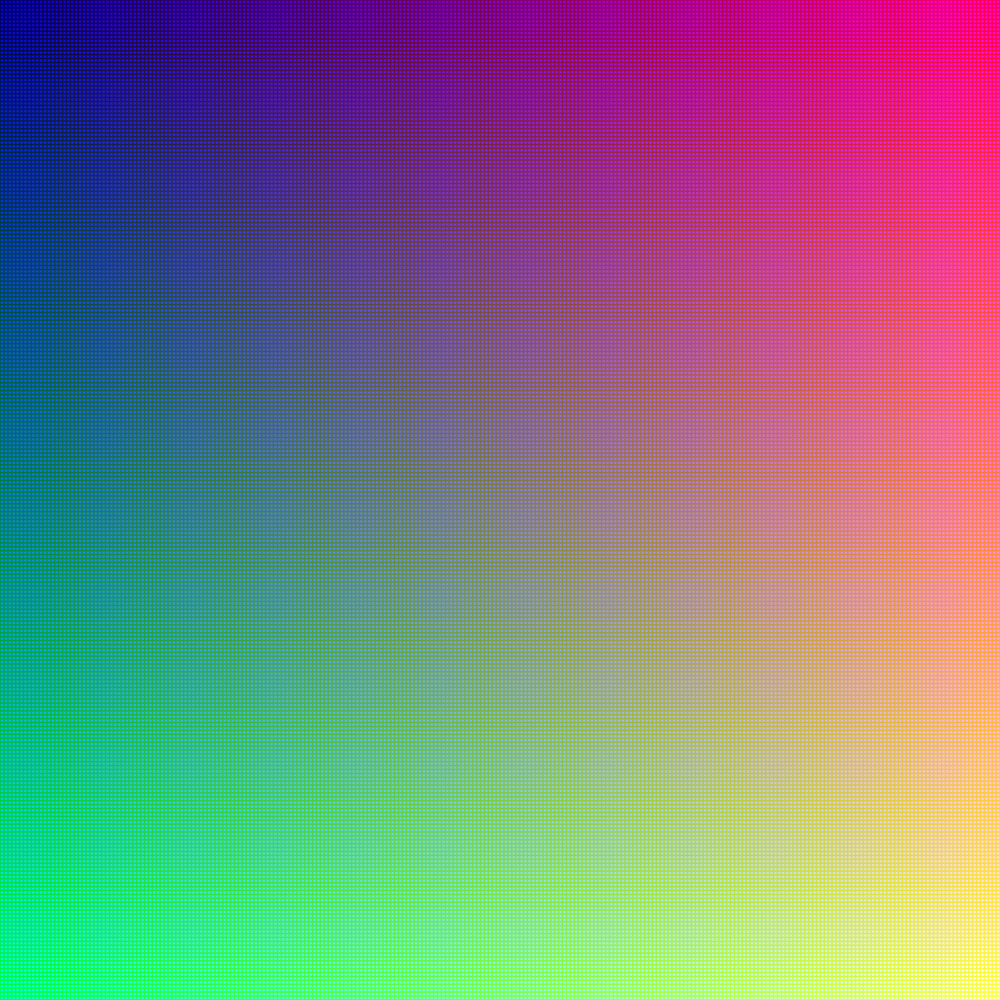

notes:
This grid is one way to show all the 16 million colors. They kind of get blurred out when looking at the image in this size, but if you zoom in at the link provided, you can see every pixel from red to green to blue, and from black to white.

---

## Pink: Is it a color?

Or, for that matter, where is brown or cyan in the spectrum?

https://gizmodo.com/if-the-color-pink-doesnt-scientifically-exist-why-can-1464266788

notes:
just a point of interest, what wavelength would you say magenta (or purple) is?

(spoiler alert: its basically R all the way on, and then G & B part on so its red + white)

Also talks about CMYK -- mixes light, RGB is mixing pigments

---

## Palette Mapping

Assign each value to a specific color or element.

---

## Palette Mapping

---

## Palette Mapping

---

## Color Mapping: Normalizing Our Data

$f(v) \rightarrow (R, G, B)$

We can also re-map:

$f(v') \rightarrow (R, G, B)$

$v' = f(v)$

For instance, with logs or squares.

notes:
We can fit our continuous distribution linearly to a color map - so a low data value is at the beginning of the color map, a high value is at the top, and a middle value is halfway up the map.

Or we can remap it with exponents, or other mathematical operations.

---

## Color Mapping: Linear Normalization of Data

We map from a range of values to (0, 1):

$ v' = (v - v_0)/(v_1 - v_0) $

notes:
in order to get the data values to line up with the color bar - which goes from 0 to 1 - we have to transform our data into a range of 0 to 1. This can be as easy as dividing all value by the largest value, or we can do fancier things.

---

## Color Mapping: RGB Components of Some Colormaps

---

## Color Mapping: RGB Components of Some Colormaps

<!-- .slide: data-background-image="images/gist_stern_colors.png" data-background-size="auto 65%" -->

---

## Color Mapping: RGB Components of Some Colormaps

<!-- .slide: data-background-image="images/gray_colors.png" data-background-size="auto 65%" -->

---

## Color Mapping: RGB Components of Some Colormaps

<!-- .slide: data-background-image="images/jet_colors.png" data-background-size="auto 65%" -->

---

## Color Mapping: RGB Components of Some Colormaps

<!-- .slide: data-background-image="images/magma_colors.png" data-background-size="auto 65%" -->

---

## Color Blindness

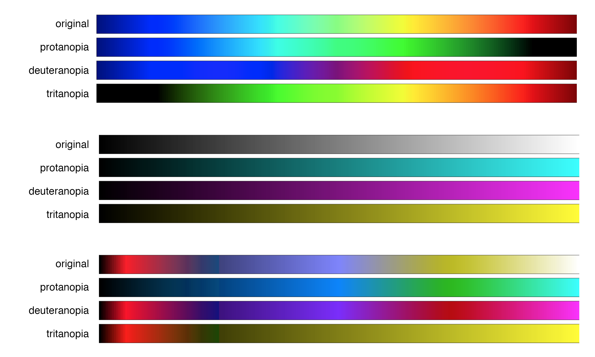

notes:
these are not the only types of color blindness, just the types where one of the three types of cone are missing. Sometimes that third cone is just "anomalous", and sometimes more than one cone is missing, but it's much rarer.

You can see that designing for a color blind person can be difficult if you put all the information into one cone. You catch a wider audience by using the colors between the cones, like yellow, cyan, and magenta.

protanopia = no red
deuteranopia = no green
trianopia = no blue

---

## Color Blindness

http://enchroma.com/test/instructions/

---

## Color Blindness - But wait!

http://enchroma.com/test/instructions/

There's more: https://nakeddata.org/2021/01/22/accessible-data-visualisation-beyond-colour-blindness/

Frank Elavksy (Staff Data Visualization Engineer + Designer on the Data Visualization team at Visa Inc.):
 * High contrast text
 * High contrast elements
 * Using texture, shape, units
 * Designing with zoom/magnification
 * Using Hierarchy and Focus
 * Using annotations or guides

notes: the focus on colorblindness in data visualization is at the expense of much more prevalent considerations like designing for low-vision folks

Elvansky suggests these other considerations are also extremely important to consider for folks that are visually impaired, a much larger portion of the population than those with colorblindness that are often ignored

---

 
 
 

# TOPIC 3: Other methods of visual encoding

---

## Other methods of visual encoding

<table><tr>
<td> Size</td>
<td> Density</td>
<td> Curvature</td>
</tr></table>

Check out [sc2.ncsu.edu/faculty/healey/PP](sc2.ncsu.edu/faculty/healey/PP) for more examples and research.

---

## Other methods of visual encoding

Motion is another channel, but is *very* attention-grabbing.

<table><tr>
<td> Flicker</td>
<td> Velocity</td>
<td> Direction</td>
</tr></table>

Check out [sc2.ncsu.edu/faculty/healey/PP](sc2.ncsu.edu/faculty/healey/PP) for more examples and research.

---

## Color as a Perception Channel

<!-- .slide: data-background-image="images/vad_slides_p51.png" data-background-size="auto 75%" -->

notes:
color hue, luminance and saturation make use of different "perception channels" listed here 

there are others that we intuatively use, like position, length, tilt, area, ect

These are ordered in terms of which are more effective to use -- i.e. which our brains has a better means of tracking -- for both numerical & ordered categorical data (ordered) and categorcial data that is ordinal (no obvious ordering)

---

## Color as a Perception Channel

<!-- .slide: data-background-image="images/stevensLaw.png" data-background-size="auto 75%" -->

notes:
without going into too much detail, this has to do with how different stimuli map to human perception -- often it is highly non-linear

For example, our sensation of electric shock is far more sensitive than just linear, but brightness is far less sensitive

Length is the most linear -- which is why bar charts are so effective for transfering information!

---

## Colormaps: Loading Data

Colormaps in Python - with the Michigan data and the scan data, we'll evaluate:

 * How to choose a colormap
 * What are some good "bounds" for that colormap
 * How do we set our color normalizations and transformations?

---

# To Python!

Let's also play with Pandas!

notes:
what we'll do is start of with some pandas stuff, since that will be useful for the HW and then circle back to color map stuffs

