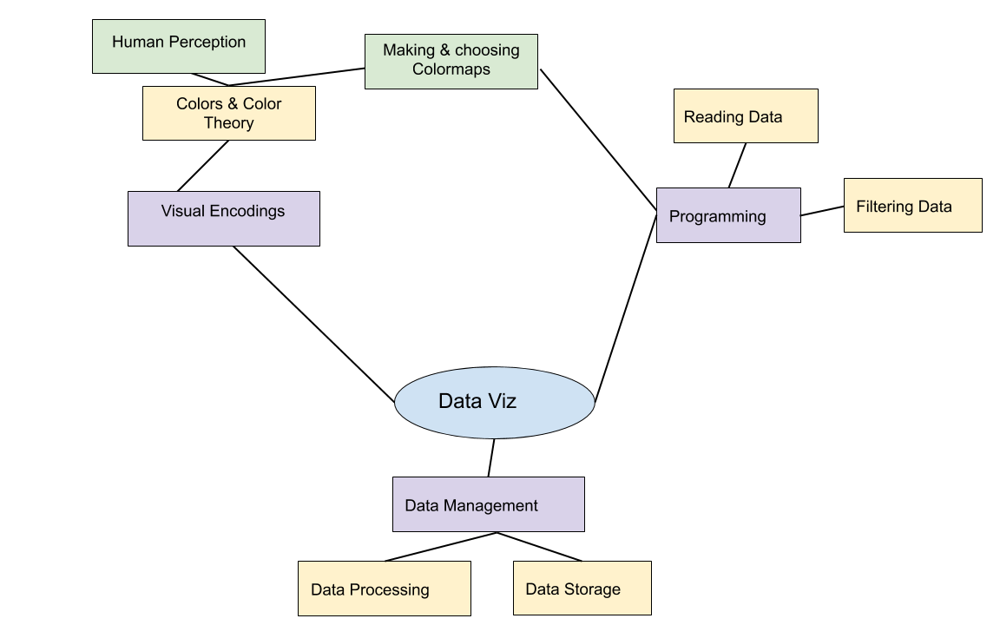
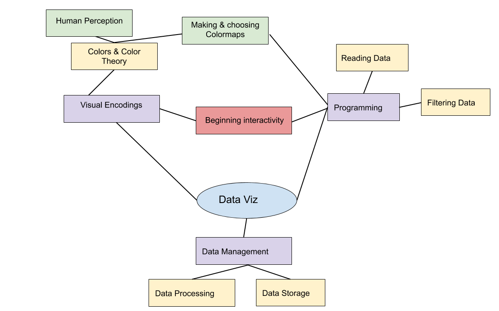

## Reminder: Modality Change Next week

No "live" class.

Recordings from last semester (+ some updated recordings).

In class notebook is already "filled out".

No prof. office hours next week.

*Will* be available on Slack!

---

## Today's Main Topics

 * ipywidgets
 * traitlets and IPython/Jupyter

These will build to the viz engine `bqplot` for next week and Javascript in the near future.

---

## Last week



notes:
last week we covered the data management and practical programming aspects of data viz

---

## Today



notes:
now we will start linking these concepts together with code

today will be very coding heavy so we will get lots of practice

---

## What is a widget?

<div class="fig-container" data-style="height: 650px;" data-file="figures/hsv_space.html" data-markdown=true>
</div>

notes:

Here is an example! (**don't start with hue!**)

order is:
1. hue
2. saturation
3. value
4. C - cyan
5. M - magenta
6. Y - yellow
7. Alpha - opacity
8. K - black

---

## What is a widget?

<div class="fig-container" data-style="height: 600px;" data-file="figures/example_coloring_image.html" data-markdown=true>
</div>

notes:
order is
1. R
2. G
3. B
4. A (alpha)

---

## What is a widget?

<div class="fig-container" data-style="height: 640px;" data-file="figures/apply_colormap.html" data-markdown=true>
</div>

notes:
I think the slider is V (value)

---

## What is a widget?

For the purposes of this class: a widget is a way to use Javascript to make interactive plots without having to learn much Javascript! 

(yet)

---

# Background: Object-Oriented Programming


notes:
While we won't be learning full JS just yet, we do need to have a bit of an understanding of object oriented programming to in Python "get" a lot of the ways we will be interacting with JS using Python.

We'll start conseptually and then put these ideas into practice.

What are some traits every vehicle has?

---

## Object-Oriented Programming

Vehicles:
 * number of wheels
 * color
 * weight

notes:
this set of traits won't necessarily be useful for things that aren't vehicles. 

---

## Object-Oriented Programming

class Vehicles:
 * int: number of wheels
 * string: color
 * float: weight

notes:
in object-oriented programming, we can use this "class" keyword to create a new object type "vehicle" which has traits that are the data types we're already familiar with - integers, floats, strings, booleans, etc.

This is like buying salad at the grocery store. You can either buy lettuce, onions, croutons, and dressing separately, or you can buy prepackaged salads with different combinations of those things already put together.

---

## Traits and Data

There are two underlying libraries we utilize for interactivity in Jupyter.
The first, `traitlets`, provides methods for datatype-verification and
"watching" for changes.

```#python
import traitlets

class MyObject(traitlets.HasTraits):
    name = traitlets.Unicode()
    age = traitlets.Int()

my_obj = MyObject(name = "Weezer", age = 26)
```
notes:
Before we dig into `bqplot` specifically, we will be examining a handful of methods by which we can provide interaction _as-is_ in Jupyter.

traitlets is a library that allows us to interact with the different attributes of a class.

datatype verification means that you check to make sure those attributes are the types you want them to be.

---

## Watching Traitlets

Once we have an object that has traits, we can watch that object for changes.

```#python

def name_changed(change):
    print(change['new'])

my_obj.observe(name_changed, ['name'])
```


---

## Watching Traitlets

Once we have an object that has traits, we can watch that object for changes.

```#python

def name_changed(change):
    print(change['new'])

my_obj.observe(name_changed, ['name'])
```

In this case, we are watching the trait `name` for changes.  When a change
occurs, the function `name_changed` is called.  The argument is a dict with
these values:

 * `new`: the new value the trait has
 * `old`: the previous value
 * `type`: the type of change
 * `owner`: the object that owns this trait
 * `name`: the name of the trait

notes: don't worry, this is just a quick overview and we'll get into more
details in the Python coding part of the lecture

---

## Widgets: Our old friends!

We can use the `ipywidgets` library to build out widgets in Jupyter notebooks.
These widgets can be quite extensive with many different operations;
additionally, they can have substantial CSS styling.


---

## Widgets: Our old friends!

We can use the `ipywidgets` library to build out widgets in Jupyter notebooks.
These widgets can be quite extensive with many different operations;
additionally, they can have substantial CSS styling.

We've used simple examples before.  For instance, we can create an interactive
function very easily:

```#python
import ipywidgets

@ipywidgets.interact(name = ['Weezer', 'Nerf Herder', 'Mustard Plug'])
def print_bandname(name):
    print(name)
```

This creates a dropdown that we can select an item from, which is supplied.
What this is doing implicitly is creating a widget with a `value` attribute,
and whenever that `value` is changed, the function is called again.

---

## Widget Types 1

Automatically creating widgets using `@ipywidgets.interact` is very handy and
useful for quick operations, but we can do this more deliberately as well.
There are a number of widgets available in `ipywidgets` already:

 * `IntSlider`, `FloatSlider`, `IntRangeSlider`, `FloatRangeSlider`,
   `IntProgress` and `FloatProgress` all display or allow the user to choose
   values.
 * `IntText`, `FloatText`, `BoundedIntText` and `BoundedFloatText` let the user
   input explicit values to a widget.

---

## Widget Types 2

There are additional widget types that can provide indicators or restricted
selections.

 * `ToggleButton`, `Checkbox` and `Valid` provide boolean indicators; `Valid`
   is read-only.
 * For selection, there are `Dropdown`, `RadioButtons`, `Select`,
   `SelectionSlider` and several others.
 * Strings can be provided using `Text`, `TextArea` and `HTML`.
 * Actions can be enabled through `Button` objects.

Widgets can also be laid out using `HBox`, `VBox`, `Tab`, and `Accordion`.

---

## Events and Linking

In addition to watching for changes, we can watch for events and we can link
two (or more) values between different widgets.  

The special method `on_click` on a `Button` allows for a function to be called
when something is clicked.  We can also link using `ipywidgets.link` and
supplying traits.  For example:

```#python
m = MyObject(name = "Weezer", age=26)
l = ipywidgets.Label()
ipywidgets.link((m, 'name'), (l, 'value'))

display(l)

m.name = 'Nerf Herder'
```

notes:
**Exercise:** Add a button and make this change occur when clicked.

---

## Reminder about the Reminder: Modality Change Next week

No "live" class.

Recordings from last semester (+ some updated recordings).

In class notebook is already "filled out".

No prof. office hours next week.

*Will* be available on Slack!

---

## To Python!

That all was a bit abstract, let's go through it again with Python.

