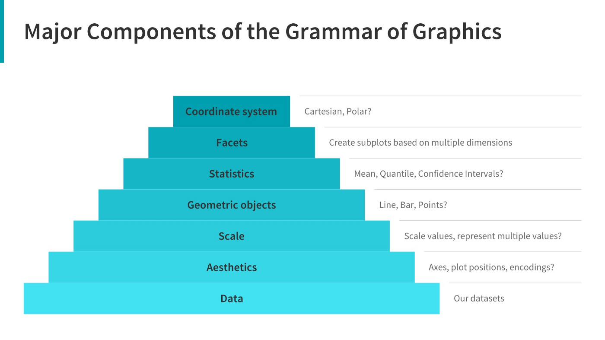
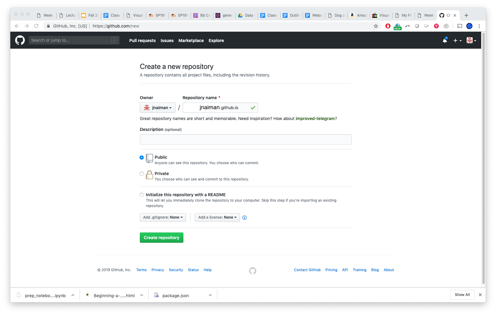
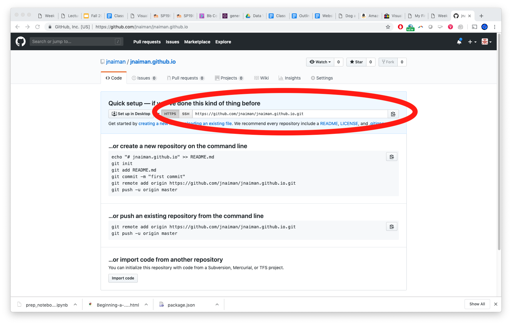
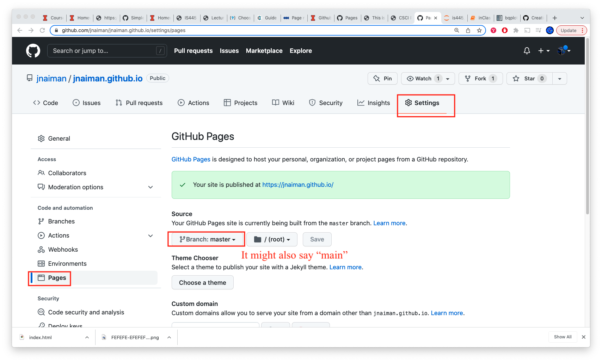

## Today's Main Topics

 * Grammar of Graphics & Imperative vs. Declaritive
 * bqplot
 * getting setup with github.io
 * Viz Platforms


notes:
bqplot!

---

## Where we are: Last week


notes:
last week we started linking together some visual encodings and programming concepts to build interactivity

---

## Where we are: This week


notes:
today we'll cover a new viz engine called bqplot (we've been using matplotlib as our main viz engine up until this point)

we'll also cover some concepts of grammar of graphics which is a way that many web-based viz engines are layed out

---

## On HW for the next two weeks

A few things to consider:

 * TurnItIn for homework #5
 * group option for homework #6

notes:
go over HW stuff

point out that HW this week is writing, talk about plagurism!!! be aware: we will have turnit in

mention that next week's (HW#6) is more coding based, and based on several concepts we'll talk about today if you want to get started on it early

there is a group option for HW6 -- go over this

---

<br />
<br />
<br />

# TOPIC 1: Imperative vs. Declaritive Viz Programming Languages

---


 * "_Declarative_ programming languages ... are rather like logics in that programs declare statements that are known to be true and relationships between these and other statements."
 * "_Imperative_ programming languages ... state what shall be done in given conditions. They start with an initial state and an explicit set of instructions that describe the process that will unfold."

[Reference](http://cfpm.org/~bruce/logreas/logreas_7.html)

notes:
so here are the definitions of declaritive vs. imperative

they are a little nebolous, but for reference we've been using mostly imperative programming for viz

you can think of imperative as a step-by-step reciepe and its usually what you'll run across in programming in Python

---

## Grammar of Graphics for Declaritive Viz

 * Declaritive viz "paints" graphics on a canvas elements common to all visualizations

<!--[](images/GoG.png)-->



[More info here](https://towardsdatascience.com/a-comprehensive-guide-to-the-grammar-of-graphics-for-effective-visualization-of-multi-dimensional-1f92b4ed4149)

notes:
declarative is more like painting, or linking different viz elements together like data and coordinates

---

## Pandas: Have been using mostly _Imperatively_

 * [pandas.pydata.org](http://pandas.pydata.org/)
 * Support for indexing, multi-indexing
 * Data structures
   * Series
   * DataFrame
   * Panel
 * Groupby, select, aggregation features
 * IO features
   * Reading/writing CSV, HDF5
   * Loading data from remote sources
   
notes:
these are just a few of the ways we've been using Pandas Imperatively

---

<br />
<br />
<br />

# TOPIC 2: Engines - bqplot

---

## Engines

This week we'll be looking at a new visualization engine.

 * `bqplot` - both imperative & declaritive methods

Next few weeks:
 * `vega-lite` - declaritive
 * `Altiar` - declaritive (built on `vega-lite`)
 
note:
full disclosure -- bqplot has a matplotlib-like, imperative, programming interface

however, we are going to focus on its declarative interface.  Why?  Because we'll be using other declarative viz engines in the next few weeks so its worth getting some practice here.

---

## bqplot

Our first engine, `bqplot`, is a Jupyter-based interactive plotting system.

It presents two principal interfaces:

1. `pyplot`-like interface, for making the transition from matplotlib easier
```#python
from bqplot import pyplot as bplt
bplt.figure(title='A Figure')
bplt.scatter(x_data, y_data)
bplt.show()
```
1. An object-oriented API for constructing interactive visualizations
```#python
scatter_chart = Scatter(x=x_data, y=y_data, scales={'x': x_sc, 'y': y_sc})
fig = Figure(marks=[scatter_chart], title='A Figure', axes=[x_ax, y_ax])
display(fig)
```

notes:
We will be using the latter far more frequently than the former.

---

## Why bqplot?

 * Has a "matplotlib" style similar to what we've been using thus far
 * Also has an option for the declaritive style of viz software like
 d3.js or tableau
 * Allows us to make NYTimes and 538-style visualizations efficiently, and
 without having to
 learn a lot of javascript

---

## bqplot

Now that we've learned a bit about widgets, we can start to dig into `bqplot`.
`bqplot` is based around traitlets and widget objects; every object you work
with will have traits and may be represented as a widget.

---

## bqplot

Now that we've learned a bit about widgets, we can start to dig into `bqplot`.
`bqplot` is based around traitlets and widget objects; every object you work
with will have traits and may be represented as a widget.

When we use `bqplot` we will be constructing `Figure` objects, which will
contain `marks` and `axes`.  To use these, we will build mark objects (`Bars`,
`Lines`, `Scatter`, `Map`, etc) and describe the relationship between points
using `Scale` objects.

---

## bqplot

Now that we've learned a bit about widgets, we can start to dig into `bqplot`.
`bqplot` is based around traitlets and widget objects; every object you work
with will have traits and may be represented as a widget.

When we use `bqplot` we will be constructing `Figure` objects, which will
contain `marks` and `axes`.  To use these, we will build mark objects (`Bars`,
`Lines`, `Scatter`, `Map`, etc) and describe the relationship between points
using `Scale` objects.

We will be building out these objects and their relationships to develop
interactivity.

---

## bqplot objects: Using Grammar of Graphics

notes:
so, some definitions we'll be using

---

## bqplot objects: Using Grammar of Graphics

 * A mark is some mechanism for displaying data.  For example, we might have
   data that has a set of x and y values, which we can use `Lines` to
   represent.

---

## bqplot objects: Using Grammar of Graphics

 * A mark is some mechanism for displaying data.  For example, we might have
   data that has a set of x and y values, which we can use `Lines` to
   represent.
 * `Scale` objects describe relationships between visual attributes (position)
   and data values.

---

## bqplot objects: Using Grammar of Graphics

 * A mark is some mechanism for displaying data.  For example, we might have
   data that has a set of x and y values, which we can use `Lines` to
   represent.
 * `Scale` objects describe relationships between visual attributes (position)
   and data values.
 * `Axis` objects are where data are placed.

---

## bqplot objects: Using Grammar of Graphics

 * A mark is some mechanism for displaying data.  For example, we might have
   data that has a set of x and y values, which we can use `Lines` to
   represent.
 * `Scale` objects describe relationships between visual attributes (position)
   and data values.
 * `Axis` objects are where data are placed.
 * `Figure` objects contain marks and axes, as well as interaction.

---

## bqplot introduction

Our first example will be a simple lineplot.
```#python
import bqplot
import numpy as np

# 1. data
x = np.arange(100)
y = np.random.random(100) + 5
# 2. scales
x_sc = bqplot.LinearScale()
y_sc = bqplot.LinearScale()
# 3. marks
lines = bqplot.Lines(x = x, y = y, scales = {'x': x_sc, 'y': y_sc})
# 4. sometimes interactive elements are defined around here
# 5. axis
ax_x = bqplot.Axis(scale = x_sc, label = 'X value')
ax_y = bqplot.Axis(scale = y_sc, label = 'Y value', orientation = 'vertical')

# finally: figure
fig = bqplot.Figure(marks = [lines], axes = [ax_x, ax_y])
display(fig)
```

notes:
walk through each line and say this order is pretty usual

---

<br />
<br />
<br />

# TOPIC 3: Getting setup with github.io

---

## github.io for publishing

Step 1: Create/login to your github account

notes:
(We'll also do this "live" in the coding section of class)

---

## github.io for publishing

Step 2: Create new repository


---

## github.io for publishing

Step 2: Create new repository


---

## github.io for publishing

Step 3: Name your new repository as ```[username].github.io```



---

## github.io for publishing

Step 3: Name your new repository as ```[username].github.io```


notes: the name is important here!!

---

## github.io for publishing

Step 4: Clone your repository


---

## github.io for publishing

Step 4: Clone your repository



notes: make note of your git name, we'll use this for "cloning" our github repo

---

## github.io for publishing

Step 5: Clone your repository
 * In command line do: ```git clone YOUR_REPO_LINK```

Step 6: Add an index.html file to this new folder, for example:

```{html}
<!doctype html>
<html>
  <head>
    <title>This is the title of the webpage!</title>
  </head>
  <body>
    <p>This is an example paragraph. Anything in the <strong>body</strong> tag will appear on the page, just like this <strong>p</strong> tag and its contents.</p>
  </body>
</html>
```

---

## github.io for publishing

Step 7: Add files to your repo officially
 * ```git add -A```
 
Step 8: Commit these files (say what you are doing)
 * ```git commit -m "my first add"```
 
Step 9: Push to your online repo
 * ```git push```
 
Step 10: wait for your website to build and then check it out!
 * Link: ```https://YOUR_GITHUB_USER_NAME.github.io/```

---

## github.io for publishing

Step 7: Add files to your repo officially
 * ```git add -A```
 
Step 8: Commit these files (say what you are doing)
 * ```git commit -m "my first add"```
 
Step 9: Push to your online repo
 * ```git push```
 
Step 10: wait for your website to build and then check it out!
 * Link: ```https://YOUR_GITHUB_USER_NAME.github.io/```
 
**You can also use the GUI interface for this if you want!**

An example from a DPI talk Prof. Turk and I gave [can be found right here](https://mediaspace.illinois.edu/media/t/1_a874v3q7).

notes:
you can also use the GUI interface to do this if you are more comfortable with that

---

## More info:

[https://pages.github.com/](https://pages.github.com/)


---

## Some things to keep in mind

 * You might have to set up a personal access token, see: https://docs.github.com/en/authentication/keeping-your-account-and-data-secure/creating-a-personal-access-token
 * You might have to specify a "branch" to build from: on your github.io code page go to Settings -> Pages and select "Branch:master"/"Branch:main" under "Source"



---

<br />
<br />
<br />

# TOPIC 4: Vizualization Engines

notes: this was something you will explore more in the HW but just to summarize formally some ideas you want to think about when looking at a new viz engine

---

## Evaluating Visualization Engines

 * Costs
 * Functionality
 * Aesthetics
 
notes: is this engine free or do you have to pay for it?  Does it do what I want?
Does its plots look like plots I want to make?

---

## Choices

 * Can I get ahold of this software?
 * Do I install it, or do I use it on a server?
 * What's the user interface like?
 * Is it declarative or is it procedural?
 
notes: in the HW you will look at several different forms of interfaces for making the same plot and thought a bit about how a user of the viz might go about making different plots and how some pathways to viz might be more or less intative for you and your given task 

---

## License: Software

 * What can you do with the software?
 * Can you study the software?
 * Who can you share it with?
 * Who can you give your derivative works to?
 
notes: while the viz engines we use in this class are generally open source, you may run into engines that are not or "somewhere in between"

In this case, you might have to think carefully about how you share your viz with others, you can use what you create? Can you actually study how the software works?

---

## License: Software

 * Copyleft: share and share-alike
 * Non-copyleft: share, but don't necessarily need to share-alike
 * https://choosealicense.com/
 
notes: this website has a bunch of "auto" generated licences, depending on what kind of license
you want *your* software to use

If you are ever in a position to create software, you can check this out to see what sorts of options you have.

Also, many of the open source packages we'll be using (including python) use a specific kind of license.  A lot of folks use the MIT licenses, fyi.

---

## License: Data

 * What can you do with the data?
 * How do you credit that data?
 * Can the data be redistributed, remixed, modified?
 * http://opendefinition.org/guide/data/
 * https://theodi.org/guides/publishers-guide-open-data-licensing

notes: additionally, the data that you chose to use might have a specific license.  So maybe you can use the data for your viz, but not share the data itself with others.

How can the data be modified?  Can you share the modified data?


---

## Accessibility

 * Is the software installed locally on your machine?
 * Is it hosted at a local or remote instance?
 * Who owns the visualizations, and how is access to them controlled?

---

## Interface

How do you interact with the software?

 * Declarative: how do you want the plot to look?
 * Imperative/Procedural: what are the steps to make the plot look that way?

---

## Evaluation: Costs

The "cost" of software is not exclusively the number of dollars you place on
the counter when you get a big cardboard box with marketing blurbs on the side.

Think about cost in several ways:

 * Monetary cost for *you* to use the software
 * Monetary cost for *someone else* to view your creations
 * Temporal cost of setting up
 * Cognitive cost for learning and using the system (documentation matters!)
 * Transmission cost for sharing your creations

---

## Evaluation: Aesthetics

Visualization is trendy.

When you construct something, think about the different ways it will be
interpreted:

 * How will the viewer understand the story of the data?
 * What will the _message_ of the visualization be?
 * Does the visualization say something about you and your handling of the data
   or utilization of tools?

---

# To Python for more interactivity!

---

