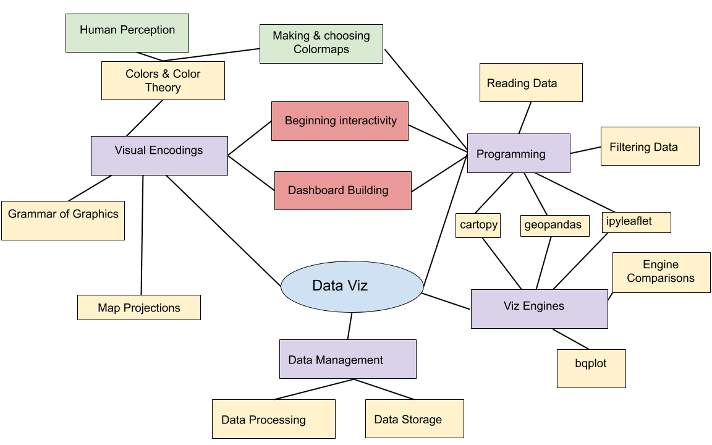
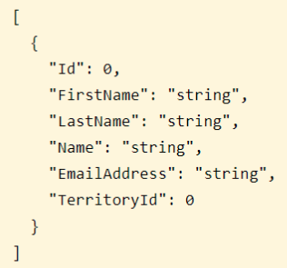

# Reminder: "Temperature Taking" Quiz

notes: talk about updates here!
 so far feed back is: 
 * a bit fast (notes about new upload times to github)
 * can we do final project alone? (yes!)

---

## Where we are: Last week


notes:
last week we messed around a bit with mappable data and made some interactive dashboards

---

## Where we are: This week



notes:
this week we'll talk a bit about map projections and a few specific engines

fyi -- we might not get to much of ipyleaflet and cartopy, but there are some extra notebooks from other years with more examples

---

## Today's Main Topics

 * Maps - in more detail
   * Projections
   * Coordinate Systems
   * Infoviz/Choropleth maps 
   * Plotting with CartoPy(?)
   * Plotting with ipyleaflet(?)
   * Plotting with geopandas
   * Geojson in general

notes:
in more detail: last week we started with maps and how we can use bqplot to do a lot of mapping type stuff

This week we will play with a few different mapping and viz engines and deal with the JSON and geo-json format for storing data

again, might not get to as much with cartopy/ipyleaflet

---

<br>
<br>
<br>

# Topic #1: Maps & their projections

---

## Maps

Thinking about map projections is important for GIS data, and generic global info viz.

Let's start by thinking about the fact that...

---

## Maps

Thinking about map projections is important for GIS data, and generic global info viz.

Let's start by thinking about the fact that...

The Earth is a sphere.

(Fun question: to what degree is it a sphere?)

Have you ever wrapped a piece of paper around a ball?

---

## Projections

To map from one system to another, we must "project" from the original sphere
to the flat object we are observing.

What are some things we could preserve during such a projection?


notes:
One common conversion from sphere to plane is the squashed cylinder approach

This can be used to conserve straight lines (distances)


---

## Projections


notes:
There's always a weird way to do it too. Here we're exploding the sphere into lots of 
mostly planar pieces that we can just lie out side-by-side.

This may preserve shape well, but it will be hard to use to navigate!

---

## Projections: Common Preservations

Typically, one or more of these will be preserved, or at least, the distortion
will be minimized:

 * Area
 * Shape (Conformal)
 * Distance

---

## Projections: Common Preservations

Typically, one or more of these will be preserved, or at least, the distortion
will be minimized:

 * Area
 * Shape (Conformal)
 * Distance

There are other properties that can be preserved, as well.  Typically, maps
will be a "compromise" between preserving different properties.

What happens when we preserve one property over another?

---

Mercator is a "conformal" projection.  What is wrong with this?

<!-- .slide: data-background-image="images/mercator.png" data-background-size="auto 80%" -->

notes:
conformal = shape preserving (at the expense of accurate size)

---

## Projections: Distortions

We can characterize distortions in a projection by examining how a known shape
appears on them.  The Tissot Ellipse of Distortion is a method of showing this
by drawing circles of a fixed radius and examining their elliptical distortion.


notes: so here for example, we see that the mercator projection has circles that
stay circles, though they change in relative size depending on where they are on the map

---

What do you notice?

<!-- .slide: data-background-image="images/mercator.png" data-background-size="auto 80%" -->

---

<!-- .slide: data-background-image="images/mercator_tissot.png" data-background-size="auto 80%" -->

notes:
Greenland and Antarctica are HUGE

---

<!-- .slide: data-background-image="images/transversemercator.png" data-background-size="auto 95%" -->

---

<!-- .slide: data-background-image="images/transversemercator_tissot.png" data-background-size="auto 95%" -->

notes:
this projection is most accurate near the vertical center line

---

<!-- .slide: data-background-image="images/lambertcylindrical.png" data-background-size="auto 95%" -->

---

<!-- .slide: data-background-image="images/lambertcylindrical_tissot.png" data-background-size="auto 95%" -->

notes:
Also known as "equirectangular", this is the favorite format of NASA because it's mathematically straightforward.

Note that the very top line of the image represents a single point on the globe.

---

<!-- .slide: data-background-image="images/mollweide.png" data-background-size="auto 95%" -->

---

<!-- .slide: data-background-image="images/mollweide_tissot.png" data-background-size="auto 95%" -->

notes:
this is considered a good compromise between shape-preserving and angle preserving - but it's not perfect at either.

---

<!-- .slide: data-background-image="images/sinusoidal.png" data-background-size="auto 95%" -->

---

<!-- .slide: data-background-image="images/sinusoidal_tissot.png" data-background-size="auto 95%" -->

notes:
this has even less distortion than mollweide, but the pointy ends don't feel very elegant and planet-like

---

<!-- .slide: data-background-image="images/gnomonic.png" data-background-size="auto 95%" -->

---

<!-- .slide: data-background-image="images/gnomonic_tissot.png" data-background-size="auto 95%" -->

notes:
this is another nightmare scenario like Mercator that was initially created for navigation. Straight lines on this map are the shortest route, but area, shape, and size are distorted.

---

## Discussion

What happens when we make a map that minimizes one region and maximizes
another?

---

## Discussion

<!--
<iframe width="1024" height="576" src="https://www.youtube.com/embed/vVX-PrBRtTY?rel=0" frameborder="0" allow="accelerometer; autoplay; encrypted-media; gyroscope; picture-in-picture" allowfullscreen></iframe>
-->

<iframe width="1024" height="576" src="https://www.youtube.com/embed/vVX-PrBRtTY?rel=0" title="YouTube video player" frameborder="0" allow="accelerometer; autoplay; clipboard-write; encrypted-media; gyroscope; picture-in-picture" allowfullscreen></iframe>

notes:
after watching this, it's useful to know that the Peters projection is actually flawed as a teaching tool because of how much it distorts the shapes of countries near the poles.

**pause recording!**

---

## Discussion

[The True Size Of...](https://thetruesize.com)

notes:
Let's go see what Greenland actually looks like ...

**did you remember to turn back on the recording??**

---

## Discussion

Why is Europe at the center of all the maps we've looked at?

---

## Discussion


notes: there is nothing specifically wrong with putting a pole at the center of the map

---

## Discussion


notes: also see here that now the equator is very distorted, and the south pole even more so!

---
## Discussion


notes: or why bother having a spherical or rectangular shape at all?

---

## Discussion


notes: look how here there is very little distortion of size or shape

---

## Maps: Coordinate Systems

Once we have our system of transformation, we need to have a method of
representing positions.

Three common baseline methods:

 * Spherical coordinates
 * Latitude and Longitude
 * Degrees, minutes, seconds

Take care with:

 * Zero points
 * North/South, East/West
 * Ranges

---

<br>
<br>
<br>

# Topic #2: Formatting for shape data

---

## JSON & GeoJSON



notes:
json is meant to be a way to store data that is "query" based - i.e. it lends itself to searches well

for this reason, it shows up in web development a lot

---

## GeoJSON


notes:
geojson is just a special json formatting for geographical data

it will specify the "shape" of the data file but also things like its default coordinate reference system which tells you something about the "center" and "stretch" of whatever it lists in its coordinates

---

## GeoJSON

<div class="left">

GeoJSON is:
* data format for encoding geographic data structures
* uses "geometries", "features" and "collections of features"
* seven Geometry types/objects
   1. Point
   1. LineString
   1. Polygon
   1. MultiPoint
   1. MultiLineString
   1. MultiPolygon
   1. GeometryCollection

</div>

<div class="right" markdown=1>


</div>


notes:
cite: https://image.slidesharecdn.com/geojson-170417122110/95/geojson-1-638.jpg?cb=1492431924

We will see a lot of Polygons & MultiPolygons.

---

## GeoJSON

Tips for dealing with GeoJSON:
 * use `.keys()` and progressively drill down to data of interest
 * look for location of `properties` and `features`

We will get practice at this during programming (and in extra notebook examples).

notes:
often our issue will be linking the information stored in JSON file formats with that of whatever plotting routine we are using

we'll get some practice with this in the coding portion of class

---

<br>
<br>
<br>

# Topic #3: Data & Viz Engines

---

## Access to geometry files

 1. GeoPandas
 1. Cartopy (extra)
 1. ipyleaflet (extra)
 
notes:
so, we'll mostly be using geopandas for this lecture, but there are other tools available like cartopy and ipyleaflet

If we have time, we'll go into those, but if not, they are in the extra prep notebook for today if you want to look on your own

---

## Geopandas


notes:
the calls for geopandas is going to look very similar to pandas calls!

---

## Geopandas

```python
gdf = geopandas.read_file('mapfile.geojson')
gdf.head()
gdf.plot()
```

notes:
very pandas-like calls we can use

---

## Geopandas

```python
gdf = geopandas.read_file('mapfile.geojson')
gdf.head()
gdf.plot()
```

Map information sources:
 * [https://datagateway.nrcs.usda.gov/](https://datagateway.nrcs.usda.gov/)
 * [US Census info](https://www.census.gov/geographies/mapping-files/time-series/geo/tiger-line-file.html)
 * [City of Champaign](https://gis-cityofchampaign.opendata.arcgis.com/)
 
notes:
we'll just touch on a few data sources, and you'll have the opportunity to explore a few more in the HW, specifically HW#8

---

## Geopandas + contextily


notes:
we'll also play around with using contextily to add backgrounds to maps

---

## Other Map Viz

 * Google Maps & Earth
 * WorldWide Telescope
 * CesiumJS
 * bqplot
 * Vega & friends
 * cartopy (see extra slides)
 * ipyleaflet (see extra slides)
 
notes:
I've added a few extra slides at the end of this slide deck about cartopy and ipyleaflet that we can look over if we get to those topics

otherwise they are left for your reference

---

# To Python!

---

---

## Intro to cartopy

CartoPy is a toolkit that builds on matplotlib to create fast, easy map
representations.

We will be relying on three key concepts:

 * Axes projections (similar to our polar projections)
 * Coordinate representations
 * Shapes

Using these, we will be able to build out many visualizations.

---

## CartoPy: Projections

We start out by constructing an axes in CartoPy that uses a given projection:

```python
import cartopy
import matplotlib.pyplot as plt

fig = plt.figure()
ax = fig.add_subplot(111, projection=cartopy.crs.Mollweide())
ax.coastlines()
```

---

## CartoPy: Coordinate Reference Systems

Transforming from a spherical reference system to a flat reference system is
the job of the projection; transforming from one discretization of a sphere to
another is the job of the coordinate system.

We can utilize Coordinate Reference Systems to describe the *input* coordinate
system and the *rasterization* system are described.

For example, there are several different ways to draw "straight" lines.  We can
do both `PlateCarree` and `Geodetic`.

```python
c_lat, c_lon = 40.1164, -88.2434
a_lat, a_lon = -18.8792, 47.5079
fig = plt.figure()
ax = fig.add_subplot(111, projection = cartopy.crs.PlateCarree())
ax.gridlines()
ax.coastlines()
ax.set_global()
ax.plot([c_lon, a_lon], [c_lat, a_lat], transform = cartopy.crs.PlateCarree())
ax.plot([c_lon, a_lon], [c_lat, a_lat], transform = cartopy.crs.Geodetic())
```

---

<!-- .slide: data-background-image="images/map_plot1.png" data-background-size="auto 95%" -->

notes:
the blue line is Plate Carree, which maintains a straight line on the lat-lon grid

the orange line is Geodetic, which maintains a straight line around the curvature of the Earth

---

<!-- .slide: data-background-image="images/map_plot2.png" data-background-size="auto 95%" -->

notes:
now even the blue line has some curvature because we are picking a best-of-both-worlds Mollweide projection that doesn't perfectly preserve angle or area.

---

## ipyleaflet

Leaflet is another mechanism of plotting, displaying and interacting with maps.

We will very briefly play with this in Python - could be of use for those that were having issues with cartopy.

