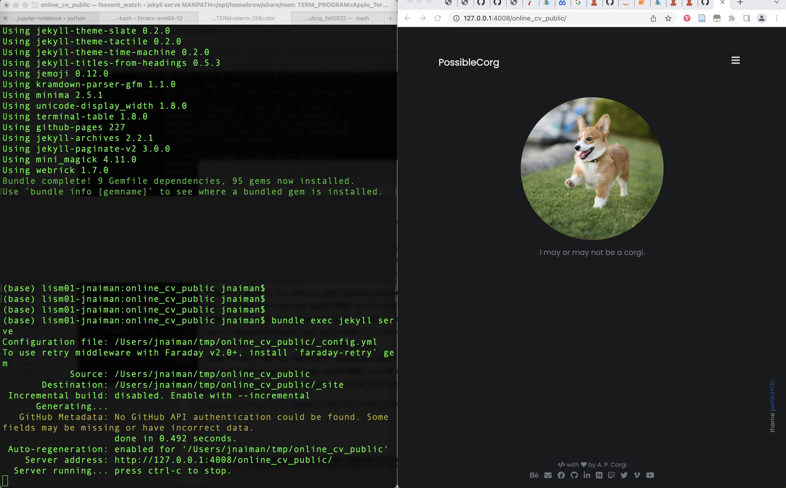

 
# Installation instructions: Ruby, Ruby Gems, Jekyll & Our Online Resume Template

## 1. Install Jekyll, Ruby & bundler

Follow the links for your system below.  **NOTE:** You will likely want to do this *outside* of your DataViz conda environment.

### General notes

If you already have Ruby installed (i.e. the "system" Ruby) -- *make sure you check the installation instructions for your relevant system anyway* -- it's possible you will want to install a non-system Ruby version.

If you already have Jekyll installed -- make sure it's the most recent version.

Pay attention if there are "next steps" listed after any of the commands, and make sure you do them.  

#### For example, **on a Mac** after brew installs you'll see:

```
==> Next steps:
- Run these two commands in your terminal to add Homebrew to your PATH:
    echo 'eval "$(/opt/homebrew/bin/brew shellenv)"' >> /Users/jnaiman/.bash_profile
    eval "$(/opt/homebrew/bin/brew shellenv)"
```

You need to run these two lines (echo and eval lines) in order to have the "brew" command in your path.

And after the Mac installation you'll see the instructions (for the .zshrc shell its a little different):

```
echo "source $(brew --prefix)/opt/chruby/share/chruby/chruby.sh" >> ~/.bash_profile
echo "source $(brew --prefix)/opt/chruby/share/chruby/auto.sh" >> ~/.bash_profile
echo "chruby ruby-3.1.2" >> ~/.bash_profile # run 'chruby' to see actual version
```

Make sure you run these as well and re-open a Terminal window so that the relevant packages will be in your path *or* you can do `source ~/.bash_profile` (bash)/`source ~/.zshrc`(zsh).


### [Instructions for Macs](https://jekyllrb.com/docs/installation/macos/)

For Macs you may have to also install bundler: `gem install jekyll bundler` instead of just Jeykll (`gem install jekyll`), but first try to run the test webpage without this extra install and see if you get any errors.

See above notes about making sure to run a few things in your Terminal window after your install.

#### Tips & Tricks for Macs

1. If you see `ld: symbol(s) not found for architecture arm64` or something similar.
 * Try installing ruby with `ruby-install ruby -- --enable-shared`

### [Instructions for Windows](https://jekyllrb.com/docs/installation/windows/)


#### Tips & Tricks for Windows
 1. Make sure you follow *all* the steps, all the way until the end of the page -- you also have to do things like install bundler.


### [Instructions for Ubuntu Linux](https://jekyllrb.com/docs/installation/ubuntu/)

### [Instructions for Non-Ubuntu Linux](https://jekyllrb.com/docs/installation/other-linux/)


## 2. Get Online Resume Template

**Notes for Windows install:**
 * You need to have git installed - <a href="https://git-scm.com/">download link here</a>.  You will have to restart your computer.
 
For Mac, you should have git already installed (but you can install it [here](https://git-scm.com/download/mac) just in case).

**Step 1:** Clone this repository using `git clone https://github.com/jnaiman/online_cv_public.git` in a Terminal or Anaconda Prompt


You can find this repository URL by navigating to the [online template GitHub repositor](https://github.com/jnaiman/online_cv_public) and copying the URL under the green "Code" button/dropdown.

**Step 2:** change to this directory with `cd online_cv_public` in the Terminal/Anaconda Prompt


**Step 3:** build the Jekyll page with `bundle install` in the Terminal/Anaconda Prompt


You should see this at the end of the bundle command.

**Step 4:** Serve the site locally with `bundle exec jekyll serve`


**Step 5:** Navigate to the URL listed in a Chrome or Firefox browser -- in the above image this is `http://127.0.0.1:4008/online_cv_public/`.  You should see teh following page pop up:


**Step 6:** Take a screenshot of a side-by-side of your running Terminal/Anaconda Prompt and the served webpage like so:



This screenshot serves as your submission for this portion of the homework assignment.


