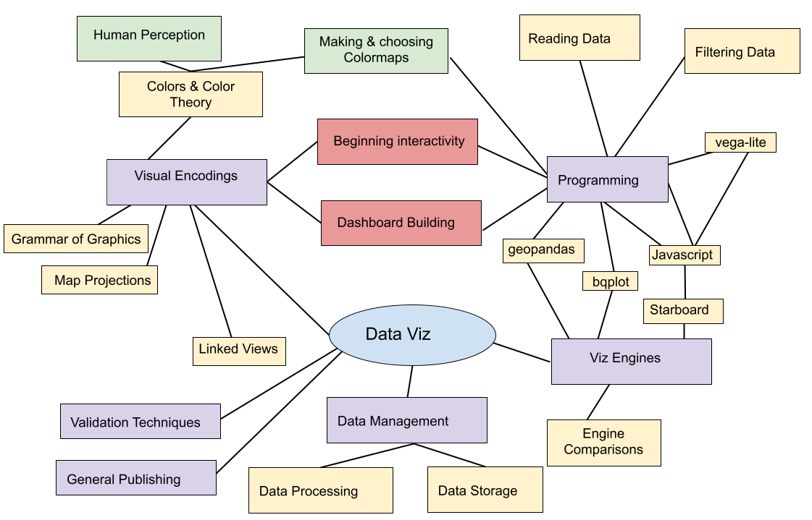
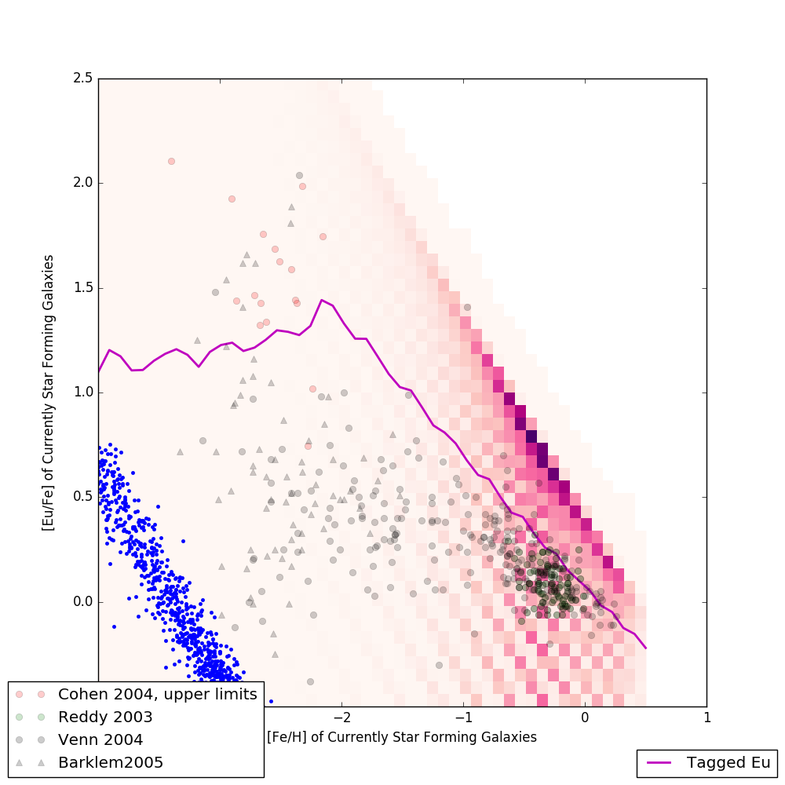

## Many thanks to folks that filled out the survey!

notes:
 * speed --> a bit fast to too fast to a bit slow
 * homeworks --> they are meant to challenge you, *but* we expect many folks to reach out in Slack/OH!

---

## Last Week



---

## This Week


notes:
this week we will discuss how one has to consider the audience of their visualization - is your audience you? your peers? others?

we'll start linking stuff together in vegalite

if we have time after doing a few more things with javascript & vega-lite, we'll start in on doing a few things with Jekyll

---

## Today

 1. Viz for Self/Peers/Others
 1. Review about final projects
 1. More `vega-lite` - transformations and calculations
 1. More programming in Starboard
 1. Intro to Jekyll (if time)

note:
we will probably not get to Jekyll until next week or week after -- thanks for all of your installation efforts!

---

<br />
<br />
<br />

# TOPIC 1: Viz Audience

---

## Three Classes of Visualizations

1. Viz for Self
1. Viz for Experts
1. Viz for the Public

---

## Viz for Self

There are no rules!


notes:
Labels don't matter. Colors don't have to look nice. Interactivity doesn't have to be fast. Here we are just trying to get something on screen that represents the data. Often this is challenge enough.

As the designer, you know what choices you have made, so "elegant design" isn't a huge deal - although don't go too crazy or you could make things more confusing for yourself.  

---

## Viz for Self


notes:
This is an example from AJ (the in-person instructor). He uses 3D software like Houdini in his "everyday" life and so this is his software of choice.  Here, he used 3D software to make a 2D plot, and arranged points to look like a bar chart even though they were rendered as individual points - aka a scatter plot.

It just had to work, and we used the most convenient software.

---

## Viz for Self


notes:
Here are some examples from my work

There are plots of data from a large scale simulation of the universe.  Here, I'm curious about how the average number of elements heavier than helium in our simulation changes over time.

---

## Viz for Self

name of: L25n512TNG_shenplot_STARS_ylimn0p5_bins_largeEu_1e2_nx050_ny050_sn099.png



notes:
You can even tell from the name of the file (which runs off the page here) that I'm playing with a bunch of things.  For example I'm plotting here stars, but there is no way you'd really get that from the actual plot itself.

These are plots that show an example of how one might "explore" the data - look for relationships.

---

## Viz for Self

Later this became (viz for peers)


[Paper if you're really curious](https://arxiv.org/pdf/1707.03401.pdf)

notes:
later, that plot became this plot right here which can be thought of as viz-for peers

While its probably not something that you all understand (unless there are some astronomers in our midst) - you can see I'm more careful here about fonts, presentatin, color schemes and actually labeling things


---

## Viz for Self

Let's talk about exploration.

 * What are characteristics of data that would influence how you visualize it?
 * What information do you have that would be visually interesting?
 * What information do you not have that you need to understand the importance of the data?

Example: A banking database where each record is a bank transaction and the fields include date, deposit or withdrawal amount, customer id, and the interest rate of the account.

notes:
some questions you want to be asking while you are exploring your data with the intent to visualize it

in these examples -- what do you think are some interesting things to visualize? what information would a consumer of your viz need to know?

---

## Viz for Self

Let's talk about exploration.

 * What are characteristics of data that would influence how you visualize it?
 * What information do you have that would be visually interesting?
 * What information do you not have that you need to understand the importance of the data?

Example: A spreadsheet of experimental crop growth measurements where each record is a measurement, and the fields include date, plant species, plant id number, number of leaves, plant height, number of internodes, and average leaf length.

notes:
internodes = the number of "generations" of a plant, aka how many branches come off the main stem.

in these examples -- what do you think are some interesting things to visualize? what information would a consumer of your viz need to know?


---

## Viz for Self

Let's talk about exploration.

 * What are characteristics of data that would influence how you visualize it?
 * What information do you have that would be visually interesting?
 * What information do you not have that you need to understand the importance of the data?

Example: A computational simulation of a galaxy where each record is a timestep in the evolution of the 3D grid, and the fields include time, X position, Y position, Z position, gas density, gas temperature, gas metallicity, and number of stars.

notes:
in these examples -- what do you think are some interesting things to visualize? what information would a consumer of your viz need to know?


---

## Viz for Self

What do you want to get out of visualization for yourself?

 * Do you want to find meaning?
 * Do you want to understand how to guide further visualizations?
 * Is the story you want to tell already known to you?
 * What __shortcuts__ can you take?

notes:
shortcut ideas ... subsampling, delete unused fields, use a simpler tool, manually select outliers by hand instead of doing it procedurally

forget labels that others have to figure out

don't worry about color schemee

---

## Viz for Experts

To design a visualization for experts, you need to analyze how they process information.

 * What do they know?
 * What conventions will they assume?
 * Are they able to fill in the blanks of information?

---

## Viz for Experts


notes:
Here's a series of visualizations made by or for domain experts that AJ just had lying around on his laptop.

What are some things you notice they have in common?

---

## Viz for Experts


notes:
Here's a series of visualizations made by or for domain experts that I just had lying around on my laptop.

What are some things you notice they have in common?

---

## Viz for Experts


notes:
Here's a series of visualizations made by or for domain experts that I just had lying around on my laptop.

What are some things you notice they have in common?

---

## Viz for Experts


notes:
Here's a series of visualizations made by or for domain experts that I just had lying around on my laptop.

What are some things you notice they have in common?

---

## Viz for Experts


notes:
Here's a series of visualizations made by or for domain experts that I just had lying around on my laptop.

What are some things you notice they have in common?

---

## Viz for Experts

Experts often want to interrogate the data themselves.

How can they do that?
 * Linked Dashboards
 * Side-by-side comparison plots
 * Text annotation with specific values listed
 * Color bar annotation

notes:
ask students - other ideas? what about interactivity? (Interactivity needs to be decent)

---

## Viz for Experts

Experts are looking to isolate variables to make scientific conclusions.

How can we make visualizations more analytical?
 * Reduce the dimensionality of the image (slices)
 * Viewpoint from "outside the box"
 * Extremely high contrast color choices (or highlight different features)

notes:
ask students - other ideas? What about animated data?

---

## Viz for the Public

This is what you're most accustomed to, because usually YOU are the public.


notes:
Who here is an expert on the historical accuracy of movies? Do you think this visualization was created for those experts? Or was it created for you? How can you tell?

---

## Jargon

<iframe src="https://player.vimeo.com/video/206139648" width="640" height="360" frameborder="0" webkitallowfullscreen mozallowfullscreen allowfullscreen></iframe>
<p><a href="https://vimeo.com/206139648">Jaret before and after</a> from <a href="https://vimeo.com/aldacenter">Alan Alda Center</a> on <a href="https://vimeo.com">Vimeo</a>.</p>

notes:
so here is an example of a scientist and, in a typical scientist fashion, using a  lot of jargon

but then after taking some improv he's able to communicate more effectively to the public

---

## Jargon

Definition: Special words or expressions that are used by a particular profession or group and are difficult for others to understand.


notes:
When working with experts on their data, they will often try to use words that are specific to their field. As a data communicator, it's your job to decipher that jargon and make it more approachable to the public.

---

## Jargon


[xkcd.com/1133](https://xkcd.com/1133/)

notes:
This XKCD webcomic makes fun of how much jargon scientists use. He tries to explain NASA's Saturn V rocket using only the 1000 most common words in the English language. 

He actually wrote a whole book about science this way called "Thing Explainer."

---

## Jargon

[Simple Writer](https://xkcd.com/simplewriter/)

notes:
And here's a neat tool he created to help you write your own!

Before:
"The Advanced Visualization Lab creates cinematic treatments of supercomputer data for immersive displays."

After:
"The very good picture making team creates movies of huge computer information for screens you can be inside of."

---

## Storytelling

Let's just get it out there: humans don't respond to data. They respond to stories.

Which of these do you care about more?
 * Global average atmospheric carbon dioxide is 405 ppm.
 * Polar bears are dying because the ice they use to hunt is melting.

notes:
In visualization, we really want to tell a story, not just a list of facts.

**plug for data storytelling class!**

---

## Storytelling

Why is that?

 <!-- width="1000"/>-->

notes:
Emotional response to storytelling is an evolutionary trait humans developed to form stronger social bonds and learn from each other's experience.

---

## Storytelling

Freytag's Pyramid


notes:
A story needs setup, conflict, and resolution. One thing many novice storytellers forget is to have a resolution or ending. You need to wrap it up in a neat package!

aside - "denouement" is one of my favorite words

---

## Storytelling

Characters and Conflict
 * People as subjects: Two political candidates are battling for office
 * People as researchers: Dr. Smith is trying to cure cancer
 * Objects as characters: The photons are trying to push their way to the sun's surface

notes:
each story is going to have different sorts of characters and different kinds of conflicts

here are a few examples - you can even make scientific data into a story!  Don't you really want to root for the photons to make it out of the sun?

---

## Know your Audience

<iframe width="853" height="480" src="https://www.youtube.com/embed/opqIa5Jiwuw?rel=0" frameborder="0" allow="accelerometer; autoplay; encrypted-media; gyroscope; picture-in-picture" allowfullscreen></iframe>

notes:
so, we won't watch this whole thing, but it is worth checking out how the jargon/language changes when he's talking to different groups of folks

---

## Know your Audience

What do you know about them?
 * Age
 * Nationality
 * Occupation
 * Affiliation with a Special Interest / Organization
 * Or is it literally EVERYBODY (web publishing)

notes:
You can hone your narrative for certain audiences. If it's the broadest audience, like for journalism shared online, you need to keep in mind that there will be children, grandparents, experts, politicians, people with money, etc all in the audience.

---

## Visualization for the Public

Images can be more powerful than words, text, and numbers. Images can tell stories.


notes:
What can you say about this event given the picture? How is this different from an average day on the National Mall in DC?

What is the story of this photograph?

notice that you need the CONTEXT of US history to "get" this story however

---

## Visualization for the Public

Context is vital for the public.
 * Embed multiple datasets
 * Place something familiar to relate to the unfamiliar
 * Smooth transitions so you can see where you've come from and where you're going to

notes:
This is different from a visualization for Experts where you usually want to isolate the dataset.

With experts, you can asssume some background of understanding.  You might start a presentation or paper with a background summary, but based on the field you don't have to explain as much.  For example, if I'm giving a astronomy talk, I can assume folks know the difference between newtonian gravity and general relativistc treatments and roughly when each apply (GR for going fast, or near big things).

---

## Visualization for the Public

Context is vital for the public.


notes:
The AVL created this sequence for a movie, which originally moved much slower on a large screen, and had a narrator explaining the sequence. Someone recaptured it and made it into a gif, sharing it on reddit with the caption "A simulation of the Earth's moon being formed."

What context might have been lost?

How well does the imagery speak for itself?

---

## Visualization for the Public

Identifying the narrative
 * Do you first find data, or first find a story?
 * What is the difference between the data narrative and a narrative for the public?

notes:
In visualization for the public, typically we will start with a dataset, and then build a narrative around it, and seek out more data to build context.

Data narrative = what the data collector is researching

Public narrative = what makes an interesting story and provides context

This is different than viz for experts where you are typically talking about the dataset you have been working with specifically.

---

## Visualization for the Public

 1. Aesthetics Matter
 1. Interactivity should not have any lag or latency
 1. Relative values are often more important than specific values
 1. Limit the amount of text/reading
 1. Limit the amount of information being packed in

---

## Visualization for the Public

 * [Election Forecast - fivethirtyeight](https://projects.fivethirtyeight.com/2018-midterm-election-forecast/senate/)
 * [Online Dating - okCupid](https://theblog.okcupid.com/exactly-what-to-say-in-a-first-message-2bf680806c72)
 * [DiCaprio Love Life - reddit](https://www.reddit.com/r/dataisbeautiful/comments/azjti7/leonardo_dicaprio_refuses_to_date_a_woman_over_25/)

notes:
What are the narratives of these visualizations? How are they different than just a list of facts?

---

<br />
<br />
<br />

# TOPIC 2: Final Projects

---

## Final Project

There are three components, turned in the last three weeks of class.

You will have three components:

1. Viz for Self (Due November 11)
1. Viz for Peers (Due November 18)
1. Viz for Others (Due December 2 (for feedback), December 14 (final))

Be aware:
 * **NO** extensions for these assignments.
 * There is a group-submission option (sign up after Homework #10 sign-ups complete).

note:
there are NO extensions available -- you can't use one of your three HW extensions for these components

---

## Final Project: Part 1 -- Individual

Submit in a Jupyter notebook.

 * Identify a dataset to explore.
   * This will be iterative!  You probably won't get one you like on the first
     try.
   * Check out sources like [data.world](https://data.world/),
     [data.illinois.gov](https://data.illinois.gov/),
     [data.gov](https://data.gov/),
     [developer.marvel.com](https://developer.marvel.com/),
     [IDB](https://databank.illinois.edu/), etc.
   * or the dataset doc that [lives right here](https://docs.google.com/document/d/15UJinT5XokAHXd9fQAYD8f6d3vEkR6kJMq8kswmkOhY/edit?usp=sharing)
 * Explore the dataset in a Jupyter notebook.  Make sure you include things that did and did not work.
 * Summarize the characteristics of the dataset in words: what does it
   represent, what are the fields/columns/rows, what data types are they, etc
   
note:
this will be the overview in general if you are doing an individual submission, for group we'll look at the requirements in a moment on the Canvas page

---

## Final Project: Part 1 -- Individual (cont)

Your datasets need to be submitted as well.  To do this, include this
information in your Jupyter notebook:

 * What is the "name" of the dataset?
 * Where did you obtain it?
 * Where can we obtain it?  (i.e., URL)
 * What is the license of the dataset?  What are we allowed to do with it?
 * How big is it in file size and in items?
 * Make a simple plot showing a relationship of interest.  You can use matplotlib or pandas (or other). Don't worry about colors, labels or anything else of that nature!

Be aware: You *must* make a plan for large datasets (larger than GitHub's upload limits).


---

## Final Project: Part 1 -- Individual (cont, cont)

You can share raw data sets and sources, ask questions about reading/modifying the dataset and post code to do so **that isn't working**.

Please do not share processed or cleaned datasets online.

---

## Final Project: Part 2

Submit in a Jupyter notebook.  

Be aware:
 * This should use the *same dataset* as Part 1.
 * Dashboard requirement (like Homework #6)

See Assignment description for more details.

note:
This part of the project will be like Homework #6 (which we know is a toughy!) -- if you didn't do well on Homework #6 and want to walk through how to approach this problem feel free to pop by office hours (mine or the TA's) and we'll walk you through it (any office hours should do, we all have the solutions :D )

---

## Final Project: Part 3

Visualization for the public -- see Assignment description for more details.

You will submit this as your final project and get some feedback -- both from the instructors and in the forum from your peers.

You will also provide feedback for 3 other students/groups (more on this later).


---

## Final Project: Part 3 (cont)

You will submit a link to a github pages site or other webpage constructed in Javascript+HTML that you/your group has constructed.

This component will include a "for others" visualization that is deeply
narrative with appropriate interactive (or static) content which is sharable on a
website.

Some possible ways to approach this:

 * Jekyll+Altair (see template)
 * Raw HTML + Javascript
 * Starboard notebook
 * We will *not* be accepting jupyter notebooks/mybinder links this semester


---

<br />
<br />
<br />

# TOPIC 3: More `vega-lite`

---

## Today

Vega-lite - II
   * Marks - more
   * Selections
   * Transformations
   * Computations

---

## Vega-Lite - I

Recall that vega-lite is defined in a JSON specification.  This specification will typically take a form similar to this:

```json
{
  "data": .. ,
  "transform": [ .. ],
  "mark": .. ,
  "selection": .. ,
  "encoding": .. ,
  "config": ..
}
```

---

## Vega-Lite - I: Embedded

We principally used a vega-lite "embed" mechanism:

```javascript
var embedded = vegaEmbed('#vis', yourVlSpec);
```

We are also able to specify a configuration variable to this at the config
option.  ([Details](https://github.com/vega/vega-embed))  You may find it
useful to update the `actions` option in `opt`, which controls which items are
available in the menu:

```javascript
var embedded = vegaEmbed('#vis', yourVlSpec, {'actions': false});
```

---

## Vega-Lite - I: Embedded

The object returned by `vegaEmbed` is a
[`Promise`](https://developer.mozilla.org/en-US/docs/Web/JavaScript/Reference/Global_Objects/Promise).
This means that when you access it, it may not *yet* be available -- so instead
of actually calling on it, we supply a function to be called *at some point*
when it is ready -- when the promise has been __resolved__.  This function will
be called with that object.

```javascript
somePromiseObject.then( function(resolvedObject) {
  resolvedObject.doSomething();
});
```

(This type of syntax, for deferring actions to the future, is very common in
Javascript.)

---

## Vega-Lite - II

Last week we discussed marks and encodings.

This week we will continue with marks, adding on transformations and selections.

---

## Marks - I

vega-lite has numerous different `mark` types.  We can break these down by the type of data they can represent.  We will only consider "primitive" marks today.

 * `area` & `line`
 * `bar` & `rect`
 * `point` & `circle` & `square`
 * `rule` & `text`
 * `tick`
 * `geoshape`

We will demonstrate several of these using our datasets, but first we need to learn how to transform data.

---

## Transformations - I

At the `view`-level of your definition, you can specify transformations that modify, filter, or reshape the data.

At the top level, we specify a transformation.  We can transform data within a given dataset (by specifying a new attribute of each data point) or by reshaping the data.

The types of transformations we will cover today are `filter` and `calculate`.

---

## Transformations - II

We apply a `filter` transform by specifying the field to filter on and the filtering characteristic.  This can be a selection, an expression, or a logical definition.  We will address selection and expression filtering later.

---

## Transformations - III

A logical filtering operation might look like one of these:

```json
"transform": [
  {"filter": {
      "field": "eye_color", "oneOf": ["blue", "brown"]
      }
  },
  {"filter": {"field": "age", "lte": 100 }
  }
]
```

We can use `lt`, `gt`, `lte`, `gte`, `eq`, `oneOf`, `range` and `valid`.

---

## Transformations - IV

We can also compute a new field using the `calculate` transform.  This is an expression that is evaluated on every data point, which is supplied as the variable `datum` to the expression.

```json
"transform": [
  {"calculate": "datum.age / 7", "as": "dog_years"}
]
```

---

## Selections - I

Selections are defined with *names* -- this seems to be the most common stumbling block.  You get to choose the name!

We use selections in one of a few ways.

 * We can conditionally encode data -- for instance, change visibility, or alpha, or color.
 * We can use selections as input for filtering data.  Typically this is done with one plot showing unfiltered data and another using a filter from that selection.
 * Scale a domain based on a selection

---

## Selections - II

There are three types of selections:

 * `single` -- selecting a single point, 
 * `multi` -- multiple points
 * `interval` -- collections of values along encoding axes

We will focus on the `interval` selection.

---

## Selections - III

We can define a box-based selector that operates along the x axis by specifying which encoding it is linked to.  Here, we name it `valrange`, but we can choose whatever name we like.

```json
"selection": {
    "valrange": {"type": "interval",
                 "encodings": ["x"]
                 }
    }
```

Let's try this.

---

# Back to Starboard!

