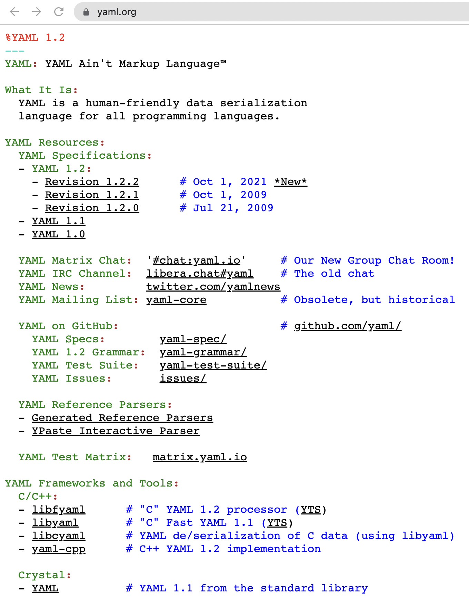
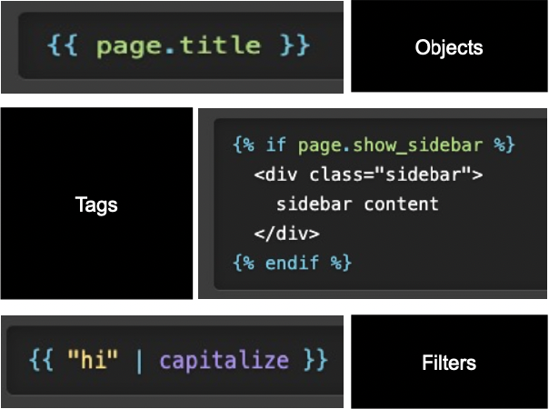
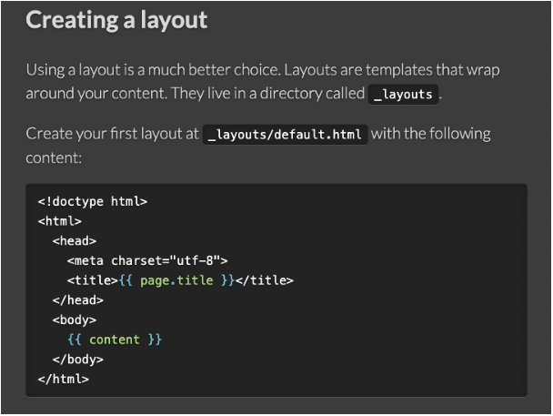
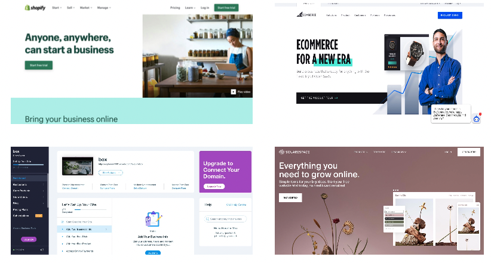
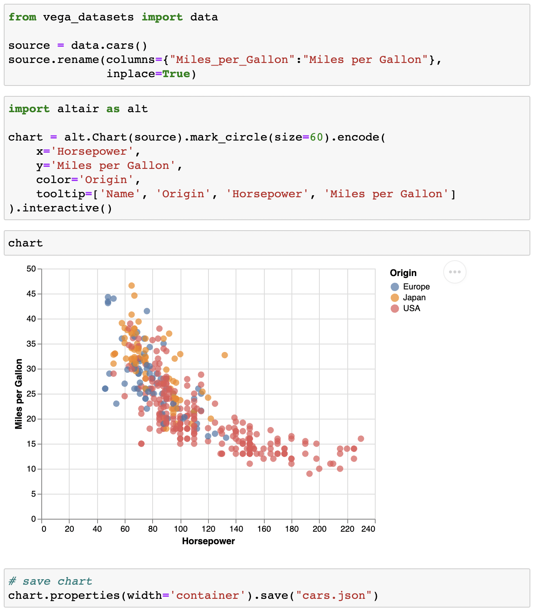
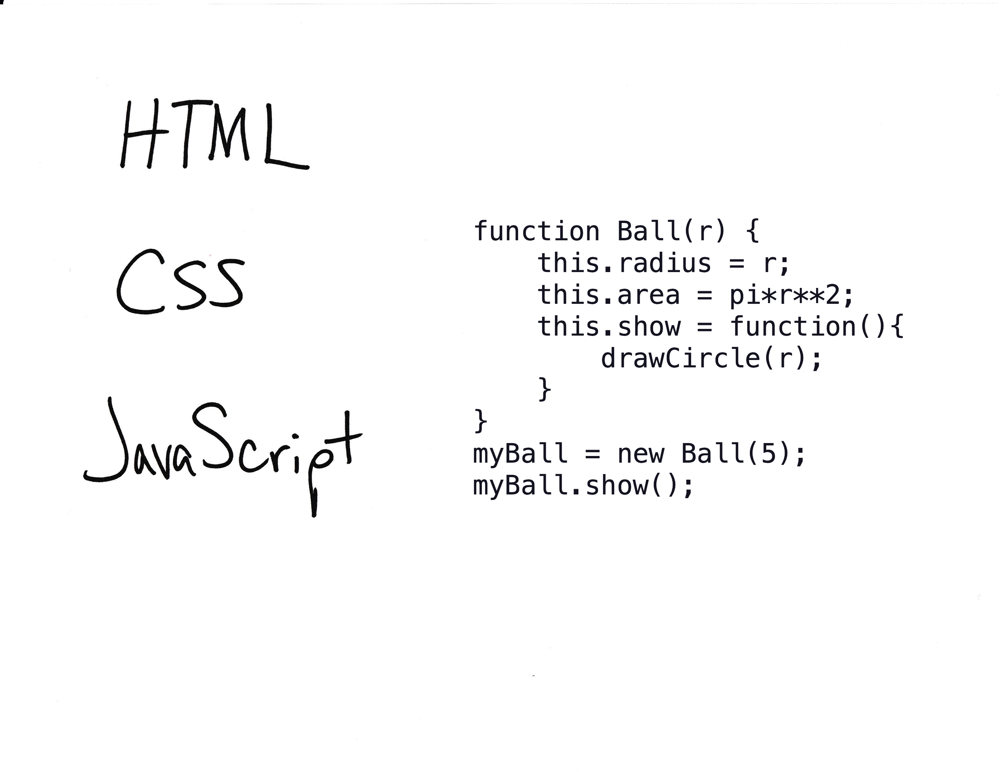

## This Week/Last Week

notes:

we'll start today with finishing up some stuff we've done in Starboard and then,

today we'll be continuing on with some of what we did last week -- moving into more Markdown-based viz and viz "reports" along with more javascript and
finally getting into jekyll probably at the end of class

---

## Dropping lowest Weekly Viz score

---

## Note about grades on Canvas

notes:
please be aware that HW grades are not fully accurate!

dropping doesn't 100% work correctly there (boo canvas)

---

## Homework #10 Groups

---

 
 
 

# Back to Starboard!!

notes:
we'll finish up some stuff in starboard, namly adding interactivity, before moving onto Idyll

**go to starboard to finish up!!**

---

## Going further with Starboard

There are also ways to embed Starboard notebooks in webpages.

Check out a few tutorials for more:
 * https://kjohnsen.org/post/embed-starboard/
 * https://github.com/gzuidhof/starboard-wrap

---

## Today

 * Publishing
   * Jekyll
   * Github Pages
   * vega-lite in Python with Altair
   
notes:
**back from starboard**

---

 
 
 

# TOPIC 1: Web developing with Jekyll (and Ruby, YAML, Liquid)

Many of these [slides](https://uiuc-ischool-dataviz.github.io/is445_spring2022/week14/Jekyll_diptendra.pdf) are credited to [Diptendra Bagchi](https://www.linkedin.com/in/diptendra-bagchi), a former TA for this course.

notes:
we'll go through a few different concepts and languages including Jekyll, YAML files, Liquid and Ruby

in practice, we won't really have to use **any** of these and we'll mostly be using things we already know like Markdown, Python, and vega-lite, but it is here as a reference in case you want to make a jekyll page with interactive visualizations in the future that is in a different format to the template that we will be using for this class

---

## Jekyll

Jekyll is a [static site generator](https://www.cloudflare.com/learning/performance/static-site-generator/)

 

notes:
* static site generator means cite is generated in HTML from data + templetes -- instead of writing the format for each of our class pages, there is a format that is used to make certain files into slides, prep notebook links, etc

---

## Jekyll

Jekyll is a [static site generator](https://www.cloudflare.com/learning/performance/static-site-generator/)

 * Reduce manual coding for webpages with repeated content [see static site source code for class webpage](https://github.com/UIUC-iSchool-DataViz/is445_bcubcg_fall2022)
 

notes:
* it can reduce manual coding for repeated "kinds" of pages, like for example the setup of our week's pages

**go to our webpage and our github!**

---

## Jekyll

Jekyll is a [static site generator](https://www.cloudflare.com/learning/performance/static-site-generator/)

 * Reduce manual coding for webpages with repeated content [see static site source code for class webpage](https://github.com/UIUC-iSchool-DataViz/is445_bcubcg_fall2022)
 * Written in Ruby
 

notes:
* it's written in the Ruby programming language, but we won't really be making much use of this ourselves and instead will use Markdown to write most of our pages

---

## Jekyll

Jekyll is a [static site generator](https://www.cloudflare.com/learning/performance/static-site-generator/)

 * Reduce manual coding for webpages with repeated content [see static site source code for class webpage](https://github.com/UIUC-iSchool-DataViz/is445_bcubcg_fall2022)
 * Written in Ruby
 * Very popular static site generator (most popular as of 2017)

 

notes:
* its useful to know how to use, as it is very popular (I think the most popular?) static site generator

---

## Jekyll

Jekyll is a [static site generator](https://www.cloudflare.com/learning/performance/static-site-generator/)

 * Reduce manual coding for webpages with repeated content [see static site source code for class webpage](https://github.com/UIUC-iSchool-DataViz/is445_bcubcg_fall2022)
 * Written in Ruby
 * Very popular static site generator (most popular as of 2017)
 * easy(ish) to deploy on github.io and other hosting platforms

 

notes:
* additionally, it is fairly easy to deploy as a github page (we'll do a bit of this, it does require understanding a bit about how github works and how to push changes)

---

## Jekyll

Jekyll is a [static site generator](https://www.cloudflare.com/learning/performance/static-site-generator/)

 * Reduce manual coding for webpages with repeated content [see static site source code for class webpage](https://github.com/UIUC-iSchool-DataViz/is445_bcubcg_fall2022)
 * Written in Ruby
 * Very popular static site generator (most popular as of 2017)
 * easy(ish) to deploy on github.io and other hosting platforms
 * can be integrated with vega-lite (requires the [class online resume/cv template](https://github.com/jnaiman/online_cv_public) but can be generalized)
 

notes:
* and finally, it is something we can integrate with vega-lite to make interactive plots!

---

## Jekyll installation

We did this in Homework #7 [recall instructions here](https://uiuc-ischool-dataviz.github.io/is445_bcubcg_fall2022/week09/installation_instructions_week11.html).

notes:
the good news is that if we recall homework #7 we already installed jekyll!  now we'll actually start making modifcations to your webpages in order to host your own content (and final projects) and publishing to github

---

## Jekyll syntax & files

 * Main configuration's are done with [YAML](https://yaml.org/) files/syntax
 

notes:

all of the ways to configure our pages are done with a yaml syntax

yaml is sort of like a cousin of markdown, and is used to use pre-determined formatting for specific elements and keep us from having to re-code things

---

## Jekyll syntax & files

 * Main configuration's are done with [YAML](https://yaml.org/) files/syntax
 

 

notes:

for example if you look in the online-cv template that we are using for class, you'll see a _config.yml file...

---

## Jekyll syntax & files

 * Main configuration's are done with [YAML](https://yaml.org/) files/syntax
 

 

notes:
... you'll see a bunch of parameters that you can set that will "auto configure" your site (like its title, its baseURL, etc)

---

## Jekyll syntax & files

 * Main configuration's are done with [YAML](https://yaml.org/) files/syntax
 * can also be included at the top of specific pages
 

(see `_posts/` directory, example blog post)

notes:
there will also often be a bits of yaml formatted text at the top of individual pages

for example, if you open the example blog post in a text editor at the top you'll see little snippets of yaml inbetween three dashes -- this is the configurations for EACH blog post that will change with the blog post.

From the example here we can see that each post has a title, subject tags, a style and color, and a description

---

## Liquid (for use in Jekyll)

[Liquid](https://shopify.github.io/liquid/) used to load [dynamic content](https://www.omniconvert.com/what-is/dynamic-content/) on webpages 

notes:
dynamic content just means content that changes based on behavior of the user

---

## Liquid (for use in Jekyll)

[Liquid](https://shopify.github.io/liquid/) used to load [dynamic content](https://www.omniconvert.com/what-is/dynamic-content/) on webpages 

 * Also written in Ruby
 * objects like `{{page.title}}` are used to print content

notes:
content is then stored in variables, which can be use to print the tags of the variable on your page

---

## Liquid (for use in Jekyll)

[Liquid](https://shopify.github.io/liquid/) used to load [dynamic content](https://www.omniconvert.com/what-is/dynamic-content/) on webpages 

 * Also written in Ruby
 * objects like `{{page.title}}` are used to print content
 * and to create logic with their tags like `if page.show_sidebar`

notes:
you can also use logic to do flow control based on the values of the object tag variables

---

## Liquid (for use in Jekyll)

[Liquid](https://shopify.github.io/liquid/) used to load [dynamic content](https://www.omniconvert.com/what-is/dynamic-content/) on webpages 

 * Also written in Ruby
 * objects like `{{page.title}}` are used to print content
 * and to create logic with their tags like `if page.show_sidebar`
 * also "built in" filters to control how tags/content is viewed

notes:
there are also some "built in" filters which can help control how content looks, for example shown is that a string variable would be capitalized

---

## Liquid (for use in Jekyll)

[Liquid](https://shopify.github.io/liquid/) used to load [dynamic content](https://www.omniconvert.com/what-is/dynamic-content/) on webpages 

 * Also written in Ruby
 * objects like `{{page.title}}` are used to print content
 * and to create logic with their tags like `if page.show_sidebar`
 * also "built in" filters to control how tags/content is viewed
 * used to build into "layouts" for repeated pages (like blog posts, or weekly content!)

notes:
there are also some "built in" filters which can help control how content looks, for example shown is that a string variable would be capitalized

---

## Liquid (for use in Jekyll)

[Liquid](https://shopify.github.io/liquid/) used to load [dynamic content](https://www.omniconvert.com/what-is/dynamic-content/) on webpages 

 * Also written in Ruby
 * objects like `{{page.title}}` are used to print content
 * and to create logic with their tags like `if page.show_sidebar`
 * also "built in" filters to control how tags/content is viewed
 * used to build into "layouts" for repeated pages (like blog posts, or weekly content!)

&nbsp;

We can ignore all of this if we use a template that supports what we want to do!

notes:
the nice thing is that, for the most part, we don't have to worry about any of this!

we'll be using a templete for our work with Jekyll for this class, so you won't have to deal with most of this -- we'll be using mostly markdown an just a bit of HTML with our Python and vega-lite skills!

---

## Markdown in Jekyll

Our Jekyll template uses Markdown for text, just like Starboard:

 * To **bold**, use `**two asterisks**`
 * You can _italicize_ with `_underscores_`
 * Try out making bullet lists with `*` on each line
 * Links are fun: `[link text](http://example.com/)`

---

## Jekyll Templates

A non-exhaustive list can be found [by searching on GitHub](https://github.com/topics/jekyll-theme) or other sites.

We'll be [using a specific template for this class](https://github.com/jnaiman/online_cv_public) (you can use others if you are already comfortable with Jekyll, but we will prioritize support for students using the template).

notes:
while there are many templates, we'll be using a specific one for this class that supports interactive visualizations with vega-lite

if you already know Jekyll you CAN use your own, but we will not be providing support for it

---

## Jekyll

Pros:
 * Popular -- well documented
 * Uses Markdown in (most) templates, minimizes coding

Cons:
 * Less common syntax (Markdown)
 * open source means less guarantee of long-term support in the future (though, popularity helps with that)
 * Doesn't support interactive visualization "out of the box"

---

## Other webpage development options

 * [Wix](https://en.wikipedia.org/wiki/Wix.com)
 * [WordPress](https://en.wikipedia.org/wiki/WordPress)
 * [BigCommerce](https://www.bigcommerce.com/)
 * [Shopify](https://en.wikipedia.org/wiki/Shopify)
 * [Squarespace](https://en.wikipedia.org/wiki/Squarespace)

notes:
there are other options out there which will help you build webpages as well, here are just a few

they will have a variety of costs and support different features, some with data viz support, others with less

there will be pros/cons to using these as well!  like cost, but also the cost of learning, or re-learning if they stop supporting the kind of web development you want to do

---

## vega-lite with Jekyll

Link to interactive version [here](https://jnaiman.github.io/online_cv_public/projects/1-vega-lite-project).

notes:
using the templete, we'll also be able to support including our vega-lite creations by saving them as json snippets and including them in `assets/json`

---

## [Altair](https://altair-viz.github.io/index.html) : Python $\rightarrow$ vega-lite $\rightarrow$ Jekyll

We will use [Altair](https://altair-viz.github.io/index.html) to translate between any Python analysis and vega-lite json's (we did this in your Homework #1 as a test):

notes:

we'll be using altair in Python to translate between any python analysis we do and our interative vega-lite plot, as stored in a json file that we can then include in our webpage

we actually already used a tiny bit of altair to generate a plot in your test homework#1!  this is what was use to generate the figure we see on the default online_cv webpage

---

## Summary

notes:
So we just covered a lot of new terms. The worldwide web is a real patchwork of different languages with different syntaxes meant to do different things. Don't let it overwhelm you. They tend to be pretty simple to start, and only get more complicated when you need them to.

and again, we'll be using templates and mostly markdown -- all of this more complex stuff is happening on the "backend"

---

## Summary

notes:
We talked about this before, but just as a reminder:

HTML or Hypertext Markup Language is the default syntax for websites. It's meant to be structured with tags like "head", "body", "paragraph", and "division". 

It's essentially a skeleton for other functionality to hang off of.

You may see the term DOM or Document Object Model. This is just another name for this skeleton/framework.

this is what all of our templates will be modifying for us

---

## Summary

notes:
you might have heard of something like CSS to modify the styles of HTML pages

CSS or cascading style sheets are how you define how websites are formatted. They do color, indentation, drop shadows, etc. Each CSS call is attached to an HTML tag.

CSS can be called in-line, or from an external file dedicated exclusively to CSS code.

again, our templates and yaml options will take care of all of this for us

---

## Summary

notes:
JavaScript is a dynamic programming language that runs natively on webpages that we've been using the past few weeks in Starboard. If you want to run programming logic in a webpage, you use javascript. If you see interactivity or animated effects on a website, you can generally expect they were written in javascript. 

now we will just use altair+vega-lite and our Jekyll templete to make this happen "under the hood" for us!

---

## Summary

Most of this is hidden from you when writing in Jekyll! But it helps to understand the underlying mechanisms.

We'll start with a "pure" Jekyll page.

Then we'll figure out how to include vega-lite plots, then we'll get into Altair and Jekyll (examples are posted).

You can use any of these tools in the final project!

notes:
what are the limits to data size in vega-lite and the web browser?

---

## Onto Jekyll web pages!

