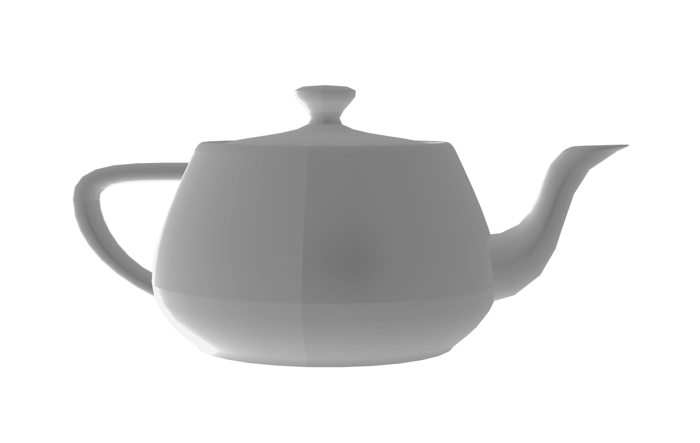
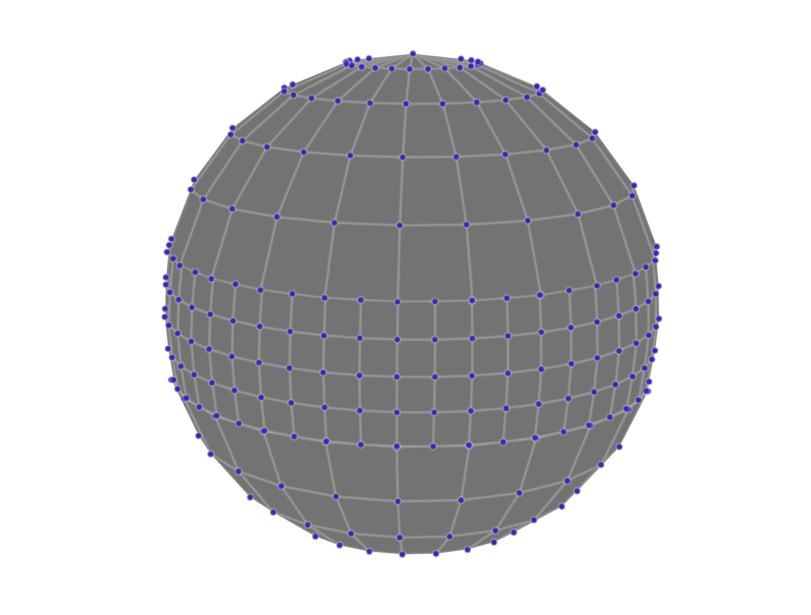
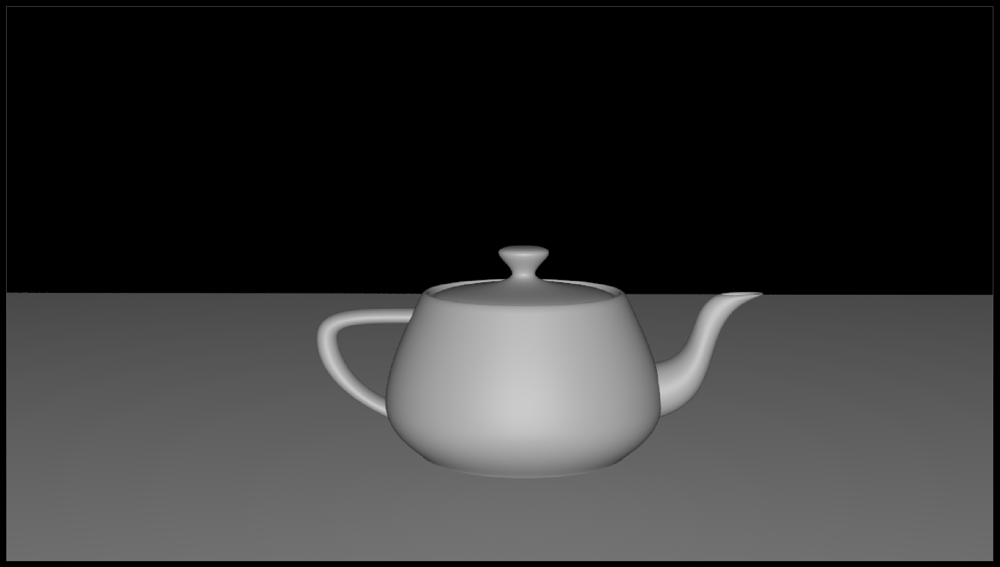

## Last Week

notes:
so far, we've been covering a bit of javascript and vega-lite as some new viz engines and using them in Idyll

(and have come across some issues!)

---

## Last Week

notes:

today we'll discuss a bit about how rendering 3D objects to make them look "photo realistic" works, which will give us an intro to scientific viz which we'll discuss a bit next week

---

## How to publish Idyll websites

Using your github.io page!

notes:
**go through this in detail!**

* mention it can take a while to build
* you can also do this with the GUI interface

---

## Another option: Jeykll

See slides from the awesome [Diptendra Bagchi](https://www.linkedin.com/in/diptendra-bagchi) that live right [here](Jekyll_diptendra.pdf) (and on the class Moodle).

notes:
**go through these slides in a little bit of detail, go over this webpage**

---

## Today

 1. 3D Computer Graphics
   * 3D Graphics Tools
   * Visual Effects tools
 1. Intro to Scientific Visualization
 
notes: so today we're going to talk a bit about some "high-end" graphics tools  and about how rendering works, this will become more important a bit next week and in the sci viz week.  While we won't end up doing a lot of this ourselves -- we are focusing on data visualization -- the concepts will still show up from time to time to its worth covering.

We'll have a talk from someone in the Advanced Visualization Lab in Week 15 and she'll touch on this a bit more as well

**make sure you have your audio settings correct!**

---

 
 
 

# TOPIC 1: 3D Computer graphics

---

## [A fun ~2 min movie from Pixar](https://www.youtube.com/watch?v=NEzJH-JrAdw)

<iframe width="1024" height="576" src="https://www.youtube.com/embed/NEzJH-JrAdw?rel=0" frameborder="0" allow="accelerometer; autoplay; clipboard-write; encrypted-media; gyroscope; picture-in-picture" allowfullscreen></iframe>

More in-depth [video found right here](./).
 
notes: this a fun link to see how folks from pixar describe what they do

There is another longer video from disney on the page for today, and we'll revisit it as "reading" in a few weeks when we talk about scientific viz

---

## 3D Computer Graphics

 * Composed of virtual 3D objects
 * Often time evolving (animated)
 * Displayed on 2D screens
 * Attempts to simulate photorealism to some extent
 
notes: note these can also be displayed on 3D screens, but the way that happens is a little different

---

## Computer Graphics Terms

 * Real-time vs Pre-Rendered graphics
 * Frames vs Timesteps

notes:
real-time graphics refresh the screen faster than the eye perceives, usually at least 30 times a second. Pre-rendered can take all the time in the world.

Frames are individual images that when strung together in time create the illusion of motion. They are the "timesteps" of a movie. But scientific data also have "timesteps" which may not be synchronized with the speed of the movie.

You'll notice in this GIF, the frame rate and the time step rate are different - we are zooming out quicker than we are updating the data in the images

---

## Computer Graphics Acronyms

 * VFX - visual effects
 * CGI - computer graphics imagery
 * FPS - frames per second
 * GUI - graphic user interface
 * HUD - heads up display
 
notes: you aren't required to remember any of these, but if you see them pop up, here they are

---

## Common Frame Rates

 * 24 FPS - theatrical films
 * 30 FPS - TV and specialty theaters
 * 48 FPS, 60 FPS - video games, interactive graphics, virtual reality
 * 120 FPS - really good virtual reality

<iframe width="560" height="315" src="https://www.youtube.com/embed/pfiHFqnPLZ4" frameborder="0" allow="accelerometer; autoplay; encrypted-media; gyroscope; picture-in-picture" allowfullscreen></iframe>

notes:

you can note if you try to follow the 15 or 30 FPS (frames per second) with your eye you see that it is jumpy

24 fps is considered the absolute minimum necessary frequency so that people don't perceive individual frames.

48 fps is widely considered so fast the human eye can't perceive any separation at all - but 60 fps is safer.

if you watch a TV and it seems distractingly smooth, it's probably doing frame interpolation to make 30fps content play back at 60fps.

This youtube video actually only plays at 60FPS, so the 120 ball is kind of pointless.

---

## Common Resolutions

 * 1024 x 768 - standard definition or SD (3:4)
 * 1920 x 1080 - high definition or HD (16:9)
 * 3840 x 2160 - ultra high definition or UHD or 4k (16:9)

notes:
Often people refer to these formats as 1k or 2k or 4k in graphics, referring to the number of pixels along the horizontal axis.

While these are the most common formats today, there's a long history of a crazy variety of formats. Cinemascope had a ratio of 2.35:1 which was wider than modern wide screens. Also fun fact, it didn't have a resolution because it was film before? digital. 

---

## Common File Formats

 * Images: JPG, PNG, TIF, EXR
 * Video: MOV, MP4, AVI
 * Codec: H.264, ProRes, DNxHD

notes:
There are many more formats, but because these are either lossless or extremely space efficient, they are the most popular.

EXR in particular is special because it can store many image layers including DEEP images which store depth information.

ProRes is only available on Apple, and DNxHD is Windows

---

## 3D Geometry

All 3D geometry is represented as:

 * Points
 

	

notes: how do we represent geometry in space? one way is points...

---

## 3D Geometry

All 3D geometry is represented as:

 * Points
 * Edges
 

	

---

## 3D Geometry

All 3D geometry is represented as:

 * Points
 * Edges
 * Surfaces
 

	

notes: we can connect these points and images to make surfaces

---

## 3D Geometry

All 3D geometry is represented as:

 * Points
 * Edges
 * Surfaces
 * Volumes
 

	

notes: or we can give the 3D surfaces some depth and make them into shapes

here these 3D cubes are called "voxels" which are similar to 2D "pixels" but for volumes

---

## 3D Geometry

<iframe src="https://player.vimeo.com/video/169599296?color=949494&title=0&byline=0&portrait=0" width="640" height="360" frameborder="0" allow="autoplay; fullscreen" allowfullscreen></iframe>

Link: https://player.vimeo.com/video/169599296?color=949494&title=0&byline=0&portrait=0

notes:

You can convert between points, surfaces and volumes, ofthen to really cool effects like shown - you can get some bananas permutations.

---

## 3D Geometry

Surfaces can be encoded as:

 * Implicit primitives
 

	

notes:
primitives are defined by mathematical functions. This sphere is defined by a center position and a radius.

---

## 3D Geometry

Surfaces can be encoded as:

 * Implicit primitives
 * Polygonal Meshes
 

	

notes:
Quadrilaterals are a good way to see the flow of geometry, which artists like, but quads can bend.

---

## 3D Geometry

Surfaces can be encoded as:

 * Implicit primitives
 * Polygonal Meshes
 

	

notes:
Triangles cannot bend because three points define a plane. So automatic geometry like the stuff you use in science is more often going to be triangles.

---

## 3D Geometry

Surfaces can be encoded as:

 * Implicit primitives
 * Polygonal Meshes
 * NURBS or Bezier Surfaces
 

	

notes:
This is a NURBS sphere. You can see the control vertices are floating off the surface. Every patch on the surface is influenced by many of the neighboring points.

Here if I wanted to deform this surface, I could pull at one of the blue points and the shape of the surface would change.

---

## 3D Geometry

Surfaces can be encoded as:

 * Implicit primitives
 * Polygonal Meshes
 * NURBS or Bezier Surfaces
 * Subdivision Surfaces
 

	

notes:
Subdivision surfaces are like those adaptive volumes we saw last week. You can add detail where you want it.

---

## 3D Geometry

Datasets with many fields called "attributes":

 1. Transform Attributes (translate, rotate, scale)
 

	

notes:
These transform attributes are the same for all objects.

Recall we discussed some of these in earlier classes for 2D plots.  Same principle here.

---

## 3D Geometry

Datasets with many fields called "attributes":

 1. Transform Attributes (translate, rotate, scale)
 1. Shape Attributes (radius, bumpyness, twistyness)
 

	

notes:
shape attributes depend totally on what the shape is.

These are something you won't really see in 2D unless you start modifying 2D shapes with some weird transforms.

---

## Rendering

Rendering is the process of flattening a 3-dimensional scene into a flat image.

How do photographic cameras accomplish this?

---

## Photographic Rendering

 1. White light leaves a light source like the sun

---

## Photographic Rendering

 1. White light leaves a light source like the sun
 1. The light bounces off an object like a ball or a leaf, and inherits the object's color

---

## Photographic Rendering

 1. White light leaves a light source like the sun
 1. The light bounces off an object like a ball or a leaf, and inherits the object's color
 1. Colored light arrives at the camera lens

---

## Photographic Rendering

 1. White light leaves a light source like the sun
 1. The light bounces off an object like a ball or a leaf, and inherits the object's color
 1. Colored light arrives at the camera lens
 1. The camera lens directs the light to a specific location on the CCD sensor, effectively a pixel

---

## Photographic Rendering

 1. White light leaves a light source like the sun
 1. The light bounces off an object like a ball or a leaf, and inherits the object's color
 1. Colored light arrives at the camera lens
 1. The camera lens directs the light to a specific location on the CCD sensor, effectively a pixel
 1. The camera processor stores the color of the light at the location of the pixel

---

## Photographic Rendering

 1. White light leaves a light source like the sun
 1. The light bounces off an object like a ball or a leaf, and inherits the object's color
 1. Colored light arrives at the camera lens
 1. The camera lens directs the light to a specific location on the CCD sensor, effectively a pixel
 1. The camera processor stores the color of the light at the location of the pixel

If we want to simulate this process in computer graphics software, how many light rays do we need to calculate? 

---

## Photographic Rendering

Trick question, that's WAAAAYYYYY too expensive!

Why?

The light rays that never arrive at the camera are a totally wasted calculation. They don't contribute to the final image at all.

Is there a better way?

---

## Raytracing

Raytracing does this process backwards:

 1. A light ray starts at a camera position and travels toward/through a specific image pixel
 1. The light ray bounces off objects in the scene
 1. If the bounced light arrives at a light, it is recorded as "lit"
 1. If the light ray never arrives at an object or a light, it is recorded as the background color, usually black

This way, we only calculate the path of one light ray for each pixel. It's efficient!

---

## Raytracing

Houdini VEX path tracer

<iframe src="https://player.vimeo.com/video/331150010" width="640" height="412" frameborder="0" allow="autoplay; fullscreen" allowfullscreen></iframe>

Link: https://player.vimeo.com/video/331150010

---

## Raytracing

Q: How does the renderer handle procedural (formula-driven) geometry?

A: Micropolygon dicing

Q: How does the renderer handle volumetric data that doesn't just "bounce"?

A: Volume ray marching

notes:
The renderer will divide interpolated or dense geometry into smaller and smaller polygons until they are smaller than the image pixel being calculated. These smaller-than-a-pixel polygons are called micropolygons.

In volume ray marching, a ray steps through a volume and accumulates opacity at regular intervals. Each interval generates a bounce to figure out lighting. Once it reaches 100% opacity, it stops ray marching.

---

## Shaders

Shaders are code that tells the renderer what something looks like. There are many types:

 1. Vertex Shaders
 1. Geometry Shaders
 1. Fragment or Pixel or Material Shaders
 1. Lens Shaders

notes:

basically, a shader tells a light ray that hits an object, "hey!" you hit something that is glass and so it should bend light like glass, or something like a leaf so it should be bumpy like a leaf

---

## The Secrets of Photorealism

 
 

	

notes:
this is a very dull and not-realistic looking image

---

## The Secrets of Photorealism

 1. Lighting changes everything - use realistic light sources
 

	

---

## The Secrets of Photorealism

 1. Lighting changes everything - use realistic light sources
 1. Photographs have motion blur - use a motion blur algorithm
 

	

---

## The Secrets of Photorealism

 1. Lighting changes everything - use realistic light sources
 1. Photographs have motion blur - use a motion blur algorithm
 1. Photographs have depth of field - use a depth of field algorithm
 

	

---

## The Secrets of Photorealism

 1. Lighting changes everything - use realistic light sources
 1. Photographs have motion blur - use a motion blur algorithm
 1. Photographs have depth of field - use a depth of field algorithm
 1. Scenes need backgrounds - embed your dataset inside a contextual dataset
 

	

---

## The Secrets of Photorealism

 1. Lighting changes everything - use realistic light sources
 1. Photographs have motion blur - use a motion blur algorithm
 1. Photographs have depth of field - use a depth of field algorithm
 1. Scenes need backgrounds - embed your dataset inside a contextual dataset
 1. Indirect light is everywhere - use an "ambient occlusion" algorithm
 

	

---

## The Secrets of Photorealism

 1. Lighting changes everything - use realistic light sources
 1. Photographs have motion blur - use a motion blur algorithm
 1. Photographs have depth of field - use a depth of field algorithm
 1. Scenes need backgrounds - embed your dataset inside a contextual dataset
 1. Indirect light is everywhere - use an "ambient occlusion" algorithm
 1. The world is fractal - increase detail with procedural noise and instancing
 

	

---

## OpenGL

Before most computers could show graphics of any kind, several companies began to compete for proprietary formats.

A company called Silicon Graphics stepped in and created an Open Source specification for computer graphics called OpenGL. 

To this day, most software graphics you see are rendered using some version of OpenGL - including the whole Mac operating system.

notes:
Many other open source projects have copied this model, such as OpenCV (computer vision), OpenCL (gpus), and OpenMP (multi-processing).

---

## WebGL

OpenGL is primarily intended for C-style programming.

WebGL implements the same set of tools for rendering through a web browser. This allows us to easily render 3D content on the internet!

---

## [Three.js](https://threejs.org/)

Three.js is a javascript library that uses WebGL to create interactive 3D graphics that render in web browsers. 

It is meant to be more user-friendly than raw WebGL code.

notes:
again, we won't be using it in this class, but feel free to check it out on your own

---

## SketchFab & ipyvolume

SketchFab uses WebGL to render YOUR 3D data in a 3D viewport in a web browser. 

[SketchFab.com](https://sketchfab.com)

ipyvolume uses WebGL to render volumes to your jupyter notebook.

notes:
we'll start playing with ipyvolume a bit next week!  And if we have time, we'll talk about sketchfab as well

---

## Scientific Visualization Tools

 * yt
 * ParaView
 * VisIt
 * VMD
 * Vapor
 
notes: there is a lot of overlap between what scientists & visual effects/special effects artists are trying to do, but their data formats are usually quite differnt
 
In week 15-ish, we'll look alot at "yt" for scientific viz

---

## Visual Effects Tools

 * Blender - for developers
 * Maya - for animators
 * Houdini - for dynamics

notes: we haven't covered any viz effects tools but here are a few to be aware of

---

## Scientific Viz Tools VERSUS Visual Effects Tools

notes: here is a quick comparision chart to show key differences between a package like yt  & a special effects tool like houdini

---

## Scientific Viz Tools VERSUS Visual Effects Tools

[ytini](www.ytini.com)

[Astroblend](www.astroblend.com)

### More from the NASA SVS Group next week!

notes:
several of us at the NCSA worked on ytini so that Houdini could use some of the features of yt natively!

This is also true of Dr. Naiman's work on Astroblend.

