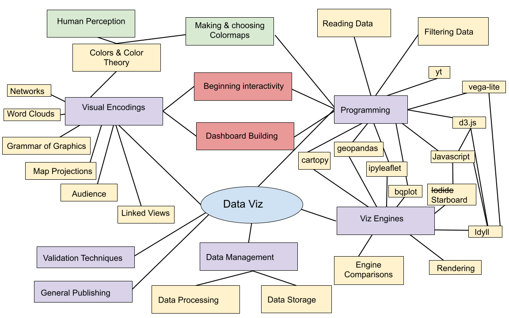
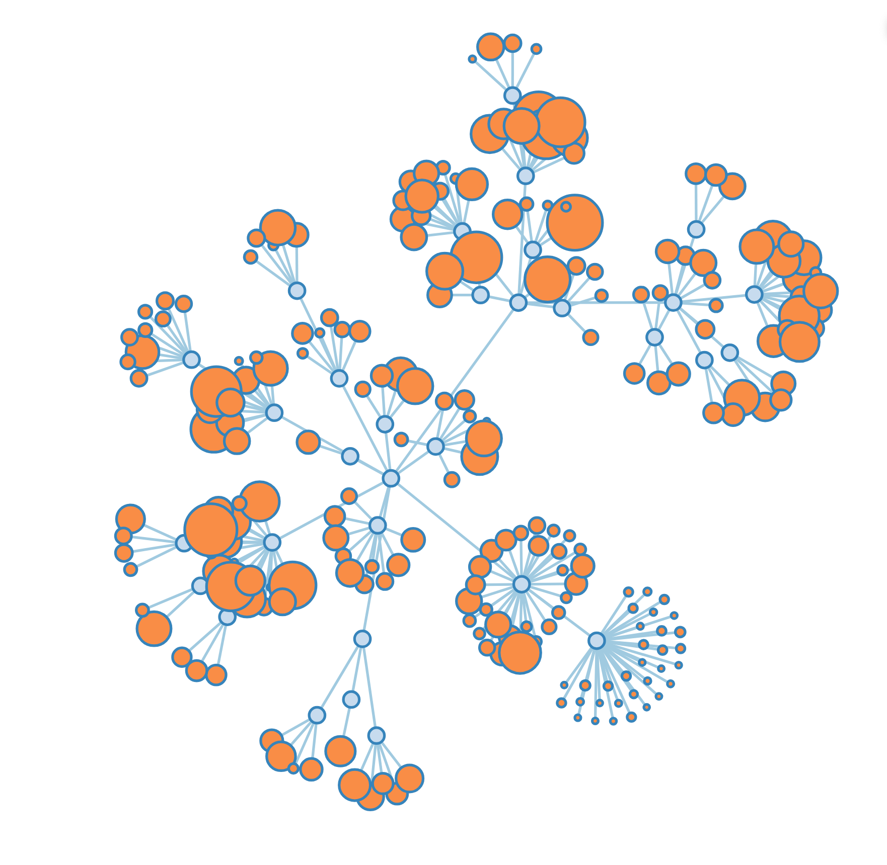
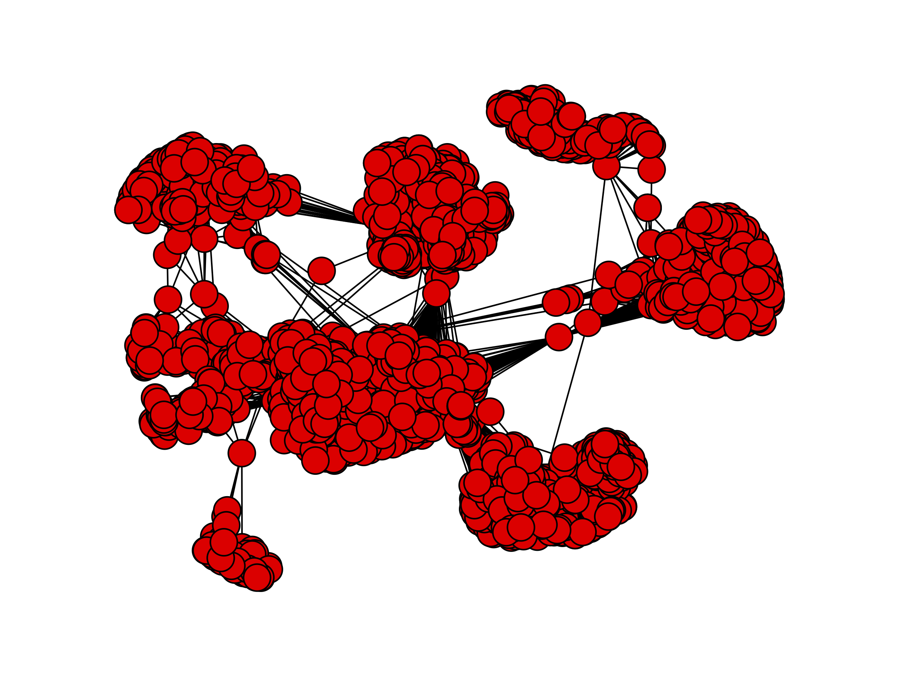
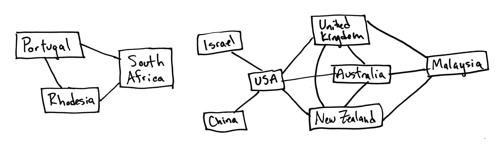
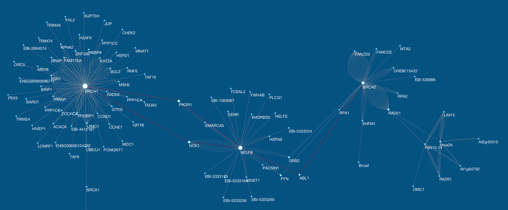
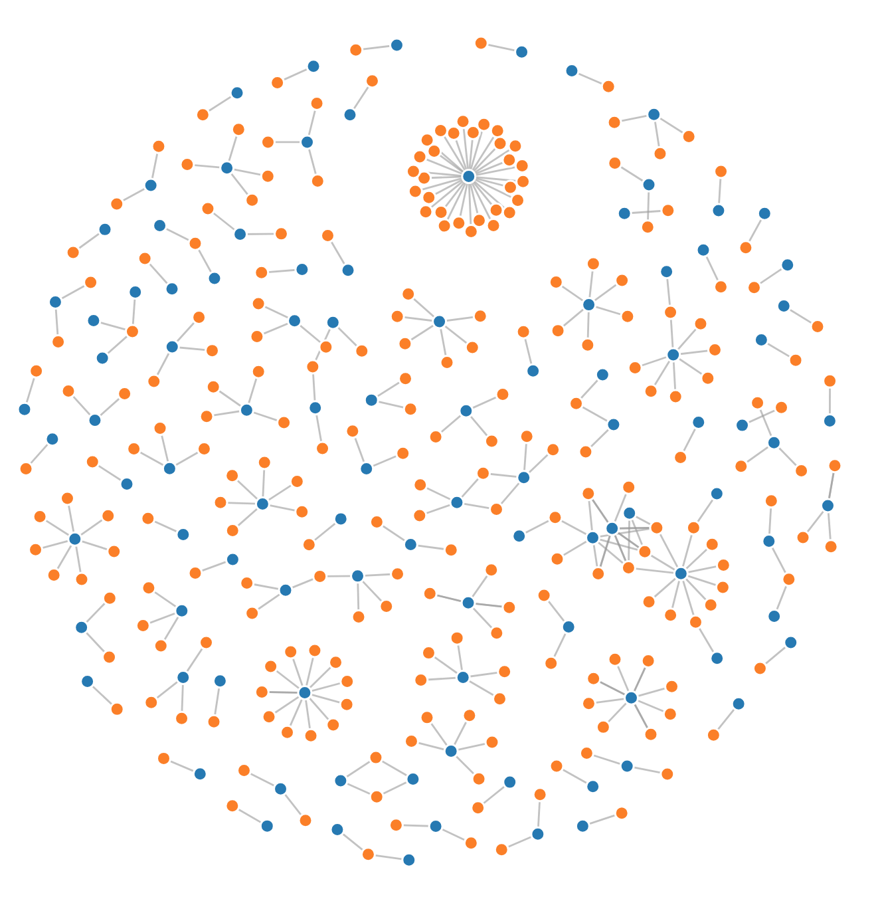
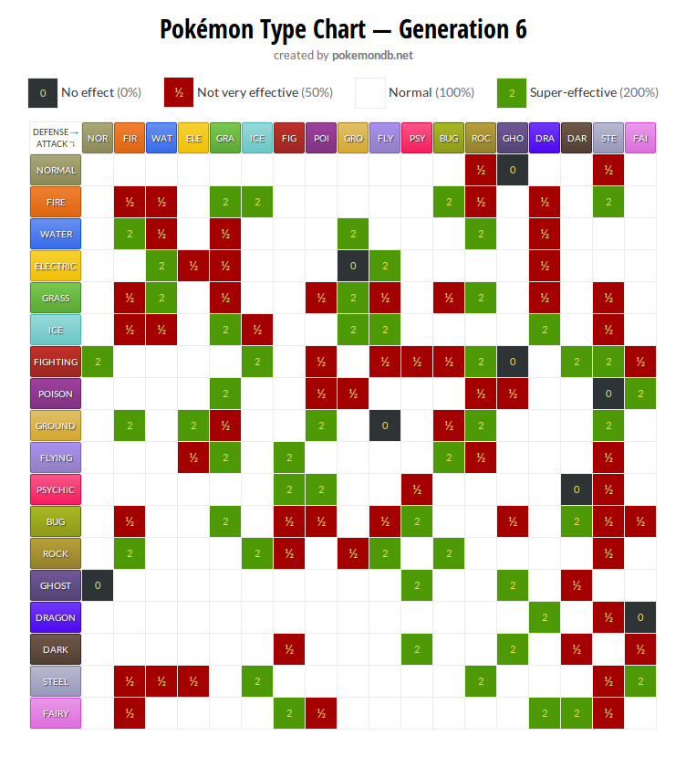
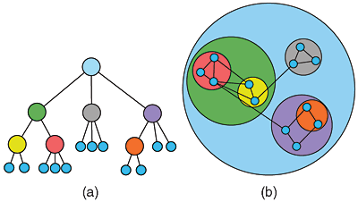

 
 
 

# You made it!

---

## This course

notes:
Look at all the stuff we covered!

Today we'll cover our last topics -- networks and word clouds

We'll really focus on word clouds in the coding and if we have time we'll get into networks, but 
we'll focus on networks in the lecture portion

If we have time, we'll circle back to sciviz topics

---

## Extra credit: Network Viz

notes:
keep in mind that we have an extra credit assignment, worth 1 homework grade, that is in this week's page

also recall that the maximum you can get on the homework is 100% of that category, so if you have a perfect HW score, you can't do better than that!

---

## Notes on Final, Part 3

Due dates:
 1. First draft of Part 3 -- due Dec 8th, will get feedback course participants
 1. Post your link in the Moodle forum to get feedback from classmates
 1. Provide feedback for 3 randomly assigned classmates -- due Dec 12th
 1. Final chance to resubmit your Part 3 -- due Dec 14th (placeholder submission link)
 
**Please be aware these are hard deadlines**
 
notes:
go to pages!!

because we have to get grades in by a certain time, these due dates are hard ones -- no extensions.

your "first" part 3 submission CAN be a work in progress -- you can outline what you want to do, but the more you have done, the better we can give you feedback and the more there is for your other feedback-giving classmates to work with

---

## This week

 1. Where to go from here
 1. Networked & Hierarchical Data
 1. Word Clouds

notes:
first I'm gonna start with some resource of where to go from here

---

 
 
 

# TOPIC 1: Where to go from here

notes:
different sub-fields of dataviz will lead you down different pathways

---

## Python

 * See whats in dev on the [bqplot gitter lobby](https://gitter.im/bloomberg/bqplot)
 * More about volume rendering with [ipyvolume](https://ipyvolume.readthedocs.io/en/latest/)
 * More about sciviz dev with [yt slack](https://yt-project.slack.com/join/shared_invite/enQtMzQ4Nzk1Mjk0ODY4LWNmOTFiNTM4N2ExZWYyY2YwZDUxN2Q1MTgwNDdjZGExMWM0Y2VlNzUzNGExZTZhMWRlNjU3ZjFmZmU3MjdkNDg)

notes:
these are notes

---

## Javascript

 * [Beginning Javascript course](https://www.codecademy.com/learn/introduction-to-javascript)
 * See what's in dev on the [Idyll gitter lobby](https://gitter.im/idyll-lang/Lobby) - including updates to vega-lite!

---

## Courses

 * [Advanced Data Visualization, iSchool](https://ischool.illinois.edu/degrees-programs/courses/is590adv)
 * [Museum Informatics](https://ischool.illinois.edu/degrees-programs/courses/is426)
 * [Data Science Storytelling](https://ischool.illinois.edu/degrees-programs/courses/is590dst)
 * [More on sciviz and graphics](https://jnaiman.github.io/csci-p-14110_su2020/) (Not UIUC, includes intro to programming)

---

## Also, don't forget to fill out your ICES forms!

---

 
 
 

# Topic 2: Networked & Hierarchical Data

---

## Networked and Hierarchical Data

 1. Node-link diagrams
 1. Matrix views

From: <a href="https://www.researchgate.net/publication/258716465_Visualizing_Weighted_Networks_A_Performance_Comparison_of_Adjacency_Matrices_versus_Node-link_Diagrams">this article</a>

notes:
There are two primary types of visualization for data that has inherent linkages.

This figure here is actually showing the same networked dataset.

---

## Node-link Diagrams

 1. Trees
 1. Force-Directed Graphs

notes:
These are the primary ways that you would draw a linked node diagram.

You might have different sizes of symbols, different shapes, or different link or symbol colors to encode other information.

---

## Node-link Diagrams

 1. Trees
 1. Force-Directed Graphs

From: <a href="https://github.com/jcatw/snap-facebook">this GitHub</a>

notes: in the python lecture we'll be working with a subset of this facebook dataset - showing linkages between individuals as their facebook friendships

this is a node-link diagram of this full facebook dataset showing groups of connected individuals, and how the groups are connected to eachother.

---

## Node-link Diagrams

 1. Nodes
   * might have 0-to-many edges linked to them
 1. Edges (sometimes called "links")
   * associated specifically with 2 nodes
   * can have a direction
   * can have a weight

notes:
This is a diagram of some selected military alliances during the Cold War.

---

## Node-link Diagrams

 1. Nodes
   * might have 0-to-many edges linked to them
 1. Edges
   * associated specifically with 2 nodes
   * can have a direction
   * can have a weight

notes:
One common use-case for these is genetics. Scientists need visualizations to understand how one gene affects another, either directly OR **indirectly**.

here is shown an example of how the BRCA genes associated with some forms of breast cancer are linked to various other genes.

---

## Tree Diagrams

 * Topological
 * Ordered
   * Left-to-Right
   * Inside-Out
   * Top-to-bottom
 * Always one incoming edge (low density)
 * Discrete, not Continuous

notes:
trees have a topology or hierarchy. These are especially good for a *deep* hierarchy.

The physical space between nodes isn't meaningful like it would be in a scatter plot. Rather the number of "hops" along edges is important.

The left hand plot has a top-down ordering, while the right-hand plot is ordered radially such that the most connected object is at the center.

---

## Force-Directed Graphs

 * Nodes push away from each other as if their edges are springs.
 * Nodes push away from each other by local repulsion force.
 * Forces can be weighted.

notes:
These use simulated forces to push apart what might otherwise look like a mad hairball.

Edge springyness can be weighted by edge weight, node repulsion can be weighted by node weight. (We'll play with this)

You could place the points in any arbitrary place and let them evolve. You could start with a scatter plot representing numerical values, but the nodes will just move. You could also put all the points at the same starting place.

Note that this means these plots are in a sense "non-deterministic" in that you can get slightly different plots every time. 

---

## Force-Directed Graphs

 * Path Distance
 * Joint or Disjoint
 * Discrete, not Continuous

notes:
These are useful for identifying clusters, finding all possible paths, finding the shortest path, finding all adjacent nodes, finding bridges between unconnected nodes, etc.

---

## Force-Directed Graphs

 1. Drawbacks:
   * Non-deterministic (different every time)
   * Link Density can be an issue when over 3-4 links per node

notes:
this is a social network graph that looks fine at high resolution, but on this screen is more or less unreadable.

---

## Matrix Views

 1. Adjacency Matrix
   * List all values along X AND Y axes

</td>
</td>

notes:
Matrix views remove occlusion and hairball issues completely. They are preferred for extremely dense data.

However they do not show topology, and they might be less intuitive to identify clustering.

---

## Matrix Views

 1. Adjacency Matrix
   * List all values along X AND Y axes
   * Can cut in half along diagonal if non-directional

notes:
This is sometimes called a "Folded" adjacency matrix

---

## Matrix Views

 1. Adjacency Matrix
   * List all values along X AND Y axes
   * Can cut in half along diagonal if non-directional
   * Color cells by edge weight

notes:
Matrix views remove occlusion and hairball issues completely. They are preferred for extremely dense data.

However they do not show topology, and they might be less intuitive to identify clustering.

As you can see by the square plots here - these are supposed to show the networked structure of some brain data - can you easily pick out what variables are linked? (I can't!)

---

## Matrix Views

notes:
Pokemon type-effectiveness chart yay!

So, AJ (the other instructor) put this in and I think I'd be remiss if I didn't show it, but I literally have no idea what is going on here - does anybody here play pokeman and can explain it to the class?

Notice this is directional - Attackers and Defenders don't have same effect on different types.

---

## Hierarchical Data

 1. Trees
 1. Containment
   1. Treemaps

notes:
Another way to look at networked data - treemaps

containment better at shallow, broad trees than node-link tree diagrams

good for identifying topological outliers

This visualization is file size of the D3 visualization library.

---

## Hierarchical Data

 1. Trees
 1. Containment
   1. Treemaps
   1. Nested Circles

notes:
This is also known as circle-packing.

---

## Compound Networks

 1. Network and Tree together

notes:
Now we're combining a hierarchical nested circle containment WITH linked nodes from our cold war alliances.

There are lots of ways to combine types of network visualizations like this.

---

## An aside: <a href="https://en.wikipedia.org/wiki/Hilma_af_Klint">Hilma af Klint</a>

---

## An aside: <a href="https://en.wikipedia.org/wiki/Hilma_af_Klint">Hilma af Klint</a>

---

 
 
 

# Topic 3: Text visualization & Wordclouds

---

## Today's Python: Networks & Word clouds

notes:
We'll be focusing a lot on ways of representing text occurances in Python with histograms and wordclouds and then if we have time we'll circle back to networks

---

 

# To Python!
